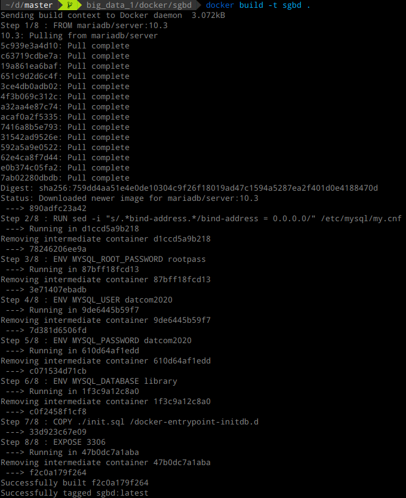

```{r setup, include=F}
knitr::opts_chunk$set(echo = TRUE, eval = FALSE)
```

# Introducción

En esta práctica mostraremos cómo podemos desplegar contenedores en
distintas máquinas utilizando `docker`. Mostraremos cómo desplegar
tres contenedores distintos, uno con un sistema gestor de bases de
datos consultable desde fuera, otro con un entorno de ejecución de
python preparado para ciencia de datos, y otro con un entorno de
ejecución en R, también preparado para ciencia de datos. El despliegue
de los contenedores se realizará tanto en local como en Microsoft
`Azure.

Todas las imágenes de los contenedores han sido desplegadas en un
repositorio público de DockerHub, para hacerlas accesibles desde
cualquier lugar. Estas imágenes son las que se han utilizado
posteriormente para el despliegue de los contenedores en Azure.

Comenzamos mostrando el contenedor basado en MariaDB para la
base de datos.

# Contenedores desarrollados

## Contenedor con SGBD MySQL

El primer contenedor desarrollado está preparado para utilizar en él
una base de datos. El nombre del contenedor es `sgbd`. En el mismo se
ha configurado mariadb para aceptar conexiones desde el exterior, se
ha creado un usuario al que se le han asignado permisos sobre una base
de datos (también creada), y se ha creado una tabla de ejemplo, la
cual nos permitirá comprobar que en efecto todas las operaciones se
han realizado correctamente.

Listamos en primer lugar el archivo `Dockerfile` que hemos desarrollado:

```{bash, eval=FALSE}
## PREVIOUS IMAGE
FROM mariadb/server:10.3

## ENVIRONMENT VARIABLES
ENV MYSQL_ROOT_PASSWORD rootpass
ENV MYSQL_USER datcom2020
ENV MYSQL_PASSWORD datcom2020
ENV MYSQL_DATABASE library

## Change bind address (allow remote connections)
RUN sed -i "s/.*bind-address.*/bind-address = 0.0.0.0/" /etc/mysql/my.cnf

## Copy init file to folder to execute
COPY ./init.sql /docker-entrypoint-initdb.d

## Open port in firewall
EXPOSE 3306
```

Describimos dicho archivo. En primer lugar tenemos la imagen de la que
partimos, la cual es proporcionada directamente por `MariaDB` para
facilitar el despliegue en Docker de un sistema de base de datos con
su entorno. A continuación, tenemos las variables de entorno, las
cuales nos permiten especificar la contraseña del usuario root del
sistema de bases de datos, el usuario que queremos crear, su
contraseña y el nombre de la base de datos sobre la que tendrá
permisos. A continuación, aparece una línea que utiliza la utilidad
`sed` para sustituir el `bind-address` del archivo de configuración de
la base de datos, de forma que se permitan conexiones desde cualquier
IP. Después, se copia el archivo `init.sql` al punto de entrada de
`docker`, de forma que cuando se construya el contenedor, se ejecute
dicho archivo dentro de SQL. Finalmente, abrimos el puero 3306, que
es el puerto donde escucha el servicio de MariaBD. Mostramos también
el contenido del archivo `init.sql`:

```{sql, eval=FALSE}
CREATE TABLE library.book
(
name VARCHAR(100),
price FLOAT
);
```

Como podemos observar, en dicho archivo simplemente creamos la tabla
`book` dentro de la base de datos `library`. Una vez descrito el
`Dockerfile`, tenemos que construir la imagen en el sistema,
utilizando la utilidad `docker`:



Una vez creada la imagen, podemos arrancar un contenedor local que
funcione como un `daemon` y que la utilice:


Una vez que tenemos el contenedor corriendo, podemos conectarnos al
mismo utilizando mysql en la máquina local:
