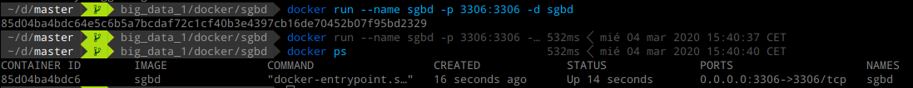
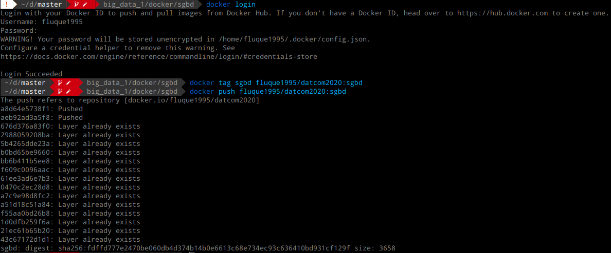

```{r setup, include=F}
knitr::opts_chunk$set(echo = TRUE, eval = FALSE)
```

# Introducción

En esta práctica mostraremos cómo podemos desplegar contenedores en
distintas máquinas utilizando `docker`. Mostraremos cómo desplegar
tres contenedores distintos, uno con un sistema gestor de bases de
datos consultable desde fuera, otro con un entorno de ejecución de
python preparado para ciencia de datos, y otro con un entorno de
ejecución en R, también preparado para ciencia de datos. El despliegue
de los contenedores se realizará tanto en local como en Microsoft
`Azure.

Todas las imágenes de los contenedores han sido desplegadas en un
repositorio público de DockerHub, para hacerlas accesibles desde
cualquier lugar. Estas imágenes son las que se han utilizado
posteriormente para el despliegue de los contenedores en Azure.

Comenzamos mostrando el contenedor basado en MariaDB para la
base de datos.

# Contenedores desarrollados

## Contenedor con SGBD MySQL

El primer contenedor desarrollado está preparado para utilizar en él
una base de datos. El nombre del contenedor es `sgbd`. En el mismo se
ha configurado mariadb para aceptar conexiones desde el exterior, se
ha creado un usuario al que se le han asignado permisos sobre una base
de datos (también creada), y se ha creado una tabla de ejemplo, la
cual nos permitirá comprobar que en efecto todas las operaciones se
han realizado correctamente.

### Archivo Dockerfile

Listamos en primer lugar el archivo `Dockerfile` que hemos desarrollado:

```{bash, eval=FALSE}
## PREVIOUS IMAGE
FROM mariadb/server:10.3

## ENVIRONMENT VARIABLES
ENV MYSQL_ROOT_PASSWORD rootpass
ENV MYSQL_USER datcom2020
ENV MYSQL_PASSWORD datcom2020
ENV MYSQL_DATABASE library

## Change bind address (allow remote connections)
RUN sed -i "s/.*bind-address.*/bind-address = 0.0.0.0/" /etc/mysql/my.cnf

## Copy init file to folder to execute
COPY ./init.sql /docker-entrypoint-initdb.d

## Open port in firewall
EXPOSE 3306
```

Describimos dicho archivo. En primer lugar tenemos la imagen de la que
partimos, la cual es proporcionada directamente por `MariaDB` para
facilitar el despliegue en Docker de un sistema de base de datos con
su entorno. A continuación, tenemos las variables de entorno, las
cuales nos permiten especificar la contraseña del usuario root del
sistema de bases de datos, el usuario que queremos crear, su
contraseña y el nombre de la base de datos sobre la que tendrá
permisos. A continuación, aparece una línea que utiliza la utilidad
`sed` para sustituir el `bind-address` del archivo de configuración de
la base de datos, de forma que se permitan conexiones desde cualquier
IP. Después, se copia el archivo `init.sql` al punto de entrada de
`docker`, de forma que cuando se construya el contenedor, se ejecute
dicho archivo dentro de SQL. Finalmente, abrimos el puero 3306, que
es el puerto donde escucha el servicio de MariaBD. Mostramos también
el contenido del archivo `init.sql`:

```{sql, eval=FALSE}
CREATE TABLE library.book
(
name VARCHAR(100),
price FLOAT
);
```

Como podemos observar, en dicho archivo simplemente creamos la tabla
`book` dentro de la base de datos `library`. Una vez descrito el
`Dockerfile`, tenemos que construir la imagen en el sistema, correr un
contenedor que utilice dicha imagen, y hacer consultas desde fuera a
la base de datos.

### Arranque de un contenedor en el equipo local

Lo primero que haremos será correr el contenedor en nuestro equipo.
Utilizando el `Dockerfile`, podemos construir la imagen:


Una vez creada la imagen, podemos arrancar un contenedor local que
funcione como un `daemon` y que la utilice:



Una vez que tenemos el contenedor corriendo, podemos conectarnos al
mismo utilizando mysql en la máquina local y hacer consultas al
sistema.  En la imagen siguiente, podemos observar cómo hacemos una
consulta sobre la base de datos con el usuario que hemos creado,
en la que pedimos que se nos muestre el esquema de la tabla `book`:


Podemos observar que el proceso completo es correcto, y tenemos acceso
al contenedor con el usuario que hemos creado. A continuación,
repetiremos el mismo proceso sobre la plataforma Azure.

### Despliegue del contenedor sobre Microsoft Azure

Una vez tenemos el contenedor corriendo en nuestra máquina, vamos a
desplegar el mismo contenedor sobre Azure. Lo primero que tenemos que
hacer es subir nuestra imagen a un hub, para poder descargarla a
posteriori desde Azure. En nuestro caso, utilizaremos Docker Hub
(http://hub.docker.com) para almacenar las imágenes. Para subir
nuestra imagen al docker hub, necesitamos crear un repositorio (en
nuestro caso https://hub.docker.com/r/fluque1995/datcom2020, es
público), y mandar las imágenes allí. En la siguiente imagen se
puede observar el proceso de subida:



Una vez hemos subido la imagen al Docker Hub, podemos utilizarla desde
Azure para construir nuestro contenedor (suponemos que el grupo de
recursos está ya creado a priori):


Podemos observar que dicho contenedor ha aparecido en nuestra cuenta
de Azure:


Y hacer consultas desde nuestro equipo al contenedor, del cual tenemos
la IP si entramos en el detalle del contenedor en la vista anterior:


Una vez hemos hecho el despliegue del contenedor en Azure, pasamos a
estudiar el despliegue de un contenedor específico para ciencia de
datos basado en Python.

## Contenedor con Python para ciencia de datos

En este apartado mostraremos cómo construir un contenedor orientado a
la experimentación en ciencia de datos utilizando Python. El nombre
del contenedor será `cdpython`. En él instalaremos `python3`, así como
un conjunto de librerías adecuadas para el análisis de datos
(`pandas`, `numpy`, `sklearn`, `matplotlib`...).

### Archivo Dockerfile

El `Dockerfile` generado es el siguiente:

```{bash, eval=FALSE}
# Select base image
FROM ubuntu

# Update machine and install python3 and pip
RUN apt-get update
RUN apt-get -y install python3 python3-pip

# Use pip to install libraries
RUN pip3 install pandas numpy scipy scikit-learn matplotlib plotly seaborn
```

No comentaremos a fondo el archivo ya que es relativamente simple.
Una vez tenemos el `Dockerfile`, vamos a correr un contenedor en
nuestro equipo que utilice dicha imagen.

### Arranque de un contenedor en el equipo local

Mostramos cómo correr el contenedor en nuestro equipo. Construimos la
imagen a partir del `Dockerfile`:


Y corremos ahora el contenedor a partir de la imagen:


Podemos observar que el contenedor funciona correctamente, y se nos ha
permitido importar las librerías previamente instaladas. Una vez
tenemos el contenedor funcionando en nuestro equipo, repetiremos el
despliegue del mismo en Azure.

### Despliegue del contenedor en Azure

En este caso, modificaremos ligeramente el contenedor para tener un
contenedor corriendo con un servidor SSH, de forma que nos podamos
conectar al contenedor y ejecutar Python dentro del mismo. El
`Dockerfile` en este caso es similar al anterior, pero añadiendo
después la configuración de SSH:

```{bash, eval=FALSE}
# Select base image
FROM ubuntu

# Update machine and install python3 and pip
RUN apt-get update
RUN apt-get -y install python3 python3-pip

# Use pip to install libraries
RUN pip3 install pandas numpy scipy scikit-learn matplotlib plotly seaborn

# Install SSH daemon
RUN apt install -y openssh-server

# Create dir for SSH, add user and set passsword
RUN mkdir /var/run/sshd
RUN useradd datcom2020 -s /bin/bash -d /home/datcom2020 -m
RUN echo 'datcom2020:datcom2020' | chpasswd

# Port expose
EXPOSE 22

# Set SSH daemon as default command
CMD ["/usr/sbin/sshd", "-D"]
```

Creamos la imagen en local y la subimos al Docker Hub (no mostramos la
creación de la imagen debido al tamaño de la salida):


Y ahora podemos crear el contenedor en Azure:


Ahora, podemos ir al portal de Azure y ver el nuevo contenedor creado:


Y utilizando la IP que se nos proporciona, podemos conectarnos por SSH
al contenedor y ejecutar Python en él:


Finalmente, vamos a realizar el mismo proceso creando un contenedor
basado en R.

## Contenedor con R para ciencia de datos

En este apartado mostraremos cómo construir un contenedor orientado a
la experimentación en ciencia de datos utilizando R. El nombre
del contenedor será `cdr`. En él instalaremos `R-base` y un conjunto
de paquetes útiles para el desarrollo de ejemplos de ciencia de datos
en dicho lenguaje (`caret`, `ggplot2`, `tidyverse`, `frbs`...). Ya
que en el apartado anterior hemos tenido que configurar SSH para la
conexión al contenedor en Azure, incluiremos también la configuración
de SSH en el `Dockerfile` original, aunque en local no utilicemos
dicha funcionalidad.

### Archivo Dockerfile

El `Dockerfile` generado es el siguiente:

```{bash, eval=FALSE}
# Select base image
FROM ubuntu

# Set variable to avoid interaction
ARG DEBIAN_FRONTEND=noninteractive

# Update image and install R
RUN apt update
RUN apt -y upgrade
RUN apt install -y r-base

# Installation of packages needed for next step
RUN apt install -y curl libcurl4-openssl-dev libxml2-dev libssl-dev

# Install packages inside R
RUN Rscript -e 'install.packages(c("caret", "ggplot2", "tidyverse", "RSNNS", "frbs", "FSinR", "forecast"))'

# Install SSH daemon
RUN apt install -y openssh-server

# Create dir for SSH, add user and set passsword
RUN mkdir /var/run/sshd
RUN useradd datcom2020 -s /bin/bash -d /home/datcom2020 -m
RUN echo 'datcom2020:datcom2020' | chpasswd

# Port expose
EXPOSE 22

# Set SSH daemon as default command
CMD ["/usr/sbin/sshd", "-D"]
```

De nuevo, dado que estamos haciendo lo mismo que en los apartados
anteriores, no comentaremos más a fondo este archivo.  Una vez tenemos
el `Dockerfile`, vamos a correr un contenedor en nuestro equipo que
utilice dicha imagen.

### Arranque de un contenedor en el equipo local

Mostramos cómo correr el contenedor en nuestro equipo. Construimos la
imagen a partir del `Dockerfile`:


Y corremos ahora el contenedor a partir de la imagen:


Podemos observar que el contenedor funciona correctamente, y se nos ha
permitido importar los paquetes `ggplot2` y `caret`. Una vez
tenemos el contenedor funcionando en nuestro equipo, repetiremos el
despliegue del mismo en Azure.

### Despliegue del contenedor en Azure

Como en el `Dockerfile` anterior ya hemos configurado SSH, no tenemos
que volver a crear la imagen. Podemos mandar dicha imagen directamente
a Docker Hub:


Y ahora podemos crear el contenedor en Azure:


Ahora, podemos ir al portal de Azure y ver el nuevo contenedor creado:


Y utilizando la IP que se nos proporciona, podemos conectarnos por SSH
al contenedor y ejecutar Python en él:


