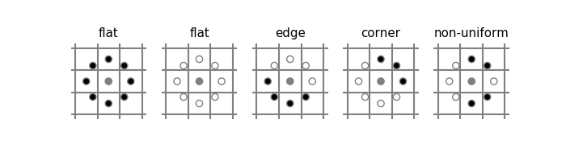
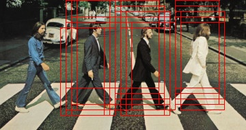
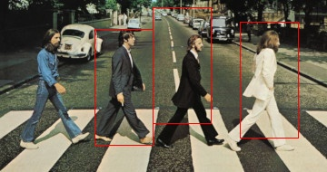
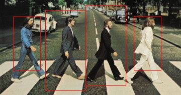
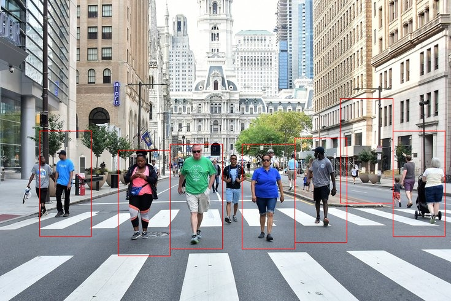

```{r setup, include=F}
knitr::opts_chunk$set(echo = TRUE)
set.seed(0)

## Package import
library(caret)
library(reticulate)
library(knitr)
library(kableExtra)
use_virtualenv("master")
```

# Introducción

En esta práctica se va a implementar un clasificador de peatones, que
nos permita distinguir imágenes de personas de imágenes de fondo. En
la primera parte se estudiarán distintas propuestas de clasificadores
de peatones, para tratar de determinar qué modelo nos permite obtener
mejores resultados a la hora de resolver este problema. Concretamente,
compararemos las características que se extraen de una imagen,
utilizando el histograma de gradientes orientados (HOG) y los patrones
binarios locales (LBP), para ver qué descriptores son más informativos
en este problema, y propondremos distintos clasificadores basados en
SVM, alterando sus parámetros.

En una segunda fase, estudiaremos algunas mejoras que pueden hacerse
al descriptor basado en LBP, combinando por un lado la información
extraída por ambos descriptores, y por otro calculando una extensión
de LBP conocida como LBP uniforme, la cual agrupa algunos de los
valores de LBP que son poco representativos con el fin de ahorrar
memoria.

Una vez seleccionado el mejor clasificador, se implementará un
detector de peatones en imágenes arbitrarias, basado en el modelo que
se haya escogido. Dicho detector recibirá una imagen de entrada
de cualquier tamaño,

## Aspectos de implementación

El código se ha desarrollado en Python3, utilizando `numpy` como
librería para cálculo numérico eficiente. La implementación base de
Python no está pensada para realizar cálculos computacionalmente
costosos, si no para simplificar la escritura de código al
programador. Esto hace que muchas operaciones no sean eficientes
cuando se implementan directamente en Python, utilizando los tipos
de datos originales del lenguaje.

La ventaja de utilizar `numpy` a la hora de realizar cálculos es la
simplicidad con la que se manejan cálculos matriciales. A fin de
cuentas, una imagen puede verse simplemente como una matriz de números
enteros (si la imagen es blanco y negro) o como un tensor (una matriz
con tres canales, si la imagen es en color). Por tanto, las
operaciones que tendremos que realizar en la mayoría de los casos
serán operaciones matriciales, las cuales podremos paralelizar
utilizando esta librería.

```{python, include=F}
TRAIN_IMAGES_FOLDER = "data/train"
TEST_IMAGES_FOLDER = "data/test"
IMG_EXTENSION = ".png"
```

El código está organizado de la siguiente manera. En el archivo
`LBP.py` se implementa el descriptor LBP y el detector basado en LBP
uniforme, cada uno de ellos estructurado como una clase.  En el
archivo `utils.py` se incluyen funciones genéricas que simplifican el
código que se adjunta en este documento (funciones para carga de
datos, cómputo de los descriptores dada una lista de imágenes,
entrenamiento y test del modelo, validación cruzada...). Este PDF
contiene los fragmentos de código que se han utilizado para generar
los resultados que en él aparecen. Para la generación de la
documentación se ha utilizado Rmarkdown junto con la librería
`reticulate`, la cual ofrece soporte para la ejecución de fragmentos
de código en Python desde Rmarkdown. Se adjunta también el código
fuente utilizado para generar este PDF, para hacer replicable la
experimentación. Además, se adjuntan tres ficheros de código Python
ejecutables:

- `hog_test.py`: Se realiza la validación cruzada utilizando el
descriptor HOG
- `lbp_test.py`: Se realiza la validación cruzada utilizando el
descriptor LBP (hay un parámetro arriba que indica si se utiliza
o no el uniforme)
- `lbp_detect.py`: Se entrena el clasificador LBP uniforme utilizando
toda la base de datos, y se detectan peatones sobre tres imágenes
distintas.

# Clasificador basado en HOG

En esta sección, estudiaremos la calidad del modelo que se nos
proporciona como ejemplo, el cual se basa en un clasificador SVM
entrenado sobre el descriptor HOG de la imagen de entrada.
Utilizaremos diversas medidas para poder comparar los resultados de
este modelo con el que obtendremos utilizando el descriptor LBP.

El conjunto de medidas que evaluaremos es el siguiente:

- Exactitud (_accuracy_): Esta medida representa la fracción del total
de ejemplos bien clasificados. Dicha medida se calcula como el número
de ejemplos bien clasificados (tanto positivos como negativos) entre
el total de ejemplos de la base de datos
- Precisión (_precision_): Es la fracción de ejemplos correctamente
clasificados entre los ejemplos predichos en la clase positiva. Da una
medida del buen comportamiento del clasificador contra los falsos
positivos.
- Sensibilidad (_recall_): Es la fracción de ejemplos correctamente
clasificados de entre todos los ejemplos positivos. Da una medida
de la capacidad de detectar correctamente a los ejemplos de la clase
positiva
- Especificidad (_specificity_): Fracción de ejemplos correctamente
clasificados entre todos los ejemplos negativos. Da una medida de la
capacidad del clasificador para descartar ejemplos negativos.
- _$F_1$-score_: Se calcula como la media armónica entre la
sensibilidad y la precisión. Da una intuición de la calidad del
clasificador a la hora de clasificar la clase positiva, dando
información agrupada sobre la capacidad de evitar los falsos positivos
y falsos negativos en relación con esta clase. Es especialmente
interesante el cómputo de esta métrica cuando existe un desbalanceo
entre clases, especialmente cuando la clase positiva es la
minoritaria, ya que otras medidas globales (como la exactitud), sufren
un sesgo importante cuando una clase tiene muchos más ejemplos que
otra. En nuestro caso, el desbalanceo no es muy acusado, pero aun así
tenemos un mayor número de ejemplos de fondo (lo que podríamos
considerar clase negativa) que de peatones, y es por esto por lo que
se ha decidido incluir esta métrica.

Dado que todas las métricas se pueden calcular a partir de la matriz
de confusión y no vienen todas implementadas por defecto en `sklearn`,
calcularemos la matriz de confusión utilizando esta librería, y a
partir de ella calcularemos las medidas que nos interesan:

```{python}
def accuracy(conf_mat):
    return (conf_mat[0,0] + conf_mat[1,1]) / np.sum(conf_mat)

def precision(conf_mat):
    return conf_mat[1,1] / np.sum(conf_mat[:,1])

def recall(conf_mat):
    return conf_mat[1,1] / np.sum(conf_mat[1,:])

def specificity(conf_mat):
    return conf_mat[0,0] / np.sum(conf_mat[0,:])

def f1score(conf_mat):
    pr = precision(conf_mat)
    rc = recall(conf_mat)
    return 2*pr*rc / (pr + rc)
```

Una vez hayamos evaluado el clasificador básico que se nos ha
proporcionado, trataremos de mejorar el mismo cambiando algunos
de los parámetros del modelo SVM que se utiliza de base.

## Evaluación sobre el conjunto de test

Dado que se nos proporcionan los conjuntos de entrenamiento y test
separados, en una primera etapa evaluaremos el clasificador sobre
dicha configuración. Entrenaremos con las imágenes de entrenamiento
y evaluaremos después sobre el test.

```{python}
import utils
import sklearn.metrics
import numpy as np
import cv2

## Cargamos las imágenes de entrenamiento y test
train_images, train_classes = utils.load_data(TRAIN_IMAGES_FOLDER, IMG_EXTENSION)
test_images, test_classes = utils.load_data(TEST_IMAGES_FOLDER, IMG_EXTENSION)

## Calculamos los descriptores HOG
train_descriptors = utils.compute_hog(train_images)
test_descriptors = utils.compute_hog(test_images)

## Entrenamos el clasificador y lo evaluamos sobre el test
classifier = utils.train(train_descriptors, train_classes)
predictions = utils.test(test_descriptors, classifier)

## Calculamos las métricas indicadas
conf_mat = sklearn.metrics.confusion_matrix(test_classes, predictions)

acc = accuracy(conf_mat)
pr = precision(conf_mat)
rc = recall(conf_mat)
spec = specificity(conf_mat)
f1 = f1score(conf_mat)
```

Mostramos toda la información calculada en la siguiente tabla:

```{r, echo=FALSE}
metrics = data.frame(Accuracy=py$acc, Precision=py$pr, Recall=py$rc,
                     Specificity=py$spec, F1=py$f1)

kable(metrics, digits=4, booktabs = TRUE) %>% kable_styling(position = "center")
```

Como podemos observar, el modelo entrenado con este descriptor obtiene
unos resultados bastante buenos. La exactitud del modelo es bastante
alta, el ratio de falsos positivos es muy bajo, como muestra la
precisión, y la especificidad es también bastante alta, es decir, es
capaz de reconocer correctamente los ejemplos negativos. La única
medida que está ligeramente más baja es la sensibilidad, es decir, la
capacidad de detectar ejemplos de la clase positiva (peatones, en
nuestro caso). No obstante, estamos hablando de un 95 % de ejemplos
correctamente detectados, lo cual no puede considerarse un mal
resultado. La puntución $F_1$ del modelo es también significativamente
alta, por lo que estamos hablando de un clasificador bastante potente.

## Validación cruzada del modelo

El resultado obtenido anteriormente puede no ser excesivamente
preciso, y deberse a una división fortuita del conjunto de test y
entrenamiento. Para evitar esta problemática y dotar de robustez a los
resultados obtenidos, se suelen evaluar los clasificadores utilizando
una estrategia de validación cruzada. Esta política consiste en
separar el conjunto de datos en $k$ particiones, y entrenar nuestro
modelo $k$ veces, utilizando cada vez una de las particiones como
conjunto de test, y las otras $k-1$ como conjunto de entrenamiento.
De esta forma, en lugar de tener información sobre resultados una sola
vez, tenemos $k$ medidas, tomadas sobre conjuntos de datos
"distintos". Así podemos hacernos una idea más fiable de la calidad
del modelo, ya que tendremos información más robusta.

Para construir los conjuntos de datos, suele utilizarse el muestreo
aleatorio estratificado. Esto significa que los ejemplos se reparten
de forma aleatoria entre los $k$ conjuntos, pero manteniendo la
proporción de ejemplos de cada clase en las particiones, para no
introducir sesgos de desbalanceo al realizar los repartos.

Queda por responder la pregunta de qué $k$ es adecuado. Si tomamos un
$k$ demasiado grande, los conjuntos de entrenamiento serán pequeños y
los resultados obtenidos en los mismos no serán muy representativos.
Si el $k$ es demasiado pequeño, tendremos pocos conjuntos y el número
de medidas tomadas será bajo, por lo que los resultados finales no
serán especialmente robustos. Empíricamente se ha determinado que un
valor de $k$ entre 5 y 10 suele ser adecuado para la mayoría de
conjuntos. Como nuestra base de datos no es especialmente grande, y en
origen se utilizaban aproximadamente un 20 % de las instancias para el
conjunto de test, seleccionaremos $k=5$ para nuestros experimentos.

Para realizar las particiones, utilizaremos la librería `sklearn`, que
trae módulos ya implementados para realizar la validación cruzada
estratificada de forma sencilla.

Otro punto que conviene remarcar es que, dado que el descriptor que
estamos utilizando no utiliza información sobre el conjunto de datos
de entrenamiento, y hemos calculado los descriptores en el apartado
anterior, aprovecharemos estos descriptores en este apartado. No
podríamos hacer esto si hiciésemos algún preprocesamiento dependiente
de los datos conjunto de entrenamiento (escalados, normalizaciones
dependientes de la distribución de las variables, PCA...), pero debido
a que no utilizamos ningún tipo de preprocesado de este tipo,
aprovechamos la información calculada previamente, ya que es
invariante, y así ahorramos tiempo de cómputo. Mostramos a
continuación el código que realiza la validación cruzada:

```{python}
import sklearn.model_selection

## Instanciamos el estratificador
skf = sklearn.model_selection.StratifiedKFold(
    n_splits=5, shuffle=True, random_state=0
)

## Agrupamos los descriptores y las etiquetas de train y test
descriptors = np.vstack((train_descriptors, test_descriptors))
labels = np.concatenate((train_classes, test_classes))

## Listas de resultados vacías
accs, prs, rcs, specs, f1s = [], [], [], [], []

## Repetimos la clasificación para cada split
for train_index, test_index in skf.split(descriptors, labels):
    train_desc, train_labs = descriptors[train_index], labels[train_index]
    test_desc, test_labs = descriptors[test_index], labels[test_index]

    classifier = utils.train(train_desc, train_labs)
    predictions = utils.test(test_desc, classifier)

    conf_mat = sklearn.metrics.confusion_matrix(test_labs, predictions)

    accs.append(accuracy(conf_mat))
    prs.append(precision(conf_mat))
    rcs.append(recall(conf_mat))
    specs.append(specificity(conf_mat))
    f1s.append(f1score(conf_mat))

accs.append(np.mean(accs))
prs.append(np.mean(prs))
rcs.append(np.mean(rcs))
specs.append(np.mean(specs))
f1s.append(np.mean(f1s))
```

Los resultados obtenidos en este caso son los siguientes:

```{r, echo=FALSE}
cv.metrics = data.frame(cbind(Accuracy=format(py$accs, digits=4),
                              Precision=format(py$prs, digits=4),
                              Recall=format(py$rcs, digits=4),
                              Specificity=format(py$specs, digits=4),
                              F1=format(py$f1s, digits=4)))

rownames(cv.metrics) <- c(1:5, "Average")

kable(cv.metrics, digits=c(4,4,4,4,4), booktabs = T) %>%
    row_spec(5, hline_after = T) %>%
    kable_styling(position = "center")
```

Podemos observar cómo los resultados que obtuvimos sobre el conjunto
de entrenamiento no eran del todo precisos. Aunque no han variado en
gran medida cuando hemos introducido la validación cruzada, en todos
los casos la medida es ligeramente inferior a la obtenida sobre el
conjunto de test. Ahora podemos estar más seguros de la robustez del
análisis previo. No comentaremos con más profundidad los valores
resultantes debido a que son muy similares a los obtenidos
anteriormente, que ya fueron comentados.

## Mejora del modelo basado en SVM

En este apartado, trataremos de mejorar el clasificador basado en SVM
que hemos estudiado en los apartados anteriores. El clasificador
utilizado hasta el momento era un clasificador basado en SVM con un
kernel lineal. Este es el kernel más simple que se utiliza con este
tipo de modelos, el cual da lugar a un clasificador lineal. Estos
modelos son capaces de aprender fronteras más complejas utilizando
funciones de distancia más sofisticadas. Dichas funciones de distancia
se corresponden con productos escalares en espacios de dimensionalidad
mayor a los de los datos de entrada. No entraremos en mayor profundidad
sobre los kernels que se utilizan ya que dicha discusión escapa de los
contenidos de esta práctica.

Probaremos a entrenar nuestra SVM con kernels complejos que suelen
utilizarse normalmente en problemas de clasificación generales. Un
conocimiento más profundo del problema y del espacio de
características con el que se trabaja podría guiar la elección del
kernel a priori, pero dado que carecemos de dicha información,
entrenaremos varios clasificadores y estudiaremos sus resultados
utilizando una estrategia de validación cruzada igual a la anterior,
seleccionando a posteriori la configuración que mejores resultados
obtenga. Los kernels que probaremos serán los siguientes:

- Kernel polinómico: Este kernel es capaz de aprender fronteras
  polinómicas. Probaremos con varios valores para el exponente,
  lo que nos permitirá aprender fronteras definidas por polinomios
  de menor o mayor grado
- Kernel gaussiano: Este kernel, también conocido cono kernel radial,
  se basa en la distribución normal. Este kernel establece una
  similaridad que decae exponencialmente al alejar los puntos, lo que
  permite crear fronteras definidas por curvas cerradas alrededor de
  los vectores de soporte. Este kernel acepta un parámetro $\gamma$,
  que define la velocidad de decaimiento del exponente. Probaremos con
  varios valores para tratar de buscar el más adecuado.

Existen una gran variedad de kernels disponibles, pero los dos
comentados anteriormente son los más utilizados. Los kernels más
complejos suelen ser diseñados con propósitos específicos para cada
problema, por lo que sin más conocimiento sobre nuestros datos,
evitaremos probar núcleos más específicos, y nos limitaremos a los dos
comentados. Para automatizar la validación cruzada que realizamos
anteriormente, hemos implementado una función que realiza el
procedimiento completo y devuelve las medidas que hemos calculado:

```{python}
## Kernel polinómico - grado 2
metrics = utils.cross_validation(descriptors, labels,
                                 svm_kernel=cv2.ml.SVM_POLY,
                                 params = {"degree": 2,"gamma": 1})
```
```{r, echo=FALSE}
parse.results <- function(python_dict){
    metrics <- data.frame(do.call(cbind, python_dict))
    metrics <- apply(metrics, 2, function(x) format(x, digits=4))
    colnames(metrics) <- names(python_dict)
    rownames(metrics) <- c(1:5, "Average")
    metrics
}

kable(parse.results(py$metrics), booktabs = T) %>%
    row_spec(5, hline_after = T) %>%
    kable_styling(position = "center")
```

Podemos ver que los resultados obtenidos por este modelo son ligeramente
mejores a los que obtenía el kernel lineal simple. Especialmente, la
precisión y la especificidad han aumentado significativamente, en un
punto porcentual en ambos casos.El resto de medidas se han visto menos
afectadas, aunque también han mejorado. Probamos ahora con polinomios de
tercer grado

```{python}
## Kernel polinómico - grado 3
metrics = utils.cross_validation(descriptors, labels,
                                 svm_kernel=cv2.ml.SVM_POLY,
                                 params = {"degree": 3,"gamma": 1})
```

```{r, echo=FALSE}
kable(parse.results(py$metrics), booktabs = T) %>%
    row_spec(5, hline_after = T) %>%
    kable_styling(position = "center")
```

Podemos observar que el modelo sigue mejorando ligeramente, aunque la
mejora es menos significativa en este caso. Hay que tener en cuenta
que aumentar el grado del kernel polinómico implica calcular potencias
de nuestros valores, por lo que el tiempo de cómputo es
mayor. Probablemente, una mejora tan poco relevante no compense el
aumento de tiempo requerido. Probamos ahora con el kernel gaussiano:

```{python}
## Kernel gaussiano - gamma = 1
metrics = utils.cross_validation(descriptors, labels,
                                 svm_kernel=cv2.ml.SVM_RBF,
                                 params = {"gamma": 1})
```

```{r, echo=FALSE}
kable(parse.results(py$metrics), booktabs = T) %>%
    row_spec(5, hline_after = T) %>%
    kable_styling(position = "center")
```

Podemos observar que los resultados obtenidos con este kernel no son
muy deseables. El algoritmo ha obtenido peores resultados en todas las
métricas, empeorando especialmente su sensibilidad, la cual puede ser
la más importante de las medidas que estamos empleando, porque nos
refleja la capacidad del algoritmo para detectar peatones presentes en
la imagen, que es a fin de cuentas la tarea que intentamos resolver.
Probaremos a tomar varios valores de $\gamma$ para tratar de obtener
mejores resultados. Tomando $\gamma = 2$, obtenemos:

```{python}
## Kernel gaussiano - gamma = 2
metrics = utils.cross_validation(descriptors, labels,
                                 svm_kernel=cv2.ml.SVM_RBF,
                                 params = {"gamma": 2})
```

```{r, echo=FALSE}
kable(parse.results(py$metrics), booktabs = T) %>%
    row_spec(5, hline_after = T) %>%
    kable_styling(position = "center")
```

Donde sufrimos un empeoramiento significativo. No parece que esta vía
sea prometedora. Finalmente, con $\gamma = 3$:

```{python}
## Kernel gaussiano - gamma = 3
metrics = utils.cross_validation(descriptors, labels,
                                 svm_kernel=cv2.ml.SVM_RBF,
                                 params = {"gamma": 3})
```

```{r, echo=FALSE}
kable(parse.results(py$metrics), booktabs = T) %>%
    row_spec(5, hline_after = T) %>%
    kable_styling(position = "center")
```

Obtenemos un resultado curioso. Ahora, el clasificador es capaz de
detectar con mucha sensibilidad los ejemplos de la clase positiva
(obteniendo resultados mucho mejores que con las otras configuraciones
de parámetros), pero a costa de perder muchísima calidad en el resto
de medidas. Concretamente, la cantidad de falsos positivos que se
cometen es notablemente alta (como podemos observar en la precisión).
La búsqueda que hemos hecho para este parámetro no ha sido
particularmente exhaustiva, pero teniendo en cuenta que es el kernel
que conlleva un cálculo más lento, y con los resultados que hemos
obtenido en las pruebas realizadas, todo parece indicar que esta
vía no es recomendable en este caso, por lo que se descarta el uso
de este tipo de núcleos para el problema que nos ocupa.

Por tanto, se concluye que el mejor núcleo encontrado para este
problema cuando se utilizan descriptores HOG es el núcleo polinómico,
escogiendo el grado 2 o 3 en función de si se requiere mayor velocidad
o precisión en el modelo.

En el siguiente apartado, probaremos a utilizar el descriptor LBP
para resolver este mismo problema, para tratar de comparar con qué
información obtiene mejores resultados el clasificador basado en SVM.

# Clasificador basado en LBP

En este apartado, vamos a implementar el descriptor LBP para cambiar
la información que recibe el clasificador basado en SVM. De esta manera,
estudiaremos cuál de los descriptores es más apropiado para resolver
nuestro problema, fijado el clasificador.

## Implementación del descriptor

En primer lugar, vamos a comentar la implementación de este descriptor.
OpenCV no incorpora LBP entre sus descriptores, por lo que tendremos
que programarlo nosotros.

La implementación básica del descriptor supone, dada una imagen, iterar
sobre todos los píxeles de la misma, y para cada píxel calcular su LBP.
Una vez calculado el descriptor LBP de cada pixel, podemos calcular el
descriptor para cada bloque iterando sobre los mismos y calculando
el histograma de descriptores. Una vez calculados los histogramas para
cada bloque de la imagen, se concatenan todos los histogramas por orden
para obtener el descriptor completo de la imagen.

El problema de la implementación anterior es el cálculo de LBP para
cada píxel. Dado que la práctica se ha implementado en Python, el
hecho de iterar sobre todos los píxeles es muy lento, ya que el uso de
bucles está poco optimizado. Para evitar tener que iterar sobre todos
los píxeles de la imagen, se ha estudiado cómo implementar el
descriptor en términos de operaciones matriciales. De esta forma,
podemos utilizar la potencia de cálculo numérico de `numpy`, y
realizar los cálculos de forma mucho más rápida.

La implementación que se ha realizado, finalmente, se basa en la
siguiente idea. Podemos calcular el descriptor del píxel $i,j$ viendo
el valor de la posición $i,j$ en 8 matrices distintas. Dada $I$ la
imagen original, y sea $I_{i,j}$ la imagen en la que se han movido las
filas $i$ posiciones hacia abajo (colocando las últimas arriba) y las
columnas $j$ posiciones hacia la derecha (colocando las más a la
derecha a la izquierda). Dado $i$ o $j$ negativos, la idea es la misma,
salvo que el desplazamiento es en la dirección contraria. Podemos ver
la matriz original como $I_{0,0}$. Las 8 matrices que tenemos que calcular
son:

- $I \geq I_{1,1}$
- $I \geq I_{1,0}$
- $I \geq I_{1,-1}$
- $I \geq I_{0,-1}$
- $I \geq I_{-1,-1}$
- $I \geq I_{-1,0}$
- $I \geq I_{-1,1}$
- $I \geq I_{0,1}$

De esta forma, el bit $k$-ésimo del descriptor LBP para cada pixel
$i,j$ de la matriz original será el pixel $i,j$ en la matriz $k$-ésima
anterior. En los bordes, el cálculo no es exactamente correcto, ya que
estamos disponiendo la imagen cíclicamente, es decir, algunos de los
píxeles adyacentes al borde se sitúan en el extremo opuesto de la
imagen, pero dado que en el borde hay 380 píxeles, no representan ni
el 5 % de los píxeles totales, por lo que daremos la solución como
suficientemente buena. Se pueden explorar otras formas de rellenar los
bordes de la matriz desplazada con otra política, pero la mejora, en
caso de existir, sería poco relevante, por lo que no se ha realizado
dicho estudio.

Por tanto, podemos calcular todos los descriptores LBP de la imagen
haciendo las 8 diferencias de matrices anteriores, y colocándolas
formando un tensor de tamaño $8 \times 128 \times 64$.  Una vez
tenemos dicho tensor, podemos reducir la primera componente
aprovechando las reglas de difusión (_broadcast_) de valores de
`numpy`, multiplicando la matriz por otro tensor de dimensiones $8
\times 1 \times 1$, cuyos valores sean las potencias de 2 en orden
descendente, del 128 al 1. Así conseguimos dar a cada píxel del tensor
el valor correspondiente en notación decimal a su posición dentro del
descriptor final que queremos conseguir. Finalmente, sólo nos queda
reducir el tensor a una matriz de tamaño $128 \times 64$ sumando todos
los canales en la primera componente.

Una vez tenemos el valor del descriptor LBP para cada píxel, sólo
tenemos que calcular el histograma para cada bloque. Esta operación es
mucho menos costosa, y podemos hacerla recorriendo la matriz bloque a
bloque. Trabajamos con bloques de tamaño $16 \times 16$ y con un
incremento en ambas direcciones de 8 píxeles, para que haya un
solapamiento entre los bloques calculados. El histograma de la imagen
final será la concatenación de los histogramas de cada bloque. Aunque
el orden en el que se concatenan los histogramas es indiferente a
priori, debe ser consistente en todos los ejemplos de la base de
datos.  Por convención, se suele iterar sobre la imagen desde la
esquina superior izquierda hasta la inferior derecha, primero en
horizontal y después en vertical.


El código que se ha desarrollado sigue la misma estructura que tienen
los descriptores en la librería OpenCV. Se ha implementado una clase
que encapsula los parámetros con los que se trabaja (tamaño de bloque
en las direcciones x e y (16 en nuestro caso), incremento en ambas
direcciones (8 en nuestro caso) y tamaño de la ventana ($128 \times
64$). Una vez creado un objeto de la clase con los
parámetros que nos interesan, podemos llamar a la función `compute`
con la imagen a la que queremos calcular los descriptores como
parámetro y se nos devuelve el descriptor de la imagen completa.
De esta forma, podemos calcular los descriptores de la misma forma
que hicimos para HOG, cambiando simplemente el objeto que se encarga
del cálculo.

## Evaluación del clasificador sobre el conjunto de test

Al igual que hicimos para HOG, comenzaremos evaluando el modelo basado
en SVM sobre los descriptores LBP de las imágenes sobre las particiones
de entrenamiento y test que se nos proporcionan.

Se ha implementado una función en el archivo `utils` que nos permite
calcular directamente los descriptores dado un conjunto de datos.
Aprovechamos las imágenes que cargamos al principio:

```{python}
## Calculamos los descriptores LBP
train_descriptors = utils.compute_lbp(train_images)
test_descriptors = utils.compute_lbp(test_images)

## Entrenamos el clasificador y lo evaluamos sobre el test
classifier = utils.train(train_descriptors, train_classes)
predictions = utils.test(test_descriptors, classifier)

## Calculamos las métricas indicadas
conf_mat = sklearn.metrics.confusion_matrix(test_classes, predictions)

acc = accuracy(conf_mat)
pr = precision(conf_mat)
rc = recall(conf_mat)
spec = specificity(conf_mat)
f1 = f1score(conf_mat)
```

Mostramos las métricas en una tabla:

```{r, echo=FALSE}
metrics = data.frame(Accuracy=py$acc, Precision=py$pr, Recall=py$rc,
                     Specificity=py$spec, F1=py$f1)

kable(metrics, digits=4, booktabs = TRUE) %>% kable_styling(position = "center")
```

Podemos observar que los resultados obtenidos son ligeramente mejores
en este caso que los que obteníamos con el descriptor HOG sobre el
conjunto de test. Como ya comentamos previamente, estos resultados no
son especialmente significativos, ya que son muy dependientes de cómo
se haya hecho la partición del conjunto de datos. Para evitar este
sesgo, vamos a realizar el mismo estudio utilizando la estrategia de
validación cruzada.

## Evaluación del modelo con validación cruzada

Como hemos dicho anteriormente, es posible que los resultados
obtenidos no sean estadísticamente significativos, así que evaluaremos
el algoritmo con una estrategia de validación cruzada. Para que los
resultados sean directamente comparables, hemos configurado el
estratificador para que devuelva las mismas particiones en cada
llamada, fijando la semilla interna del mismo. De esta forma,
la comparativa entre ambos modelos es más fiable:

```{python}
## Agrupamos los descriptores LBP y las etiquetas de train y test
descriptors = np.vstack((train_descriptors, test_descriptors))
labels = np.concatenate((train_classes, test_classes))

## Kernel lineal
metrics = utils.cross_validation(descriptors, labels,
                                 svm_kernel=cv2.ml.SVM_LINEAR,
)
```

```{r, echo=FALSE}
kable(parse.results(py$metrics), booktabs = T) %>%
    row_spec(5, hline_after = T) %>%
    kable_styling(position = "center")
```

Obtenemos un resultado bastante curioso, en este caso. Las métricas
son ligeramente más altas en el caso de la validación cruzada que
cuando evaluamos sobre el conjunto de test, al contrario de lo que nos
ocurría con el descriptor HOG. Si hubiésemos utilizado exclusivamente
la información sobre el conjunto de test, podríamos haber concluido
que con ambos descriptores se obtenían resultados más o menos
similares, pero una vez que hacemos validación cruzada, parece sensato
concluir que con el clasificador SVM lineal, el descriptor LBP
funciona mejor para distinguir peatones que el descriptor
HOG. Especialmente, se ha mejorado la exactitud, lo que implica que
reconocemos correctamente más ejemplos sobre el total, y la
sensibilidad, lo que nos dice que este modelo distingue mejor la clase
positiva que el anterior.

Al igual que hicimos anteriormente, vamos a intentar mejorar el
clasificador que utilizamos, cambiando la función kernel junto con
sus parámetros.

## Mejora del clasificador basado en SVM

Al igual que hicimos con el descriptor HOG, vamos a intentar optimizar
los parámetros del clasificador SVM para obtener mejores resultados.
Las configuraciones que probaremos serán las mismas que utilizamos
en el caso anterior. Comenzamos con el kernel polinómico con distintos
valores para el exponente:

```{python}
## Kernel polinómico - grado 2
metrics = utils.cross_validation(descriptors, labels,
                                 svm_kernel=cv2.ml.SVM_POLY,
                                 params = {"degree": 2,"gamma": 1})
```
```{r, echo=FALSE}
kable(parse.results(py$metrics), booktabs = T) %>%
    row_spec(5, hline_after = T) %>%
    kable_styling(position = "center")
```

Vemos que con este nuevo kernel se produce una pequeña mejora, aunque
es menos acusada que la que obtuvimos para el caso de HOG. Esto puede
deberse, en parte, a que los resultados de partida eran mejores, por
lo que el margen de mejora es bastante bajo. Probamos a aumentar
el grado del polinomio, al igual que hicimos anteriormente:

```{python}
## Kernel polinómico - grado 3
metrics = utils.cross_validation(descriptors, labels,
                                 svm_kernel=cv2.ml.SVM_POLY,
                                 params = {"degree": 3,"gamma": 1})
```

```{r, echo=FALSE}
kable(parse.results(py$metrics), booktabs = T) %>%
    row_spec(5, hline_after = T) %>%
    kable_styling(position = "center")
```

En este caso, los resultados obtenidos son peores para todas las
medidas, a excepción de la sensibilidad. Además, el tiempo de cálculo
aumenta cuando se utilizan polinomios de grado mayor, por lo que no
parece sensato aumentar este valor, y conviene utilizar el kernel
polinómico de grado dos.

Pasamos ahora a ver los resultados obtenidos cuando utilizamos el
kernel gaussiano:

```{python}
## Kernel gaussiano - gamma = 1
metrics = utils.cross_validation(descriptors, labels,
                                 svm_kernel=cv2.ml.SVM_RBF,
                                 params = {"gamma": 1})
```

```{r, echo=FALSE}
kable(parse.results(py$metrics), booktabs = T) %>%
    row_spec(5, hline_after = T) %>%
    kable_styling(position = "center")
```

```{python}
## Kernel gaussiano - gamma = 2
metrics = utils.cross_validation(descriptors, labels,
                                 svm_kernel=cv2.ml.SVM_RBF,
                                 params = {"gamma": 2})
```

```{r, echo=FALSE}
kable(parse.results(py$metrics), booktabs = T) %>%
    row_spec(5, hline_after = T) %>%
    kable_styling(position = "center")
```

```{python}
## Kernel gaussiano - gamma = 3
metrics = utils.cross_validation(descriptors, labels,
                                 svm_kernel=cv2.ml.SVM_RBF,
                                 params = {"gamma": 3})
```

```{r, echo=FALSE}
kable(parse.results(py$metrics), booktabs = T) %>%
    row_spec(5, hline_after = T) %>%
    kable_styling(position = "center")
```

Ahora, obtenemos un resultado muy curioso en los tres casos. El
algoritmo en este caso sobreaprende la clase positiva, pero desprecia
completamente la clase negativa. Este modelo, por tanto, no nos permite
discriminar entre peatones y fondo, ya que la cantidad de falsos
positivos es muy alta. En particular, para 3 de las 5 particiones,
no se llega a reconocer ningún elemento del conjunto de test como
fondo, y en los otros dos casos, apenas se encuentra ninguno. De nuevo,
no seguiremos explorando esta vía dada su complejidad computacional,
unido a los malos resultados que se obtienen.

Podemos concluir, tras este estudio, que LBP parece tener un mejor
comportamiento que HOG a la hora de clasificar peatones utilizando
clasificadores SVM, a pesar de que los resultados obtenidos utilizando
ambos descriptores son realmente buenos. Además, la utilización de un
kernel lineal o un kernel polinómico de segundo grado es suficiente, y
el uso de kernels polinómicos de grado mayor, o kernels gaussianos,
aumenta innecesariamente la complejidad de los cálculos sin producir
una mejora sustancial en los resultados, a veces incluso empeorando
la calidad del clasificador.

En la siguiente sección, comprobaremos si podemos mejorar los resultados
obtenidos con estrategias distintas

# Mejoras sobre el clasificador

En esta sección, vamos a estudiar posibles mejoras que pueden hacerse
a nuestro clasificador. En primer lugar, implementaremos una
modificación de LBP conocido como LBP uniforme. A continuación,
veremos si el agrupamiento de ambos descriptores (HOG y LBP) aporta
una serie de características más robusta a la clasificación y
conseguimos mejorar los resultados aún más.

Comenzamos con la implementación de LBP uniforme.

## LBP uniforme

LBP uniforme es una modificación de LBP clásico que se basa en
estudiar la frecuencia de aparición de los distintos descriptores
dentro de las imágenes de textura. Si se estudian los distintos
patrones posibles que detecta el algoritmo LBP, se pueden reconocer
los patrones que hacen referencia a superficies lisas, líneas y
esquinas más o menos cerradas. A continuación se muestran algunos
ejemplos:



Si nos fijamos en el último ejemplo, etiquetado como non-uniform,
resulta complicado imaginar en qué contexto puede darse un patrón de
píxeles que pueda dar lugar a esta posible configuración. De la misma
manera ocurre con todos los patrones etiquetados como no uniformes,
que son aquellos en los que hay dos o más grupos de valores 1
separados por valores 0 (se suele definir también como aquellos en los
que hay más de dos transiciones 0 a 1 o 1 a 0). En concreto, en
[@ojala2002multiresolution], artículo que define este descriptor, se
estudia que en las imágenes de textura, aproximadamente el 90 % de los
descriptores que se obtienen son del tipo uniforme cuando se
consideran los 8 píxeles adyacentes, mientras que el otro 10 % no lo
son. Cuando se utilizan grupos de píxeles más grandes, por ejemplo, se
utilizan los píxeles a distancia 2, la proporción se regula
ligeramente, pero sigue habiendo muchos más descriptores uniformes que
no uniformes.

La propuesta consiste en unificar todos los descriptores no uniformes
en un único código. De esta manera, en lugar de tener 256 códigos
distintos, tenemos sólamente 59. De esta forma, en lugar de tener,
para cada imagen, $105 \times 256 = 26880$ características,
correspondientes a los 256 valores de los histogramas de los 105
bloques, tenemos $105 \times 59 = 6195$, lo cual supone reducir en un
factor de 4 la cantidad de información almacenada, y por ende, el
tamaño del conjunto de datos que tiene que manejar el clasificador.
Esto se traduce en un aumento de la eficiencia del modelo. Si esta
reducción de información no produce un empeoramiento significativo
en la precisión del clasificador, habremos obtenido un modelo mucho
más interesante.

En cuanto a la implementación de este descriptor, tenemos una lista de
256 elementos como atributo de la clase LBPDescriptor, la cual tiene
en la posición $i$-ésima el código de LBP uniforme que corresponde con
el código LBP $i$. De esta forma, con el indexado con vectores de
`numpy` podemos sustituir los valores de la matriz original con los
descriptores LBP con los descriptores LBP uniformes de forma
sencilla. A la hora de instanciar la clase, se ha añadido un parámetro
más, `uniform`, el cual nos permite especificar si se va a calcular el
descriptor uniforme o el clásico. Por defecto, este valor es falso,
para que todo el código desarrollado hasta el momento tenga el mismo
funcionamiento, pero podamos añadir la funcionalidad del descriptor
LBP uniforme sin tener que reescribir la clase. Dicho parámetro se ha
incorporado también a la función que calcula los descriptores LBP en
el archivo `utils`. Al igual que hicimos anteriormente, vamos a
estudiar el comportamiento de este nuevo descriptor sobre el conjunto
de test:

```{python}
## Calculamos los descriptores LBP uniformes
train_descriptors = utils.compute_lbp(train_images, uniform=True)
test_descriptors = utils.compute_lbp(test_images, uniform=True)

## Entrenamos el clasificador y lo evaluamos sobre el test
classifier = utils.train(train_descriptors, train_classes)
predictions = utils.test(test_descriptors, classifier)

## Calculamos las métricas indicadas
conf_mat = sklearn.metrics.confusion_matrix(test_classes, predictions)

acc = accuracy(conf_mat)
pr = precision(conf_mat)
rc = recall(conf_mat)
spec = specificity(conf_mat)
f1 = f1score(conf_mat)
```

Y mostramos las métricas obtenidas en una tabla:

```{r, echo=FALSE}
metrics = data.frame(Accuracy=py$acc, Precision=py$pr, Recall=py$rc,
                     Specificity=py$spec, F1=py$f1)

kable(metrics, digits=4, booktabs = TRUE) %>% kable_styling(position = "center")
```

Podemos observar que los resultados son ligeramente peores que los
obtenidos con el descriptor clásico. La sensibilidad del modelo se ha
mantenido, pero el resto de medidas han sufrido un ligero
empeoramiento.  No obstante, dicha pérdida de rendimiento no supone ni
un punto porcentual en ninguna de las medidas, por lo que, en función
de la aplicación que vayamos a darle a nuestro modelo, puede ser
interesante tener en cuenta la mejora al haberse reducido por cuatro
la información almacenada.

Ejecutamos el modelo utilizando una estrategia de validación cruzada
para garantizar la robustez de los resultados obtenidos:

```{python}
## Agrupamos los descriptores LBP uniformes y las etiquetas de train y test
descriptors = np.vstack((train_descriptors, test_descriptors))
labels = np.concatenate((train_classes, test_classes))

## Kernel lineal
metrics = utils.cross_validation(descriptors, labels,
                                 svm_kernel=cv2.ml.SVM_LINEAR,
)
```

```{r, echo=FALSE}
kable(parse.results(py$metrics), booktabs = T) %>%
    row_spec(5, hline_after = T) %>%
    kable_styling(position = "center")
```

Cuando comprobamos los resultados obtenidos tras la validación
cruzada, observamos que las diferencias entre ambos descriptores se
han reducido significativamente. De hecho, el descriptor uniforme
arroja mejores resultados que el descriptor clásico en términos de
precisión y especificidad, lo que nos hace considerar esta alternativa
como más interesante incluso que anteriormente.

Al igual que hicimos con los modelos anteriores, trataremos de
utilizar distintos tipos de kernels y configuraciones de parámetros
para tratar de obtener el mejor modelo posible:

```{python}
## Kernel polinómico - grado 2
metrics = utils.cross_validation(descriptors, labels,
                                 svm_kernel=cv2.ml.SVM_POLY,
                                 params = {"degree": 2,"gamma": 1})
```
```{r, echo=FALSE}
kable(parse.results(py$metrics), booktabs = T) %>%
    row_spec(5, hline_after = T) %>%
    kable_styling(position = "center")
```

```{python}
## Kernel polinómico - grado 3
metrics = utils.cross_validation(descriptors, labels,
                                 svm_kernel=cv2.ml.SVM_POLY,
                                 params = {"degree": 3,"gamma": 1})
```

```{r, echo=FALSE}
kable(parse.results(py$metrics), booktabs = T) %>%
    row_spec(5, hline_after = T) %>%
    kable_styling(position = "center")
```

En la misma línea que hemos venido estudiando hasta el momento, el uso
de un kernel polinómico de grado 2 mejora los resultados ligeramente
respecto al uso de un kernel lineal, pero cuando consideramos un kernel
de grado 3 el modelo sobreajusta la clase positiva (se llega a una
sensibilidad media del 99 %), y se produce un empeoramento para un
gran número de medidas.

Para el kernel gaussiano:

```{python}
## Kernel gaussiano - gamma = 1
metrics = utils.cross_validation(descriptors, labels,
                                 svm_kernel=cv2.ml.SVM_RBF,
                                 params = {"gamma": 1})
```

```{r, echo=FALSE}
kable(parse.results(py$metrics), booktabs = T) %>%
    row_spec(5, hline_after = T) %>%
    kable_styling(position = "center")
```

```{python}
## Kernel gaussiano - gamma = 2
metrics = utils.cross_validation(descriptors, labels,
                                 svm_kernel=cv2.ml.SVM_RBF,
                                 params = {"gamma": 2})
```

```{r, echo=FALSE}
kable(parse.results(py$metrics), booktabs = T) %>%
    row_spec(5, hline_after = T) %>%
    kable_styling(position = "center")
```

```{python}
## Kernel gaussiano - gamma = 3
metrics = utils.cross_validation(descriptors, labels,
                                 svm_kernel=cv2.ml.SVM_RBF,
                                 params = {"gamma": 3})
```

```{r, echo=FALSE}
kable(parse.results(py$metrics), booktabs = T) %>%
    row_spec(5, hline_after = T) %>%
    kable_styling(position = "center")
```

Obtenemos los mismos resultados que con el descriptor LBP clásico,
descartando por completo esta vía para el problema que tratamos de
resolver.

Pasamos a proponer una nueva mejora sobre el modelo que hemos
desarrollado hasta el momento. Fusionaremos la información extraída
por ambos descriptores y aprenderemos el modelo sobre la información
conjunta.

## Fusión de descriptores

En este apartado, estudiaremos el comportamiento del clasificador
cuando fusionamos información extraída por ambos descriptores.
Para acelerar los cálculos utilizaremos el descriptor LBP uniforme,
en lugar del clásico, ya que los resultados que se obtienen en ambos
casos son similares y el tamaño del uniforme es cuatro veces menor.

Al igual que hicimos en los apartados anteriores, evaluaremos sobre el
conjunto de test en primer lugar, con una estrategia de validación
cruzada, y con las distintas mejoras que se proponen al modelo.

Comenzamos evaluando el modelo sobre el conjunto de test:

```{python}
## Calculamos los descriptores LBP uniformes
train_descriptors_lbp = utils.compute_lbp(train_images, uniform=True)
test_descriptors_lbp = utils.compute_lbp(test_images, uniform=True)

## Calculamos los descriptores HOG
train_descriptors_hog = utils.compute_hog(train_images).reshape(4306,-1)
test_descriptors_hog = utils.compute_hog(test_images).reshape(1100,-1)

## Fusionamos los descriptores
train_descriptors = np.hstack((train_descriptors_lbp, train_descriptors_hog))
test_descriptors = np.hstack((test_descriptors_lbp, test_descriptors_hog))

## Entrenamos el clasificador y lo evaluamos sobre el test
classifier = utils.train(train_descriptors, train_classes)
predictions = utils.test(test_descriptors, classifier)

## Calculamos las métricas indicadas
conf_mat = sklearn.metrics.confusion_matrix(test_classes, predictions)

acc = accuracy(conf_mat)
pr = precision(conf_mat)
rc = recall(conf_mat)
spec = specificity(conf_mat)
f1 = f1score(conf_mat)
```

Y mostramos las métricas obtenidas en una tabla:

```{r, echo=FALSE}
metrics = data.frame(Accuracy=py$acc, Precision=py$pr, Recall=py$rc,
                     Specificity=py$spec, F1=py$f1)

kable(metrics, digits=4, booktabs = TRUE) %>% kable_styling(position = "center")
```

Podemos observar que los resultados obtenidos son muy similares a los
obtenidos con el descriptor LBP uniforme del apartado anterior. Comprobamos
a continuación si dichos resultados se mantienen en la validación cruzada:

```{python}
## Agrupamos los descriptores y las etiquetas de train y test
descriptors = np.vstack((train_descriptors, test_descriptors))
labels = np.concatenate((train_classes, test_classes))

## Kernel lineal
metrics = utils.cross_validation(descriptors, labels,
                                 svm_kernel=cv2.ml.SVM_LINEAR,
)
```

```{r, echo=FALSE}
kable(parse.results(py$metrics), booktabs = T) %>%
    row_spec(5, hline_after = T) %>%
    kable_styling(position = "center")
```

Podemos comprobar que los resultados se mantienen cuando aplicamos la
estrategia de validación cruzada. Cuando hemos evaluado sobre el
conjunto de test, todas las medidas eran ligeramente inferiores para
la fusión de descriptores que para el descriptor LBP uniforme. Ahora,
en cambio, hay medidas en las que se comporta mejor un modelo y
medidas en las que obtiene mejores resultados el otro. No obstante,
las diferencias son tan pequeñas que no parece interesante este nuevo
enfoque, ya que el tamaño del descriptor de las imágenes ha aumentado
significativamente, y los resultados no mejoran en consonancia.

Comprobamos a continuación si una variación en los núcleos utilizados
producen una mejora, como hemos estudiado en las modificaciones
anteriores:


```{python}
## Kernel polinómico - grado 2
metrics = utils.cross_validation(descriptors, labels,
                                 svm_kernel=cv2.ml.SVM_POLY,
                                 params = {"degree": 2,"gamma": 1})
```
```{r, echo=FALSE}
kable(parse.results(py$metrics), booktabs = T) %>%
    row_spec(5, hline_after = T) %>%
    kable_styling(position = "center")
```

```{python}
## Kernel polinómico - grado 3
metrics = utils.cross_validation(descriptors, labels,
                                 svm_kernel=cv2.ml.SVM_POLY,
                                 params = {"degree": 3,"gamma": 1})
```

```{r, echo=FALSE}
kable(parse.results(py$metrics), booktabs = T) %>%
    row_spec(5, hline_after = T) %>%
    kable_styling(position = "center")
```

Con los kernels polinómicos obtenemos unos resultados similares a los
obtenidos hasta el momento. El modelo que utiliza el núcleo con grado
2 obtiene unos resultados ligeramente mejores que cuando se utiliza un
kernel lineal, y dichos resultados empeoran ligeramente cuando se
aumenta el grado a 3. Tanto con LBP uniforme como con la fusión de
descriptores se consiguen unos resultados parecidos. La única
diferencia significativa reside en el hecho de que los resultados con
el kernel de grado 3 se ven menos perjudicados cuando se utilizan los
descriptores fusionados. Esto nos hace pensar que este enfoque
consigue una representación más robusta, menos dependiente del
clasificador, y por tanto más deseable. No obstante, no parece
justificación suficiente para preferir este enfoque al anterior,
teniendo en cuenta que la cantidad de cálculos necesarios ha aumentado
significativamente, ya que hay que calcular ambos descriptores para cada
imagen.

Finalmente, aplicando el kernel gaussiano:

```{python}
## Kernel gaussiano - gamma = 1
metrics = utils.cross_validation(descriptors, labels,
                                 svm_kernel=cv2.ml.SVM_RBF,
                                 params = {"gamma": 1})
```

```{r, echo=FALSE}
kable(parse.results(py$metrics), booktabs = T) %>%
    row_spec(5, hline_after = T) %>%
    kable_styling(position = "center")
```

```{python}
## Kernel gaussiano - gamma = 2
metrics = utils.cross_validation(descriptors, labels,
                                 svm_kernel=cv2.ml.SVM_RBF,
                                 params = {"gamma": 2})
```

```{r, echo=FALSE}
kable(parse.results(py$metrics), booktabs = T) %>%
    row_spec(5, hline_after = T) %>%
    kable_styling(position = "center")
```

```{python}
## Kernel gaussiano - gamma = 3
metrics = utils.cross_validation(descriptors, labels,
                                 svm_kernel=cv2.ml.SVM_RBF,
                                 params = {"gamma": 3})
```

```{r, echo=FALSE}
kable(parse.results(py$metrics), booktabs = T) %>%
    row_spec(5, hline_after = T) %>%
    kable_styling(position = "center")
```

Obtenemos unos resultados iguales a los anteriores. El hecho de
incluir información extraída con el descriptor HOG a la hora de llevar
a cabo la clasificación no es suficiente, y el modelo sigue
sobreajustando la clase positiva y obteniendo unos resultados pésimos,
independientemente del parámetros $\gamma$ que se utilice.

Como conclusión al estudio, parece que el descriptor LBP uniforme es
el más adecuado para la resolución del problema que nos
ocupa. Consigue unos resultados similares a los que obtiene el
clasificador LBP clásico, pero con la salvedad de requerir cuatro
veces menos información, lo que se traduce en un aumento de
rendimiento del sistema completo. En cuanto al clasificador utilizado,
parece interesante la utilización de una SVM con kernel lineal o
polinómico de grado 2, prefiriéndose el primero si los requerimientos
temporales son importantes, y el segundo si la restricción temporal
es poco relevante, pero se requiere un clasificador con una mejor
tasa de acierto.

En la siguiente sección, vamos a aplicar el clasificador basado en
LBP uniforme con kernel polinómico de grado 2 para la detección de
peatones dentro de una imagen.

# Detección de peatones en imágenes de mayor tamaño

En las secciones anteriores hemos estudiado siempre el problema de
clasificación, estudiando qué modelos conseguían mejores resultados
sobre nuestro conjunto de datos. En esta sección vamos a utilizar uno
de estos clasificadores para resolver una tarea ligeramente distinta.
En lugar de clasificar imágenes completas, ahora trataremos de
encontrar peatones en una imagen de mayor tamaño. A grandes rasgos, el
algoritmo consistirá en proponer múltiples regiones de la imagen que
queremos estudiar, adaptar dichas regiones al tamaño adecuado para
nuestro clasificador, y clasificarlas con el mismo. Si el modelo
clasifica el parche dentro de la clase de peatones, significa que en
dicho parche se ha detectado una persona, y se añade dicho parche
a la salida del algoritmo.

## Entrenamiento del clasificador

El detector que hemos implementado se basa en el uso de un
clasificador sobre una ventana deslizante sobre la imagen. Haciendo
uso de los estudios de los apartados previos, se ha decidido que el
mejor modelo encontrado es el que utiliza el descriptor LBP uniforme
con un kernel polinómico de segundo grado. Para aprovechar toda la
información posible, se utiliza como conjunto de entrenamiento la
unión de los conjuntos de entrenamiento y test que se nos
proporcionaron originalmente. De esta forma, el clasificador estará
entrenado con la máxima información disponible, una vez que hemos
fijado qué clasificador tiene un mejor comportamiento con nuestros
datos.

## Implementación del detector

El detector está implementado dentro del archivo `LBP.py`, con el
nombre de `LBPDetector`. Cuando se inicializa el detector, se deben
especificar los mismos parámetros que indicábamos para el extractor
del descriptor HOG (tamaño de bloque, ventana y desplazamiento para
los bloques tanto en la dirección de X como la dirección de Y), junto
con el slide que va a utilizarse sobre la imagen, y el detector basado
en LBP uniforme preentrenado.

El funcionamiento básico del detector es sencillo. Dada una imagen de
entrada, se itera sobre ventanas de tamaño $128 \times 64$ (tamaño de
las imágenes de entrenamiento). Se clasifica cada ventana utilizando
el clasificador preentrenado, y se conservan las coordenadas de las
ventanas que se han clasificado dentro de la clase positiva. Con este
primer clasificador, el resultado obtenido es el siguiente:

[ width=80% }

Podemos observar que hay un claro problema. Parece que el detector
funciona más o menos correctamente, aunque no ha sido capaz de
detectar al último peatón. No obstante, tenemos multitud de ventanas
para cada uno de los peatones detectados. Esto se debe a que hay un
porcentaje importante de solapamiento entre una ventana y la siguiente
(la ventana tiene un tamaño de $128 \times 64$, y en el ejemplo
anterior se desplaza 8 píxeles en horizontal y vertical mientras se
itera). Esto implica que la misma persona ocupará múltiples ventanas
que se predecirán como clase positiva. La forma de afrontar esta
problemática ha sido la supresión de no-máximos.

## Supresión de no-máximos

El enfoque que se ha dado a esta problemática es el siguiente. El
clasificador basado en SVM es capaz de predecir no sólo la clase de la
ventana con la que se trabaja, si no dar una medida de distancia entre
el ejemplo que estamos clasificando y la frontera de decisión
aprendida. De esta manera, podemos obtener, no sólo una clasificación,
sino una forma de ordenar las detecciones.

En particular, haciendo un estudio sobre nuestro clasificador, los
ejemplos que pertenecen a la clase positiva tienen una distancia
negativa a la frontera de clasificación. Por tanto, cuanto menor sea
este valor, más lejos nos encontraremos del 0, y por tanto más seguros
estaremos de la clase que hemos asignado. Lo que hacemos para eliminar
las detecciones sobrantes es lo siguiente:

- Llevamos a cabo la detección en toda la imagen.
- Para las detecciones que se han clasificado en la clase positiva,
  calculamos el ratio de solapamiento entre cada par de detecciones
    - Si dos detecciones están solapadas más de un cierto valor,
    conservamos la detección que tiene mayor distancia a la frontera
    de clasificación
    - Si el solapamiento es menor, conservamos ambas

De esta manera, podemos eliminar todas las detecciones que engloban
a un mismo individuo salvo una, que es la que se ha predicho con
una seguridad mayor. Una vez llevamos a cabo esta etapa, el resultado
sobre la imagen anterior es el siguiente:

{ width=80% }

Podemos comprobar que ha mejorado sustancialmente el resultado del
modelo. Ahora pasamos a tener una única caja por individuo, en lugar
de las múltiples cajas que teníamos previamente. No obstante, el
modelo sigue sin detectar al primero de los peatones, ya que no hemos
añadido ninguna directiva que aumente el número de detecciones.

En la siguiente sección veremos cómo podemos mejorar el resultado
obtenido por el modelo buscando a diferentes escalas en la imagen.

## Búsqueda de peatones a distintas escalas

En el modelo que hemos desarrollado hasta el momento, sólamente se
encontraban peatones a escala original, es decir, sólo se buscaban
peatones en la imagen de entrada, sin tener en cuenta que puede
haber personas con distintos tamaños presentes en la imagen. Esto
puede dar lugar a que no encontremos algunos individuos por aparecer
demasiado pequeños o demasiado grandes en la imagen.

Para evitar esta problemática, se ha implementado un detector a varias
escalas. En el método de detección se permite especificar una lista de
tamaños a los que se escalará la imagen para buscar individuos.  Para
cada tamaño especificado, se reescala la imagen, se lleva a cabo la
detección en dicho tamaño, y para los peatones detectados se traduce
la caja detectada a coordenadas de la imagen original. Cabe remarcar
que el proceso de detección es el mismo en todos los casos, es decir,
la ventana que se desliza por la imagen, independientemente de la
escala, es del mismo tamaño. De esta manera, si se escala la imagen
a un tamaño menor, la ventana tenderá a ocupar una porción más grande
de la imagen, y por tanto podremos detectar peatones de gran tamaño
en la imagen original. Si por el contrario, la imagen se transforma
a un tamaño mayor, conseguiremos encontrar peatones de tamaño pequeño
en la imagen original.

Ahora, la supresión de no-máximos se realiza al final. Una vez se han
llevado a cabo las detecciones en todas las escalas, se unifican las
cajas obtenidas en un único vector, con las coordenadas de las mismas
adaptadas al tamaño original de la imagen. Una vez unificadas, se
realiza la supresión de no-máximos, para eliminar posibles detecciones
de un mismo individuo a diferentes escalas. En la imagen siguiente
puede verse el resultado obtenido tras implementar el clasificador
multiescala:

{ width=80% }

En la imagen podemos observar que se han encontrado los cuatro
peatones, aunque el resultado es mejorable para el primero y el
último, ya que la caja que los señala no los engloba perfectamente.

Estudiamos el comportamiento del detector sobre otras imágenes:

{ width=80% }

Podemos observar que el clasificador tiene un comportamiento bastante
aceptable, y es capaz de detectar a un número importante de individuos
en la imagen anterior. No obstante, podemos observar que comete
algunos errores. A las personas de la parte derecha, las coloca a las
tres (el niño de la mano del padre y la mujer con el carro) dentro de
la misma caja. Esto se puede deber a que no se ha establecido un nivel
de zoom lo suficientemente fino como para encontrar cajas que los
engloben por separado. Por otra parte, hay dos individuos, el central
de camiseta oscura y el chico de más a la izquierda, que no son
detectados. Probablemente, esto se deba a la etapa de supresión de
no-máximos. Dado que hay personas que están muy cerca, es probable que
el grado de solapamiento entre sus cajas sea alto, y por tanto, el
algoritmo de supresión de no-máximos elimine alguna de las cajas
erróneamente. Además, se ha colado un falso positivo en la parte
derecha de la imagen, probablemente provocado por la cantidad de
líneas verticales que hay en esa zona de la imagen. Si observamos el
resto del fondo, está poblado de líneas horizontales, que son menos
comunes en una persona de pie. En cambio, las líneas de orientación
vertical aparecen con cierta frecuencia.

Finalmente, vamos a estudiar cómo la distorsión de la imagen puede
producir un empeoramiento significativo en la capacidad de predicción
del modelo:

{ width=80% }

En la imagen anterior, podemos observar cómo la presencia de distintas
distorsiones provoca un empeoramiento significativo en los resultados
obtenidos. En primer lugar, la imagen anterior presenta cierto grado
de emborronamiento, lo que hace que las líneas estén menos definidas.
Además, la perspectiva en la que se ha tomado la imagen es distinta a
la que teníamos hasta el momento. Esta imagen está tomada con cierta
inclinación desde arriba, mientras que todas las imágenes anteriores
estaban tomadas de frente. Probablemente, en el conjunto de datos, la
mayoría de las imágenes de las que se dispone sean de personas tomadas
de frente, aunque no se ha hecho un estudio exhaustivo como para poder
confirmar esta teoría. La presencia de estas distorsiones hace que los
resultados obtenidos sobre esta imagen sean bastante mejorables,
detectándose sólamente a tres de las nueve personas que hay presentes
en la imagen, y obteniendo el peor resultado hasta el momento.
