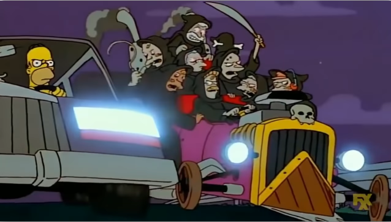
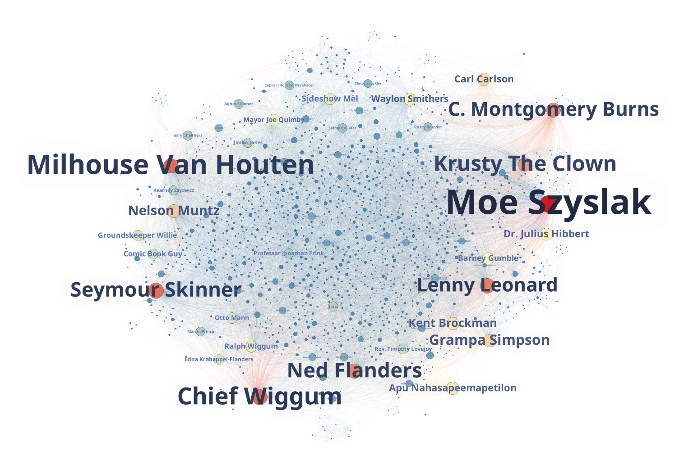
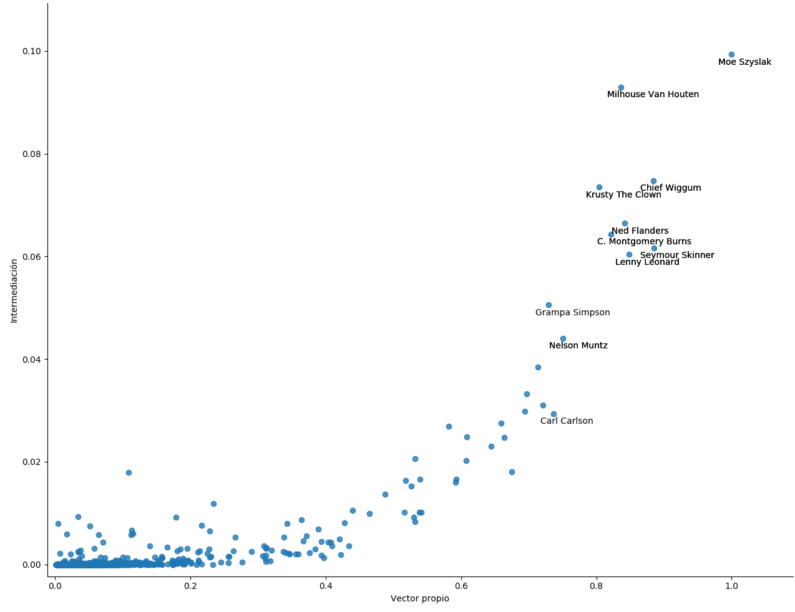
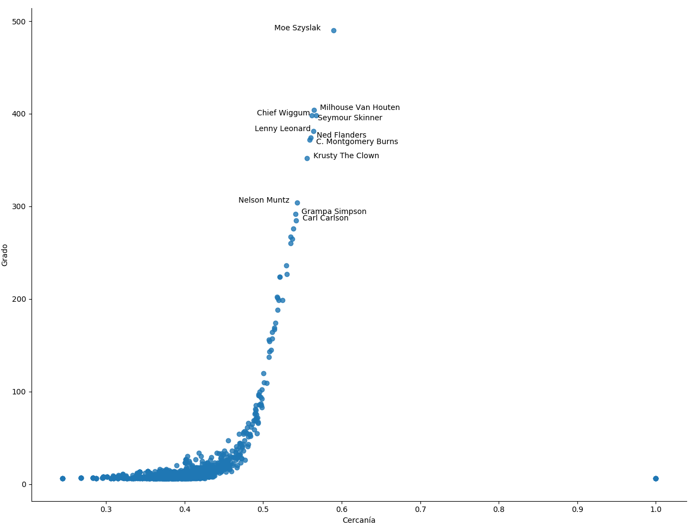
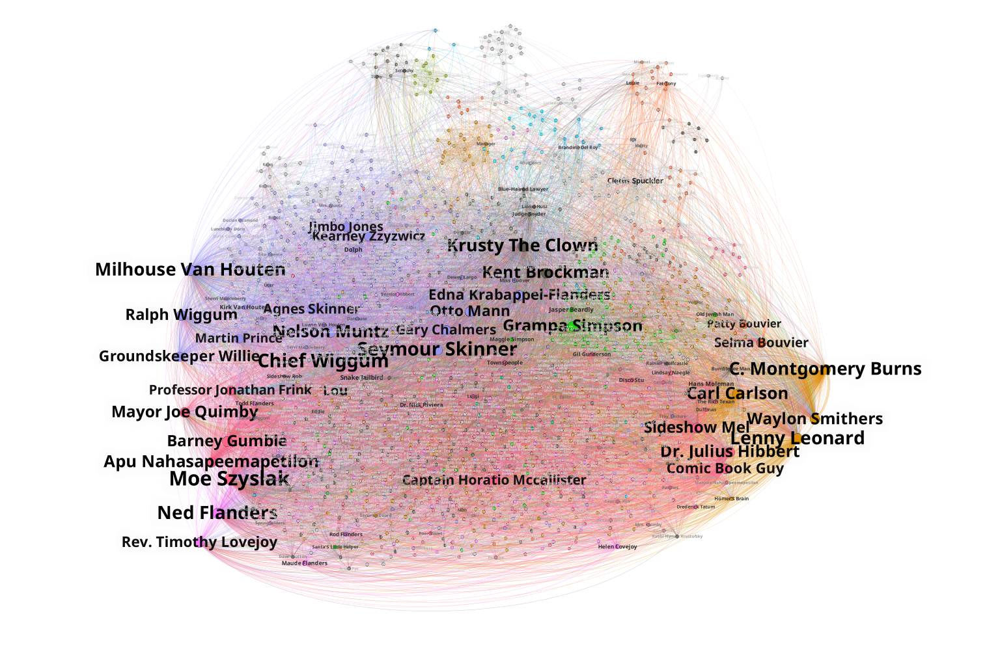
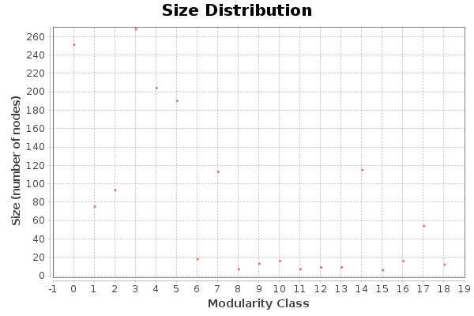

```{r setup, include=F}
knitr::opts_chunk$set(echo = FALSE)

library(knitr)
library(kableExtra)
```

# Introducción

En esta práctica se va a estudiar el uso de la herramienta Gephi para
el análisis y visualización de redes sociales. En particular,
estudiaremos la estructura de comunidad que aparece en la serie de
televisión _The Simpsons_. Esta serie ofrece una estructura de
comunidad muy interesante, debido a que cuenta con más de 30
temporadas y casi 700 capítulos, con una cantidad inmensa de
personajes y grupos cohesivos fácilmente distinguibles entre sí. La
estructuración del pueblo de Springfield que se observa a través de
los capítulos de la serie se adecúa bastante bien al comportamiento de
un pueblo de tamaño mediano.

# Base de datos escogida y tratamiento de datos

En esta sección, comentaremos cómo hemos procesado los datos, para llegar
desde la información en bruto hasta el conjunto de datos con el que hemos
trabajado

## Recolección de datos y construcción preliminar de la red

La base de datos que se ha empleado en el desarrollo de la práctica ha
sido extraída de [@dataset]. Este conjunto de datos fue generado en el
año 2016, y está compuesto por información relativa a las primeras 27
temporadas de la serie, estando la última a mitad de emisión en el
momento de la recolección de datos. En concreto, el archivo en el que
nos hemos centrado, `simpsons_script_lines.csv`, aparecen las líneas
de texto hablado por los personajes de los primeros 568 capítulos de
la serie.

La política de construcción de las conexiones entre los individuos es
la siguiente. En el CSV de partida, además de las frases de los
personajes en la serie, tenemos información de los cambios de escena.
Algunas de las líneas, marcadas como texto no hablado, describen la
localización en la que tiene lugar la escena que tiene lugar a
continuación. Por ejemplo, si mostramos las seis primeras líneas del
dataset:

```{r}
dataset <- read.csv("first_lines.csv")

kable(dataset[,4:5], booktabs = T)
```

Podemos observar que la primera escena de la serie tiene lugar en el
interior del coche de la familia Simpson, en el que se encuentran
Homer y Marge, en dirección al colegio de primaria de Springfield,
donde tiene lugar la siguiente escena. Con el dataset ordenado, por
tanto, tenemos información de los cambios de escena y de las personas
que interactúan en cada una de ellas. A pesar de que en la tabla
anterior hemos mostrado sólamente algunas de las columnas que componen
el conjunto, tenemos disponible una columna en la que se indica el
nombre del personaje al que pertenece esa línea de texto. Las líneas
que indican un cambio de escena, tienen ese campo vacío. Por tanto,
podemos considerar, quedándonos con dicha columna, que los nombres de
los personajes que aparecen contiguos entre dos elementos vacíos de
dicha columna, son personajes que han participado juntos en la escena.

Utilizaremos dicha información para crear las conexiones de nuestro
grafo. Tendremos un nodo por cada personaje y contaremos el número de
escenas para cada par de personajes en las que aparecen juntos. De
esta forma, los personajes que aparezcan juntos en la serie en muchas
ocasiones tendrán una arista entre ellos con un peso muy alto,
mientras que los personajes que no intervengan en toda la serie en la
misma escena tendrán una arista con peso 0, es decir, no estarán
conectados entre sí.

El código para la construcción de la base de datos se ha implementado
utilizando Python. Se proporciona un script
(`process_raw_dataset.py`), el cual produce el CSV de aristas que
posteriormente se leerá con Gephi. Para llevar a cabo la construcción
explicada anteriormente, se han llevado a cabo los siguientes pasos:

- Se ha ordenado la base de datos por la columna `id`, la cual
establece el orden en el que ocurren las líneas (al descargar la base
de datos no venía ordenada)
- Se ha aislado la columna `raw_character_text`, que es la que
contiene el texto del personaje al que pertenece dicha línea (el campo
está vacío si la línea indica un cambio de escena)
- Se ha normalizado dicha columna a formato de título, con la primera
letra de cada palabra en mayúscula y el resto en minúscula (se
detectaron algunas inconsistencias en un pequeño EDA)
- Se eliminan apariciones duplicadas de campos vacíos, para contar con
un único separador entre escenas. Si observamos las dos primeras
líneas, ambas son líneas no habladas, lo cual corresponde a dos
elementos vacíos contiguos en el vector de personajes. Esto puede
provocar comportamientos indeseables en los pasos posteriores, por lo
que si hay más de un elemento vacío consecutivo, se normaliza y se
deja sólo uno.
- El vector de nombres se convierte en una lista de listas, utilizando
como separador los campos vacíos. De esta forma, en lugar de tener un
único vector, tenemos tantos vectores como escenas, y cada vector
contiene los nombres de los personajes que intervienen en la misma.
- Para cada uno de esos vectores, eliminamos los elementos repetidos.
De esta manera, aunque un personaje intervenga varias veces en la
escena, lo tendremos en cuenta una única vez a la hora de establecer
las parejas. Esto puede ser problemático, porque podríamos querer dar
más peso a las conversaciones largas, en las que dos personajes
intervienen varias veces. No obstante, hemos preferido evitar dar
mucho peso a conversaciones que se dan de forma recurrente en la
serie, en las que varios personajes tienen varias intervenciones muy
cortas y con poco contenido.
- Eliminamos los vectores que contienen un único elemento. Las
intervenciones en forma de monólogo no nos aportan información para el
análisis de redes sociales, así que en este caso las eliminamos.
- Los vectores se ordenan por orden alfabético, para que el orden en
el que aparecen los personajes en las parejas sea siempre el mismo.
Este paso no es necesario, ya que Gephi es capaz de fusionar la
información de los enlaces con la forma ($p_i$, $p_j$) y ($p_j$,
$p_i$), considerándolos el mismo y sumando sus pesos, si especificamos
que el grafo es no dirigido. No obstante, a la hora de manejar la
información en Python, nos será más cómodo que estén ordenadas las
parejas siempre de la misma forma, para trabajar con conjuntos más
pequeños.
- Calculamos las combinaciones sin repetición de cada uno de los
vectores anteriores. De esta forma, por cada vector de escena de la
forma $[p_1, p_2, ... p_n]$ obtenemos una lista de parejas $[(p_i,
p_j), i = 1,... n, i < j]$, es decir, todas las parejas de elementos
distintos en el vector, sin tener en cuenta el orden (la pareja $(p_i,
p_j)$ no vuelve a aparecer como pareja $(p_j, p_i)$, para no
considerarla dos veces).
- Unificamos todas las listas anteriores en una única lista, para
tener las parejas de todas las escenas en una misma colección.
- Contamos las repeticiones de las parejas anteriores, y conseguimos
un CSV con tres campos: `personaje_1`, `personaje_2`, `n_ocurrencias`

Ya tenemos procesada la información de forma que puede ser cargada
en Gephi como una lista de aristas. A partir de dicha lista, el sistema
es capaz de contabilizar el número de nodos de la red, el número de
conexiones de la misma, y el peso de cada arista (`n_ocurrencias`),
y construir de esta forma el grafo en cuestión.

## Primer filtrado: actores no relevantes

Tras esta primera construcción, nos encontramos con que en la red hay
6759 nodos, por lo que es una red demasiado grande para el análisis
que pretendemos llevar a cabo. Nos planteamos entonces reducir el
tamaño de la misma, en primer lugar eliminando personajes que nos
parecen irrelevantes.

En primer lugar, nos encontramos con que algunos elementos del vector
de personajes no representan realmente a individuos concretos, si no
que representan a nombres genéricos o grupos de personas. Por ejemplo,
el personaje "Crowd" aparece 504 veces, pero es evidente que no en
todos los casos nos estaremos refiriendo al mismo grupo de
personas. Los personajes "Man" y "Woman" también aparecen en más de
100 ocasiones a lo largo de todo el conjunto. Es bastante probable que
estos nodos resulten relevantes en la red, ya que tendrán un gran
número de conexiones de poco peso, porque se encontrarán presentes en
conversaciones muy dispares, con personajes muy distintos, al no estar
representando sólo a un individuo, si no a distintas personas en
diferentes contextos. Se han tratado de eliminar estos personajes de
la base de datos, porque consideramos que pueden introducir ruido en
la estructura de comunidad que queremos analizar. Este filtro se ha
implementado en dos consultas distintas. Una en la que se eliminan
personajes cuyo nombre coincide exactamente con algún elemento de una
lista de cadenas, y otra en la que se eliminan personajes cuyo nombre
contiene una subcadena en otra lista de palabras. Esta separación se
ha hecho para no eliminar personajes que sí nos interesan, pero al
mismo tiempo poder eliminar listas completas de personajes poco
interesantes. Por ejemplo, además de la cadena "Crowd" por sí sola,
existen multitud de particularizaciones de la misma, como "Angry
Crowd" o "Crowd Of Mice". En cambio, si buscamos la subcadena "Man",
la cual también queremos eliminar, perderíamos al personaje "Otto
Mann", conductor del autobús del colegio y que aparece de forma
recurrente en la serie. En este caso, querremos que la cadena "Man"
se presente exactamente, y no como subcadena.


Nos hemos encontrado también con personajes numerados, es decir,
conjuntos de personajes que hablan alternativamente y se les coloca un
identificador numérico. Por ejemplo, en un anuncio televisivo que
aparece en la temporada 6 (capítulo 126), dos presentadores ofertan
televisión por cable. Estos dos personajes están marcados como "Tv
Announcer #1" y "Tv Announcer #2". Utilizando la almohadilla,
filtraremos también este tipo de personajes, que tienen un total de
1297 líneas de texto en el conjunto de datos.

Estos dos filtros se han introducido dentro del pipeline de formación
del conjunto de datos de origen. Para más información sobre las
palabras que se han introducido en los filtros, puede consultarse el
script de Python.

Una vez llevados a cabo estos filtros, el número de nodos ha
descendido hasta 5217, lo cual supone haber eliminado más de 1500
nodos.  Aún así, seguimos teniendo una red de un tamaño excesivo. Esto
ocurre por dos motivos. Por un lado, el filtrado que hemos hecho no ha
sido particularmente exhaustivo. Aunque se ha dedicado un tiempo
importante a esta fase, debido a que el trabajo con texto suele ser
complejo, es difícil conseguir una base de datos suficientemente
limpia aplicando sólo las técnicas que hemos descrito. Una posibilidad
habría sido una búsqueda de palabras comunes en un tesauro, lo cual
nos habría permitido eliminar de una forma más sencilla aquellos
personajes referenciados por palabras comunes. No obstante, hemos
decidido no aplicar esta técnica porque se salía de los contenidos de
la práctica, y no habíamos trabajado previamente con ella. Por otra
parte, una serie del estilo de los Simpsons está cargada de
referencias y cameos, y por tanto aparecen una gran cantidad de
personajes famosos de forma muy esporádica, y con pocas líneas de texto.
Nos ha llamado la atención, por ejemplo, la aparición de Justin Bieber
con una única conexión. Este personaje claramente aparecería con los
filtros de texto, pero no parece un individuo muy interesante en esta
red, por lo que nos interesaría excluirlo.

Veremos a continuación otros filtros implementados con el propósito
de trabajar con una red algo más pequeña.

## Eliminación de los personajes centrales

El siguiente filtro que se ha implementado, ya trabajando en Gephi,
consiste en eliminar a los personajes centrales de la serie. Es
evidente que los Simpsons son los nodos más importantes de la red, la
serie gira en torno a ellos, y si observamos su grado podemos observar
que se comportan como anomalías claras. Homer está conectado (sin
tener en cuenta el peso) con más de 3300 personajes, lo que supone un
60 % del total. Bart, Marge y Lisa, oscilan entre las 2500 y 2300
conexiones. El siguiente personaje, el dueño del bar, sólo tiene 730,
un tercio del número de conexiones presentes en cualquier miembro de
la familia. Por este motivo, excluiremos de la red a los cuatro
personajes, para tratar de formar una red más realista.

Resulta curioso comentar aquí que, aunque aparece en casi tantas
escenas como Marge, Maggie (la bebé) es un personaje con muchísimas
menos conexiones, concretamente 112. Este hecho pone de manifiesto la
fuerte influencia que tiene la información recopilada a la hora de
construir la red. Probablemente, si en lugar de utilizar la
información de las líneas de texto de los personajes hubiésemos
utilizado el número de fotogramas en los que aparecen los personajes
juntos visualmente, habríamos obtenido una red completamente
distinta. No hemos realizado este estudio por la imposibilidad de
obtener dicha base de datos.

La eliminación de estos tres personajes nos ha hecho disminuir la red
de 30000 a 20000 aristas, lo que simplifica en gran medida el sistema
aunque el número de actores sólo haya variado en 4 unidades.

Una medida cuya evolución nos ha resultado curiosa al eliminar a estos
actores es el número de componentes conexas del grafo. Cuando los
cuatro personajes formaban parte de la red, había 31 componentes
conexas. Es un número bastante alto, pero puede venir justificado por
el hecho de haber dejado perdidos algunos nodos en los que no estamos
interesados que no han sido correctamente eliminados por los filtros
textuales. En el momento en el que eliminamos a los 4 actores
centrales, este valor se dispara hasta 511. Se pone así de manifiesto
la existencia de un gran número de pequeñas comunidades aisladas, cuya
única conexión con el resto de la serie es la familia Simpson. Muchas
de ellas serán conjuntos de personajes que aparecen en capítulos
sueltos, en los que la familia se desplaza a otras partes del mundo, y
no aparece el resto del pueblo.

## Último filtrado: K-core

Finalmente, nos interesa eliminar a aquellos personajes que tienen
poca relevancia en la serie. Estamos más interesados en el
comportamiento de la red a gran escala, que de los actores
individuales y con poca relevancia. Para eliminar estos actores, hemos
recurrido al filtro por $k$-core de Gephi. El $k$-core de un grafo es
el subgrafo que cumple que todos los nodos que lo contienen son al
menos de grado $k$. Utilizando este filtro, podemos eliminar aquellos
nodos de la red con menos conexiones, de forma que al final nos quede
un grafo sin actores de muy poca relevancia.

El filtro por $k$-core que implementa Gephi permite especificar el
valor de $k$ para el cual se aplica el filtro. Como curiosidad, hemos
ido ampliando paulatinamente el valor de $k$ y estudiando cómo
evolucionan las componentes conexas de la red. Resultó sorprendente
el hecho de que en el apartado anterior hubiese un número tan alto
de componentes, por lo que se ha tratado de recoger más información
en este contexto. A continuación se muestra la tabla de evolución del
valor de $k$, el número de nodos restantes en la red, y el número de
componentes conexas:

```{r}
k <- 0:6
nodes <- c(5217, 4858, 4112, 3310, 2582, 2001, 1502)
components <- c(511, 152, 65, 23, 9, 3, 2)

data <- data.frame(k = k, nodos = nodes, componentes = components)

kable(data, booktabs = T, caption="Distribución de nodos y componentes conexas al aumentar el valor de k")
```

Podemos observar que las componentes conexas de nuestro grafo, como
habíamos predicho, son grupos muy pequeños de personajes aislados del
resto. En particular, al hacer que $k=1$, desaparecen más de 350
componentes, lo cual significa que habíamos dejado más de 350 puntos
aislados con los filtrados anteriores ($k=1$ trivialmente elimina los
puntos sin conexiones, y ninguno más). Al hacer $k=3$, habiendo
perdido escasamente 1000 nodos, lo que supone un 20 % de los presentes
en la red original, el número de componentes conexas se ha reducido
casi en un 90 %. En la red con la que vamos a trabajar en profundidad,
sólo nos han quedado dos componentes conexas.

Debido a que para $k=4$ el número de componentes conexas era lo
suficientemente reducido como para ser inspeccionado manualmente, han
tratado de identificarse los capítulos en los que aparecían dichos
personajes. Como habíamos anticipado, hemos podido identificar varias
comunidades herméticas, que no tienen relación con el resto de la
serie. La primera componente, exceptuando la componente gigante, está
compuesta por los supervivientes mutantes que aparecen en una de las
pequeñas historias del capítulo "La casa del Árbol del Terror VIII".
Recurrentemente, la serie hace capítulos especiales por Halloween, en
los que los miembros de la familia Simpson cuentan pequeñas historias
de terror, que no tienen conexión con el resto de la serie. En este
caso, Homer cuenta que ha soñado con la caída de una bomba nuclear en
el pueblo tras una pelea entre el alcalde y las autoridades
francesas. La ciudad es arrasada, y los únicos supervivientes son la
familia Simpson, la cual no sufre ningún daño al no encontrarse en la
ciudad en el momento del impacto, y unos pocos personajes relevantes
en la serie, que mutan y tratan de matarlos. Cuando eliminamos a la
familia de la red, desaparecen todas las conexiones entre los mutantes
(los cuales están marcados como personajes distintos) y el resto de
personajes de la serie.

{width=80%}

Otras comunidades que han podido reconocerse están formadas por un
grupo de naipes que aparecen en un trailer durante una sesión de cine
a la que asisten Homer y Marge, los duendes de una serie de animación
a la que es aficionada Maggie, y que sólamente hablan entre ellos, o
los personajes de un libro que se aparecen a Lisa en un sueño.

Una vez hemos terminado el proceso de filtrado del grafo, procedemos
al análisis de la red social final que hemos obtenido.

# Análisis de la red

Una vez hemos generado la red, pasamos a estudiar sus características.
Comenzaremos estudiando las medidas globales de la red, después
pasaremos a estudiar la centralidad de los actores de la red, para
tratar de identificar los más relevantes, y finalmente trataremos de
detectar comunidades dentro del grafo obtenido.

## Medidas globales de la red

En primer lugar, analizaremos las medidas globales de la red. Tras el
filtrado descrito en el apartado anterior, la red con la que
trabajaremos finalmente contiene 1502 nodos y 13650 aristas. Se han
extraído las siguientes medidas globales de la red:

```{r}
concepts <- c("Nº de nodos $N$", "Nº de enlaces $L$",
              "Nº máximo de enlaces", "Densidad del grafo",
              "Grado medio <$k$>", "Grado medio ponderado",
              "Diámetro $d_{max}$", "Distancia media $d$",
              "Coeficiente medio de clustering <$C$>",
              "Nº de componentes conexas",
              "Nº de nodos de la componente gigante (\\%)",
              "Nº de aristas de la componente gigante (\\%)")

measurements <- c("1502","13650","1127251","0.012","18.176","41.422",
                  "5","2.562","0.809", "2", "1495 (99.53 \\%)",
                  "13629 (99.85 \\%)")

measures <- data.frame(Medida = concepts, Valor = measurements)

kable(measures, "latex", booktabs=T, escape=F) %>% row_spec(4, hline_after=T) %>%
    row_spec(9, hline_after=T) %>% kable_styling(position="center")
```

Teniendo en cuenta que el número máximo de enlaces es $1502 \times
1501/2 = 1127251$, la densidad del grafo obtenido es de $13650/1127251
= 0.012$. Como podemos observar, es un valor muy bajo, lo cual
concuerda con el comportamiento de las redes sociales reales, en las
que el grafo es muy disperso.

A continuación, se ha calculado el grado medio, sin ponderar y
ponderado.  La diferencia entre estas dos medidas radica en si se
tiene en cuenta o no el peso de la arista. En el caso del grado medio,
tenemos un valor ligeramente superior a 18, lo que indica que en
media, cada personaje está relacionado con otras 18 personas. Teniendo
en cuenta el número de personajes de la serie, parece que este valor
es ligeramente bajo, pero aquí aparece claramente la influencia de los
personajes puntuales. El grado medio ponderado asciende hasta casi
41.5. Esto indica que las relaciones, por lo general, son
relativamente fuertes, ya que este valor es casi 2.5 veces superior al
del grado medio, por lo que, si existe una conexión entre dos
personajes, en media esta conexión tendrá una ponderación mayor a 2,
lo que significa que si dos personajes aparecen al menos una vez
juntos, es muy probable que lo hagan en más ocasiones. Este
comportamiento es bastante lógico, ya que cuando un personaje o un
grupo de personajes hace aparición en un capítulo, no lo hace en una
única escena, si no que su presencia es recurrente a lo largo de dicho
capítulo. Es por esto por lo que tendremos pocos enlaces de peso 1, y
el grado medio ponderado es más alto que el grado medio a secas.

Mostramos a continuación los gráficos de la distribución de grados,
tanto ponderados como sin ponderar:

\begin{figure}[!h]
    \begin{subfigure}[t]{0.5\textwidth}
    \includegraphics[width=.95\textwidth]{images/degree-distribution}
    \caption{Distribución de grados sin ponderar}
    \end{subfigure}
    \hfill
    \begin{subfigure}[t]{0.5\textwidth}
    \includegraphics[width=.95\textwidth]{images/w-degree-distribution}
    \caption{Distribución de grados ponderada}
    \end{subfigure}
    \caption{Distribución de grados de nuestra red}
\end{figure}

Podemos observar que nuestra red se comporta como una red libre de
escala, y la distribución de grados sigue una ley de la potencia
clara. Además, podemos observar que para el grado ponderado, la caída
es más pronunciada, lo que significa que hay valores más extremos en
este caso, y que los actores con muchas conexiones son también
aquellos que tienen conexiones con más peso.

El número de hubs, como era esperable, no es especialmente alto. Sólo
tenemos 15 actores (un 1 % del total de nodos) con más de 250
conexiones (hemos obtenido este valor con la tabla de datos de
Gephi). Como era esperable, estos nodos coinciden con los personajes
secundarios más famosos de la serie. Entre ellos se encuentran el
director del colegio, Milhouse (mejor amigo de Bart) o Moe, el dueño
del bar. Los estudiaremos con más detenimiento en las medidas de
centralidad de actores.

Pasamos a comentar el coeficiente de clustering de la red. Hemos
obtenido un coeficiente medio de clústering de 0.808. Estamos
hablando de un coeficiente de clústering muy alto, lo cual indica la
presencia de comunidades muy cohesivas, con grupos de nodos en zonas
localmente densas. En particular, si mostramos la distribución de
coeficientes de clustering, observamos que casi la mitad de los nodos
(731, concreamente), tienen un valor de coeficiente de clustering
igual a 1. Además, hemos comprobado que los nodos con dicho
coeficiente de clústering son todos nodos poco conectados. En
particular, Frank Sinatra, que es el nodo con más conexiones de entre
los que tienen un coeficiente de clústering igual a 1, tiene sólamente
25 conexiones, lo cual es significativamente más pequeño que las casi
500 conexiones que llegan a tener los hubs de la red. Los gráficos de
distribución del coeficiente de clústering se han generado externamente,
para poder generar el gráfico dos veces, teniendo en cuenta el valor 1
y sin tenerlo en cuenta. Esto se ha hecho porque al tenerlo en cuenta
era difícil observar el resto de información:

\begin{figure}[!h]
    \begin{subfigure}[t]{0.5\textwidth}
    \includegraphics[width=.95\textwidth]{images/clustering-1}
    \caption{Coeficientes de clústering de la red}
    \end{subfigure}
    \hfill
    \begin{subfigure}[t]{0.5\textwidth}
    \includegraphics[width=.95\textwidth]{images/clustering-2}
    \caption{Coeficientes de clústering de la red (exluyendo el 1)}
    \end{subfigure}
    \caption{Histogramas de coeficientes de clústering de los nodos de la red}
\end{figure}

Podemos observar cómo una gran cantidad de nodos tienen valores
relativamente altos de coeficiente de clústering, incluso cuando
dejamos de tener en cuenta el valor 1, lo cual concuerda con el hecho
de que los nodos con pocas conexiones tienden a estar en comundades
cohesivas y viceversa, ya que la mayoría de nodos de nuestra red
tienen pocas conexiones, y el número de hubs es bajo.

Pasamos a trabajar exclusivamente con la componente gigante de la
red. Como ya comentamos en el apartado de filtrado por $k$-core, la
reducción del tamaño de nuestra red ha provocado que sólamente nos
queden dos componentes conexas, habiéndose perdido el resto en los
distintos procesos de filtrado. La componente gigante está compuesta
por 1495 nodos y 13629 aristas, lo cual supone más del 99.5 % del
total en ambos casos. Comentamos a continuación el diámetro y la
distancia media de la red. Hemos obtenido un diámetro de 5, y una
distancia media de 2.562. A pesar de estar trabajando con una red
relativamente grande, tenemos que la distancia entre cada dos nodos no
es superior a 5 en ningún caso, lo cual implica que esta red cumple lo
que se conoce como la propiedad de mundo pequeño, muy común en las
redes sociales. A pesar de que el número de nodos de la red pueda
parecer elevado, en realidad el número de nodos que hay que visitar
para trazar un camino entre cualesquiera dos puntos de la misma
(siempre que nos restrinjamos a nodos que se encuentran en la misma
componente conexa) suele ser bastante bajo.

## Medidas de centralidad

En esta sección vamos a tratar de localizar a los actores principales
de nuestra red. Para ello, computaremos una serie de medidas para
nuestros nodos, y estudiaremos los nodos de nuestra red que consiguen
los valores más altos para dichas medidas. Aquellos nodos que
aparezcan recurrentemente en las primeras posiciones del ranking serán
probablemente nodos influyentes de nuestra red. Las medidas que hemos
calculado son las siguientes:

```{r}
degree <- c(
    "Moe Szyslak: 490",
    "Milhouse Van Houten: 404",
    "Seymour Skinner: 398",
    "Chief Wiggum: 398",
    "Lenny Leonard: 381"
)
betweenness <- c(
    "Moe Szyslak: 0.099",
    "Milhouse Van Houten: 0.093",
    "Chief Wiggum: 0.075",
    "Krusty the Clown: 0.074",
    "Ned Flanders: 0.066"
)

closeness <- c(
    "Moe Szyslak: 0.589",
    "Chief Wiggum: 0.567",
    "Milhouse Van Houten: 0.565",
    "Lenny Leonard: 0.564",
    "Seymour Skinner: 0.562"
)

eigenvector <- c(
    "Moe Szyslak: 1.000",
    "Seymour Skinner: 0.885",
    "Chief Wiggum: 0.885",
    "Lenny Leonard: 0.848",
    "Ned Flanders: 0.842"
)

data <- data.frame(
    degree = degree,
    betweenness = betweenness,
    closeness = closeness,
    eigenvector = eigenvector
)

colnames(data) = c("Grado", "Intermediación", "Cercanía", "Vector propio")

kable(data, booktabs=T) %>% kable_styling(latex_options="scale_down")
```

A raíz de los datos obtenidos, resulta inmediato concluir que el actor
más influyente de la red es Moe Szyslak, el dueño del bar en el que
Homer se reúne con sus amigos. Atendiendo a información extraída de
esta misma base de datos [@toddschneider], excluyendo la casa de la
familia, que es la localización más recurrente, los tres lugares que
más aparecen en la serie son la Escuela Primaria de Springfield, el
Bar de Moe, y la Central Nuclear (en ese orden). Además, hay que tener
en cuenta que la escuela y la central son escenarios compuestos por
muchas salas, mientras que el bar es una sola habitación, y que en las
escenas del bar es muy probable que aparezca Moe, mientras que en los
otros dos escenarios hay una variabilidad de personajes mucho mayor.
Por estos motivos, parece que la importancia de Moe en la red está
justificada. Aparece también como personaje bastante relevante
Milhouse, el mejor amigo de Bart. Estos dos personajes aparecen en
muchísimas escenas juntos, por lo que las conexiones con gente ajena a
la familia Simpson serán similares, especialmente si hablamos de
personajes jóvenes. Probablemente, Milhouse haga de hub para una gran
cantidad de estudiantes del colegio, y por esto tenga un grado de
intermediación tan alto. Resulta curioso observar que, a pesar de
aparecer en las tres primera columnas en buena posición, para la
centralidad de vector propio cae hasta la sexta posición, y se queda
fuera de la tabla anterior. Aún así, podemos considerar que este
personaje es de alta relevancia en la serie.

Otros personajes que están razonablemente bien colocados son el Jefe
de policía Wiggum y el director de la escuela, Seymour
Skinner. Aparecen empatados en grado y centralidad de vector propio,
pero Wiggum tiene una puntuación ligeramente mejor en intermediación y
cercanía. Esto puede indicar que estamos hablando de dos personajes
con una situación más o menos relevante en la red, con la diferencia
de que el jefe de policía resulta ser una pieza clave para alcanzar a
pequeñas comunidades aisladas. Probablemente, el jefe de policía se
relacione más comúnmente con comunidades similares a la mafia, la cual
aparece con relativa asiduidad en la serie pero siempre en un contexto
similar, o los jueces y abogados, que también suelen relacionarse con
grupos pequeños de gente.

Algo similar a lo que ocurre con el jefe Wiggum puede ocurrir con
Krusty el payaso o Ned Flanders. Estos personajes son clave para
relacionar a algunas comunidades con el resto de la red. Junto a
Krusty suelen aparecer personajes famosos del mundo de la televisión y
el cine, y Ned es el personaje más importante dentro del grupo de la
iglesia. Esto justifica que aparezcan en buena posición en la métrica
de intermediación.

Justo el caso contrario se puede observar con Lenny Leonard. Lenny es
uno de los amigos más cercanos de Homer, trabajador de la central
nuclear, y asiduo del bar de Moe. Debido a los ambientes en los que se
mueve este personaje, está presente en gran cantidad de
conversaciones, y conoce a mucha gente de importancia en la red. Esto
se puede observar en el hecho de que aparece en las tablas de grado,
cercanía y vector propio en una posición relativamente buena. En cambio,
como suele estar acompañado por actores más importantes, no resulta una
pieza clave a la hora de conectar comunidades aisladas, y por tanto
no aparece en la columna de intermediación (en concreto, baja hasta la
octava posición).

En relación con este personaje, puede hacerse una pequeña
reflexión. En prácticamente toda la serie se ve a Carl Carlson como
compañero inseparable de Lenny, y da la sensación de que aparecen
juntos en todas las escenas. El análisis de la red parece indicar que
no es exactamente así, y que Carl es un personaje mucho menos
relevante que Lenny.  Carl está acompañado por Lenny en la práctica
totalidad de escenas en las que aparece, pero Lenny tiene un
protagonismo individual del que Carl carece. En concreto, esta pareja
tiene la conexión de más peso de toda la red, es decir, son la pareja
de personajes (excluyendo a los simpsons) que aparecen juntos en mayor
número de escenas.

Otro personaje cuya ausencia sorprende en esta tabla es el Señor
Burns, el dueño de la central nuclear. A pesar de ser el personaje
(excluyendo a los Simpsons) que más líneas de guión tiene en la serie
(puede consultarse esta información en [@toddschneider]), no aparece
como uno de los nodos más relevantes de la red en ninguna de las
columnas (concretamente, es el sexto personaje en intermediación y
séptimo en todas las demás). Esto hace pensar que este personaje
tiende a diálogos más largos, con grupos más reducidos de personas, y
siempre con los mismos actores. Concretamente, la segunda conexión de
más peso en la red es la que forman el señor Burns y Waylon Smithers,
su asistente personal.

Para tratar de tener una mejor perspectiva de los actores más
influyentes de la red, se ha representado la misma utilizando estas
cuatro métricas para variar algunos de los aspectos de los nodos que
la forman:

{width=100%}

Concretamente, el color de los nodos representa el grado (cuanto más
cercano al rojo, mayor), el tamaño del nodo es proporcional a la
centralidad del vector propio, El tamaño del texto es proporcional a
la intermediación, y la intensidad del color del texto representa la
cercanía (colores más oscuros representan mayores valores de esta
medida).

Aquí podemos observar algunos actores que no nos habían aparecido en
las tablas, pero que tienen también cierta relevancia dentro de la
red. De mayor tamaño aparecen los personajes que hemos venido
comentando a raíz de la tabla (Moe, Milhouse, Skinner, el jefe Wiggum,
Ned Flanders, Lenny...). El Señor Burns aparece también como
relevante, pero no destaca en ninguna de las medidas, y por esto no
nos ha aparecido en las tablas.

En un tamaño mediano, podemos observar a personajes conocidos de la
serie, pero que tienen menor importancia, como puede ser el abuelo
Simpson, el médico (Julius Hibbert), Carl, al que hemos comentado
antes, Apu (dependiente del Badulaque), Kent Brockman, que es el
presentador de noticias local, o Nelson, que es uno de los matones del
colegio, y que tiene bastante relación con la familia.

En un tamaño más pequeño, podemos apreciar a otros personajes de
importancia en la serie, pero con muchos menos minutos, como el
alcalde Joe Quimby, el jardinero Willie, el dependiente de la tienda
de comics, Barney Gumble, amigo de Homer y asiduo del bar, o Ralph
Wiggum, hijo del jefe de policía y amigo de Bart y Lisa. Resulta
curioso observar cómo algunos nodos con el nombre pequeño, es decir,
que tienen una intermediación baja, tienen un tamaño de nodo
relativamente grande, por lo que están en una zona de la red
preferente en cuanto a vector propio. Estos personajes son aquellos
con papeles de acompañante, en lugar de papeles de protagonista.  Se
relacionan con personajes muy importantes de la serie, pero ellos
mismos no tienen escenas de protagonismo, por lo que no conectan
partes separadas de la red entre sí.

Además de la visualización anterior, en los siguientes gráficos pueden
apreciarse los actores más influyentes por pares de métricas. Los
puntos situados en la esquina superior derecha del gráfico serán
aquellos que maximizan ambas métricas, y por tanto serán nodos más
influyentes en nuestra red. Hemos etiquetado en las nubes de puntos
los actores más influyentes para cada una de las métricas. En
concreto, hemos etiquetado a los 10 actores más influyentes para cada
métrica:

{width=100%}

En este gráfico se puede apreciar que existe una cierta tendencia
cuadrática entre la intermediación y la cercanía. No obstante, la
tendencia no es muy clara, y las nubes de puntos son relativamente
dispersas. Los actores relevantes (a los que se les ha colocado la
etiqueta) son los mismos que veníamos analizando sobre la red y la
tabla que hemos mostrado anteriormente. Claramente, Moe Szyslak es el
actor más relevante en cuanto a las dos métricas que contemplamos.
Luego podemos apreciar algunos comportamiento curiosos, como el de
Milhouse, segundo personaje en intermediación, pero con varios
personajes por delante en cuanto a vector propio, o Carl, que aparece
como nombre relevante por su valor de vector propio, pero tiene
incluso a varios actores sin nombre por encima en grado de
intermediación. Como ya comentamos, este personaje suele aparecer en
grupos de gente, rodeado de personajes muy relevantes en la serie,
pero en pocas escenas es el protagonista único, por lo que no es llave
para comunidades aisladas.

{width=100%}

Aquí lo que puede apreciarse es una tendencia prácticamente
exponencial entre la cercanía y el grado. Una correlación positiva
entre estas dos métricas, ya que parece evidente que cuanto mayor sea
el grado de un nodo, más cortas serán las distancias del mismo para
llegar a todos los demás puntos de la red. No obstante, no se esperaba
un ajuste tan bueno de los puntos a una función exponencial. En este
caso, no podemos contemplar parejas de valores poco comunes, como
hicimos con el gráfico anterior. Lo que sí podemos observar, y que se
ha incluido intencionadamente en el gráfico, es el grupo de puntos
solapados en la coordenada (1,6) (parece que están en el 0 debido a la
escala). Estos puntos pertenecen a la componente conexa pequeña que ha
sobrevivido tras las podas. Este grupo de puntos forma un grafo
completo, aislado del resto de la red, por lo que la cercanía de todos
sus puntos es 1 (todos están a distancia 1 entre sí), pero su grado es
muy pequeño, por lo que generan una anomalía en el gráfico.

Tras el análisis de importancia de los nodos de la red, hemos podido
comprobar que los nodos más importantes coinciden con los personajes
más conocidos de la serie. Además, hemos podido identificar ciertos
patrones de comportamiento en las escenas de dichos personajes en
función de las métricas en las que destacaban. De esta forma, hemos
identificado a actores que suelen aparecer en grandes grupos de
personas, lo que hace que su grado y el valor de su vector propio sean
altos, así como actores cuyo protagonismo es más individual, lo cual
se refleja en el grado de intermediación que poseen. Como personaje
troncal de la red hemos identificado a Moe Szyslak, el cual se
presenta como actor más importante en todas las métricas contempladas,
lo cual encaja con su papel de actor principal en la serie, siendo
su bar una de las principales localizaciones en las que transcurre
la misma.

Una vez hemos analizado los nodos más relevantes de nuestra red, vamos
a llevar a cabo un análisis de comunidades sobre la misma, para tratar
de identificar grupos de personajes

# Detección de comunidades

En esta sección vamos a tratar de detectar comunidades dentro de
nuestra red. Para ello, utilizaremos el método de Lovaina, comenzando
por una resolución de 1, lo cual nos establecerá el punto de
partida. El resultado obtenido tras esta ejecución es el siguiente:

{width=100%}

En primer lugar, para la visualización se ha utilizado el algoritmo
ForceAtlas 2, disponible en Gephi, seguido de una etapa de expansión,
para evitar el solapamiento masivo de nombres, y después se ha
aplicado una etapa de ajuste de etiquetas, para terminar de ajustar
los solapamientos. Finalmente, algunas islas que se habían separado en
exceso de la nube, así como algunos nombres de gran tamaño que se
solapaban, se han recolocado ligeramente a mano (el visor de trabajo
de Gephi no devuelve exactamente el resultado final, por lo que evitar
el solapamiento en la ventana de trabajo no garantiza que se vaya a
respetar en la ventana de exportado). Tanto el tamaño como la
intensidad de color de los nombres de los personajes están escalados
utilizando el atributo Hub, calculado por Gephi bajo la pestaña
HITS. Se puede consultar más información sobre dicha medida en
[@hubs], donde aparecen definidas tanto esta métrica como la métrica
Authority, la cual se computa también en dicho menú. Estas métricas
fueron definidas originalmente para estudiar la calidad del contenido
almacenado en páginas web, así como la calidad de los hipervínculos
que contenían, pero su uso sobre redes sociales ha demostrado ser útil
a la hora de identificar actores relevantes a la hora de conectar
comunidades.

Analizando el grafo detenidamente, podemos hacernos una idea
preliminar de cómo se estructuran las comunidades dentro de la
serie. En la parte superior del gráfico podemos observar algunas
comunidades pequeñas, compuestas por grupos cohesivos de personajes
que aparecen juntos recurrentemente. Podemos observar, en color
grisáceo en la parte superior izquierda, a los personajes de la serie
de dibujos animados Rasca y Pica (aparecen de un tamaño legible los
nombre de Itchy y Scratchy). En color rojo anaranjado, ligeramente a
la derecha, aparecen los miembros de la mafia italiana, y pueden
leerse los nombre de Fat Tony y Louie. Según se va descendiendo,
empiezan a aparecer las comunidades de mayor tamaño, que agrupan a
conjuntos de personajes relevantes de la serie, y que son más
fácilmente reconocibles incluso sin un conocimiento profundo de la
serie. En color morado, a una altura media, aparece uno de los grupos
más grandes que se pueden identificar, el colegio de primaria. En este
grupo podemos reconocer tanto alumnos (Milhouse, Ralph, los matones
Nelson, Jimbo y Kearney, Martin...) como profesores y personal (el
director Skinner, el jardinero Willie, el superintendente Chalmers, la
profesora Edna Krabappel...). En este grupo se nos cuelan también
algunos personajes que, sin ser parte del colegio, tienen mucha
relación con algunos de sus actores, como Kirk van Houten, padre
de Milhouse, o Agnes Skinner, madre del director.

En verde, a la misma altura que el colegio pero en la parte central
derecha, aparece el grupo de gente relacionada con el abuelo. Ahí
podemos reconocer a algunos ancianos que viven en el castillo del
jubilado, así como versiones de los personajes que aparecen en las
historias que el abuelo cuenta recurrentemente. Por ejemplo, aparecen
personajes etiquetados como "Young ...", que hacen referencia a
actores importantes de la serie en su juventud. También se nos cuela
en este grupo, curiosamente, Maggie, el bebé de los Simpson,
probablemente porque a excepción de la familia, el personaje con el
que más tiempo comparte en pantalla, y con el que más interactúa
haciendo sonidos, sea el abuelo, el cual ejerce de cuidador en varias
ocasiones durante la serie. A la derecha completamente, en marrón,
aparecen los personajes de la central nuclear, y en la parte baja, en
color lila, el entorno de la iglesia, con el párroco y Ned Flanders
como actores principales.

Finalmente, nos queda por comentar el grupo más grande que se ha
formado, el cual es probablemente el más heterogéneo, que está
integrado por una gran cantidad de personajes secundarios unidos por
nodos muy importantes de la red. Nos referimos a todo el grupo de
puntos inferior, en un color más o menos rosado. Aquí podemos
identificar a nodos muy relevantes en la red, los cuales agrupan
también a una gran cantidad de personajes pequeños (se puede observar
el tono rosado que predomina toda la nube inferior). A este grupo
pertenece Moe, Apu, el doctor Hibbert, el alcalde... Al parecer,
encontramos aquí a los personajes de mediana edad de la serie, los
cuales se relacionan mucho entre sí y con un grupo muy variado de
actores de otras comunidades. Más adelante trataremos de identificar
de forma más precisa las características comunes que definen a estos
grupos.

A continuación vamos a estudiar la estructura global de comunidades
que hemos obtenido. Atendiendo a los resultados obtenidos por Gephi,
hemos obtenido una distribución con un coeficiente de clustering de
0.337, lo cual podemos considerar como una distribución de comunidades
suficientemente buena. Se han formado 19 comunidades
distintas. Podemos pensar que este número es relativamente alto, pero
teniendo en cuenta que estamos hablando de una red con 1500 nodos,
podría ser un número adecuado. Más adelante trataremos de cambiar los
parámetros del algoritmo para buscar tener menos comunidades, pero
previamente analizaremos las que hemos obtenido hasta el momento. El
gráfico generado por Gephi con la distribución de nodos por
comunidades es el que sigue:

{width=80%}

Podemos observar que tenemos dos comunidades predominantes, la 0 y la
3, que contienen más de 250 actores cada una. Después hay otras dos
comunidades de gran tamaño, con unos 200 personajes (índices 4 y 5).
A continuación tenemos cinco comunidades de tamaño mediano, entre 50 y
120 nodos, y finalmente 10 comunidades pequeñas, con menos de 20
personajes. Las estudiaremos a continuación en orden de importancia.

## Comunidades principales: Gente del pueblo y colegio de primaria

Si estudiamos las dos comunidades más grandes del grafo, nos encontramos
por un lado al colegio de primaria de Springfield, y por otro al grupo
grande de gente del pueblo. Comenzamos visualizando y analizando el colegio
de primaria (comunidad 3):

{width=100%}

Podemos observar que los actores más importantes dentro de esta comunidad
(se les ha calculado el vector propio reduciéndonos a esta red), son los
alumnos y profesores con mayor protagonismo en el colegio. Aparecen algunos
actores que no tenían relevancia sobre la red completa, pero que dentro
de la comunidad sí son importantes. Las gemelas Mackleberry, por ejemplo,
no las vimos en ningún momento, pero ahora sí que tienen cierta relevancia.

Además de los actores de relevancia, tenemos otros personajes dentro
de la comunidad, los cuales entran dentro de ésta por relación con los
jóvenes, probablemente. Aparecen, por ejemplo, personajes de
videojuegos, los protagonistas de la Guerra de las Galaxias (C3PO y
Mark Hamill están en la parte baja, un poco a la derecha), o algunos
músicos famosos, como Justin Timberlake o Lady Gaga. También podemos
reconocer a padres de alumnos. A pesar de que el grupo parece bastante
cohesivo, entran aquí algunos personajes que parecen no encajar
especialmente bien con el grupo, como es el caso de Troy McClure, que
es un presentador de televisión. Es posible que se haya metido aquí
por conexión con la gente famosa, pero no parece un elemento muy
representativo de la comunidad.

Pasamos observar la otra gran comunidad de la serie, formada por el
grueso de los habitantes de Springfield. La representación de esta
comunidad es la que sigue:

{width=100%}

Podemos observar de nuevo los actores más relevantes de esta
comunidad.  Ahora, a pesar de que Moe sigue siendo el personaje
troncal, algunos de los actores que vimos anteriormente y que tenían
relativamente poca importancia ahora aparecen de un tamaño
considerable. Barney Gumble es bastante relevante dentro de esta red,
por ejemplo, o el alcalde y Apu, que son personajes bastante conocidos
en el pueblo, pero que apenas salen de él, por lo que a nivel de la
red global no parecían muy relevantes. Ahora sí se convierten en actores
principales. Algo similar pasa con el dependiente de la tienda de cómics.

Los personajes famosos que se cuelan en esta comunidad, son músicos de
generaciones más antiguas, como Aerosmith, presente en la parte
superior, o Frank Sinatra, abajo. También aparecen acres coo John
Travolta, Mel Gibson o Kim Basinger. Se puede establecer así una
diferencia en los ídolos de las distintas generaciones, apareciendo
aquí estrellas más adultas que en la comunidad anterior.

Pasamos ahora a comentar las comunidades grandes que nos han
aparecido, pero que no son tan masivas como estas.

## Comunidades grandes: Famosos de la televisión y central nuclear

Pasamos ahora a comentar las siguientes comunidades en cuestión de
tamaño. Nos aparecen por un lado las personalidades famosas de la
televisión, y por otro la central nuclear y los personajes
relacionados. Veremos que estas comunidades no son tan cohesivas como
las dos anteriores. Los núcleos que vamos a observar en ellas están
formados por menos personajes, y la relación de los personajes pequeños
estará menos clara. Comenzamos mostrando a las personalidades de la
televisión:

{width=100%}

Como comentamos anteriormente, esta comunidad es menos cohesiva que
las anteriores. En primer lugar, tenemos que los actores principales
de la misma son Krusty y Kent Brockman, dos personalidades muy
influyentes de la televisión en la serie. Como actores algo menos
relevantes podemos encontrar a Rasca y Pica, el actor secundario Bob,
a Lionel Hutz, que es abogado, o al juez Snyder. Puede resultar
sorprendente el hecho de encontrar a trabajadores del ámbito de la
justicia dentro de este grupo, pero esto se debe a la falta de
cohesión que hemos comentado. Tanto el actor secundario Bob como
Krusty han tenido problemas judiciales en varias ocasiones durante la
serie, lo que ha provocado que estas dos comunidades, que podrían
aparecer separadas, hayan terminado juntas. Probablemente, si
cambiamos la granularidad del algoritmo de detección de comunidades,
estos dos grupos habrían aparecido separados. También se nos ha colado
en este grupo otra comunidad aislada, la cual aparece por su conexión
con el hombre abejorro (Bumblebee Man), asiduo de los juzgados del
pueblo. Nos referimos al grupo de puntos que aparecen en la parte
derecha, formado por los personajes de Springfield convertidos en
animales, los cuales aparecen en una de las historietas de terror que
ya comentamos al principio (concretamente en La Isla del Dr. Hibbert,
de la Casa del Árbol del Terror XIII, parodia de la película La Isla
del Dr. Moreau). Observaremos más adelante que las comunidades de
pequeño tamaño que se han formado son precisamente grupos de este
tipo.

Pasamos a comentar la comunidad que se forma alrededor de la central nuclear.
La representación gráfica de la misma es la siguiente:

{width=100%}

Los actores principales de esta comunidad son, como podía anticiparte,
los tres personajes importantes de la central, el señor Burns, Lenny y
Carl, y Smithers. Además, aparece un grupo, bastante conexo, compuesto
por músicos en la parte derecha del gráfico. Volvemos a estar ante una
comunidad que probablemente habría aparecido separada de este grupo si
hubiésemos utilizado un valor de granularidad más bajo. Estudiaremos
este hecho más adelante.

Además, nos aparecen en este grupo, probablemente por su relación
basada en el estatus económico con el señor Burns, algunos empresarios
famosos, como Jeff Bezos o Elon Musk (incluso aparece como personaje
la palabra Billionaire, sin especificar en concreto de quién se trata.
Esta es una de las palabras que han escapado a los filtrados).

Pasamos a comentar ahora las cinco comunidades de tamaño medio.

## Comunidades medias

Las comunidades de tamaño medio que se han formado están compuestas
por los círculos de personajes secundarios de menor importancia, pero
que tienen capítulos dedicados casi exclusivamente a ellos en algún
momento de la serie. Concretamente, aquí aparece el hogar de jubilado,
cuyo personaje importante es el abuelo Simpson, el entorno de las
hermanas Patty y Selma, el entorno de la iglesia, la policía y los
aliens. Vamos a comentar rápidamente estas cinco comunidades.
Comenzamos por el hogar del jubilado:

{width=100%}

En esta comunidad podemos observar claramente dos grupos
diferenciados, fuertemente conectados por el abuelo. En la parte
inferior, tenemos a los ancianos del hogar del jubilado, que es hacia
donde salen las conexiones más fuertes. En el resto, tenemos
personajes poco relevantes, muchos de ellos acompañados de la palabra
"Young", como explicamos anteriormente, los cuales hacen referencia a
las versiones jóvenes de personajes reales, los cuales aparecen en las
historias que cuenta el abuelo.

El entorno de Patty y Selma es el que se muestra a continuación:

{width=100%}

Aquí se nos solapan dos comunidades, el entorno de Patty y Selma, en
el cual aparecen personajes poco importantes, muchos de ellos cameos
secundarios o personajes de su trabajo, y el grupo de la mafia,
liderado por Tony el Gordo y Louie. Probablemente esta unión se deba a
la relación amorosa entre Selma y Tony durante varios capítulos. La
mafia podría haber aparecido también en la comunidad que mostramos a
continuación, la de la policía, dado que la conexión entre el Jefe
Wiggum y Tony el Gordo es también relativamente fuerte, pero
definitivamente ha sido agrupada aquí. Pasamos a mostrar la comunidad
de la policía:

{width=100%}

Aquí tenemos como actores principales al jefe de policía y a sus dos
ayudantes principales. Además, aparecen algunas versiones de
personajes relevantes utilizados como actores en pequeñas historias de
carácter policiaco, en las que el Wiggum es el único personaje que
aparece haciendo de sí mismo, sin estar transformado. Es por esto por
lo que él aparece como elemento muy central del grafo, conectando a
muchas pequeñas comunidades, de forma similar a lo que ocurría con el
abuelo. Pasamos a mostrar el entorno de la iglesia.

{width=100%}

Aquí tenemos como actores principales a dos familias. Por un lado, a
los Flanders, que a pesar de ser muy relevantes en el pueblo
(especialmente Ned), aparecen dentro de esta comunidad, y a los
Lovejoy, que es la familia del reverendo. A su alrededor, aparecen
personajes del ámbito de la iglesia, como Dios o Jesús, los cuales
aparecen representados en varias ocasiones en la serie.

Además, en esta comunidad, podemos observar otro de los problemas que
hemos experimentado a la hora de construir la base de datos. En
algunas ocasiones, los personajes no son referenciados con el mismo
nombre. Por ejemplo, aquí tenemos a Helen Lovejoy, mujer del párroco,
referida con y sin apellido, por lo que se le consideran nodos
distintos. También tenemos personajes que, al hablar simultáneamente,
son referenciados juntos (aparece un nodo etiquetado como Rod/Todd).
Se habría precisado de un preprocesado mucho más específico para
arreglar todas estas problemáticas y así eliminar algo de ruido de la
red. No obstante, podemos observar que aunque no hemos obtenido una
red perfecta y libre de ruido, los resultados obtenidos son
coherentes, y los dos nodos que hacen referencia a Helen pertenecen a
esta comunidad.

Finalmente, mostramos una comunidad de tamaño medio cuya aparición nos
ha resultado sorprendente, la cual agrupa a los aliens de la serie, a
múltiples personalidades políticas, y a personajes variados a través
de un trapo del bar de Moe.

{width=100%}

Esta comunidad aparece claramente dividida en dos partes, a izquierda
y derecha, con enlaces relativamente pobres. Al igual que hemos
comentado anteriormente, esta comunidad podría haber aparecido
dividida con otro valor de granularidad. Por un lado, tenemos a la
izquierda a los aliens más conocidos de la serie, Kang y Kodos, los
cuales tratan de conquistar la tierra en varias ocasiones, y por tanto
tienen mucho contacto con personajes políticos influyentes. Ahí
podemos observar a varios presidentes de los EEUU de los últimos años
(Jimmy Carter, Bill Clinton, o el presidente Bush), o a la reina
Isabel II de Inglaterra. En el lado derecho, tenemos al trapo del bar,
el cual cobra vida durante un capítulo y cuenta su historia desde que
fué tejido en el siglo XI hasta la actualidad, que se ha convertido en
un trapo del bar de Moe y finalmente un juguete del perro de los
Simpson. Todos los personajes de esta parte derecha aparecen
conectados a través del trapo, que resulta el nodo más importante de
la comunidad. La conexión entre ambas partes del grafo no está
claramente identificada, y probablemente se deba al personaje "Spanish
Man", el cual engloba de forma genérica a personas españolas sin
identificar, y por tanto personajes solapados. En una de las etapas,
el trapo pasa por España durante la inquisición, y los políticos
probablemente hayan hablado con personas españolas no identificadas
en algún momento de la serie.

Nos encontramos por tanto ante una comunidad bastante ruidosa, en la
que las conexiones que se han establecido son relativamente ficticias.

Pasamos a comentar las pequeñas comunidades restantes.

## Pequeñas comunidades: Cameos, crossovers e historias aisladas

Las 10 comunidades compuestas por pocos personajes que nos quedan por
comentar, son comunidades muy herméticas, de personajes muy
relacionados entre sí, que tienen apariciones muy esporádicas en la
serie, probablemente en un único capítulo. No mostraremos los grafos
de las mismas debido a que no aportan mucha información. Dentro de
estas comunidades, se han podido identificar algunos grupos conocidos.
Por ejemplo, la comunidad número 6 está compuesta por los personajes
de Futurama, debido a un episodio crossover entre las dos series en la
temporada 26. Futurama es una serie ambientada en el espacio, creada
también por Matt Groening, padre de los Simpson. También aparece como
comunidad aislada un grupo importante de artistas de rock, los cuales
hacen un cameo en un capítulo aislado, en el que Homer se va con sus
amigos a un campamento de verano para aprender a ser estrellas de la
música. En este capítulo, aparecen como monitores del campamento los
Rolling Stones, Tom Petty, o Lenny Kravitz.

Finalmente, aparecen comunidades como las que ya hemos comentado,
propias de los especiales de Halloween, compuestas sobre todo por
modificaciones de personajes importantes. Se puede observar la
comunidad 18, compuesta por los Simpsons en versión fantasma, los
cuales aparecen en La Casa del Árbol del Terror XXV.

# Influencia del valor de granularidad en la detección de comunidades

Ahora, vamos a estudiar cómo influye el valor de granularidad en el
algoritmo de detección de comunidades. Como hemos estudiado en teoría,
un valor más alto de este parámetro conduce a un número de comunidades
menor, mientras que su reducción provoca una mayor fragmentación. El
estudio anterior fue realizado con un valor de granularidad de 1,
valor por defecto que utiliza el algoritmo. Como el resultado que
obtuvimos fue razonablemente bueno, optamos por no variarlo, y
trabajar con la partición obtenida. Ahora, vamos a ver cómo
evolucionan estos resultados si cambiamos los valores.

En primer lugar, hemos aumentado considerablemente este parámetro,
tratando de encontrar el punto en el que se detecta una única
comunidad (trabajamos sólo con la componente gigante, ya que
evidentemente no se podrán agrupar nunca componentes no
conexas). Aumentando el valor hasta 10, lo cual es significativamente
más alto de lo que suele utilizarse, se obtienen cuatro comunidades,
que consideraremos no agrupables. Estas comunidades son, por un lado,
el grueso de los nodos de la red (más de 1400 nodos pertenecen a esta
comunidad), y luego tres comunidades pequeñas que nos habían aparecido
anteriormente. Estableceremos este punto como partida.

Si bajamos a 5 la resolución del algoritmo, nos empiezan a aparecer
más comunidades aisladas. Concretamente, seguimos teniendo la
comunidad grande, y ahora aumentamos el número de pequeñas comunidades
hasta 7, haciendo un total de 8. Empezamos a reconocer pequeños grupos
que nos han ido apareciendo en etapas anteriores, como los Simpson en
versión fantasma. Si descendemos hasta el valor 3, mantenemos el grupo
grande aún, y nos aparecen 12 comunidades pequeñas (entre ellas, las
versiones animales de la Isla del Dr. Hibbert).

Tenemos que bajar hasta el valor 1.5 para que se rompa el grupo
grande. Los dos primeros grupos que se desprenden del grupo grande son
el castillo del jubilado, que aparece como una comunidad nueva junto
con el entorno de Patty y Selma (recordemos que anteriormente estos
grupos estaban separados), y el entorno del colegio, el cual aparece
prácticamente idéntico a como lo hacía anteriormente. Esto pone de
manifiesto lo cohesiva que es esta comunidad, al menos a lo que sus
personajes principales se refiere (no se han comparado las listas de
elementos en la partición original y en esta de forma exhaustiva, pero
sí que se ha comprobado que los personajes importantes no varían en un
caso y otro). Es para este valor para el primero que se obtiene un
coeficiente de clustering aceptable (0.286). En las particiones anteriores,
el coeficiente de clustering era cercano a 0.1.

Pasamos ahora a reducir por debajo de 1 este valor. Los resultados
obtenidos entre 1.5 y 1 en varias ejecuciones consecutivas son muy
parecidos a los que se obtienen para el valor 1. El número de
comunidades entre dos ejecuciones en este caso varía ligeramente en
función de las semillas que se hayan utilizado a la hora de generar
las comunidades, obteniéndose resultados ligeramente diferentes. Por
ejemplo, el profesor Jonathan Frink, científico de la ciudad, y el
dependiente de la tienda de cómics aparecen alternativamente en el
entorno del colegio (son los dos únicos personajes relevantes de la
serie que se han visto cambiar en dicha comunidad), debido que se
relacionan de forma más o menos compensada con los jóvenes y los
adultos. También ocurre que la comunidad de la central nuclear aparece
en algunas ocasiones fusionada con la de la población en general,
probablemente debido a que Lenny y Carl pueden ser agrupados
fácilmente tanto con el señor Burns como con Moe, y dependiendo del
orden en el que se construyan las comunidades aparecerán en un sitio
u otro.

Cuando comenzamos a disminuir el valor por debajo del 1, empiezan a
fragmentarse algunas de las comunidades que habíamos detectado
anteriormente como disjuntas pero que nos habían aparecido agrupadas.
Una de las primeras a las que les ocurre esto es a la de los famosos,
que estaba unida a los juzgados. Estas dos comunidades aparecen
separadas par aun valor de 0.9. Para este valor, el dependiente de la
tienda de cómics y el profesor Frink aparecen separados en una nueva
comunidad, en la que se agrupan también los personajes de ficción
(C3PO, que antes aparecía en el grupo del colegio, se ha introducido
en este ahora). El problema de la disminución del valor de resolución
es la aparición de una gran cantidad de comunidades. Ahora tenemos
22 comunidades, lo cual empieza a complicar su análisis. No obstante,
podríamos haber analizado a fondo esta distribución, ya que no habría
existido mucha diferencia con lo que obtuvimos para el valor 1.

A partir de 0.8, las comunidades grandes se estabilizan. Los núcleos
grandes que habíamos analizado al principio se mantienen estables,
apareciendo sólamente el grupo del profesor y el dependiente, y
empiezan a crearse comunidades pequeñas que se desprenden de estas
grandes. Empieza a carecer de sentido el análisis más pormenorizado,
porque los grupos obtenidos son demasiado específicos. Siguen estables
también las comunidades herméticas que nos llevamos encontrando a lo
largo de todo el análisis, con la salvedad de que algunas de ellas, si
estaban unidas por un hub que hacía que todas perteneciesen a la misma
comunidad, se desprenden y forman dos comunidades separadas. No
obstante, esta separación se produce cuando hablamos de dos
comunidades muy herméticas, pero separadas entre sí, con un hub como
única relación entre éstas. Un ejemplo es el del trapo del bar, que
los distintos grupos que se unen a él acaban como comunidades
separadas.

# Conclusiones y trabajo futuro

En esta práctica hemos estudiado cómo podemos analizar una estructura
de red a partir de la estructura de grafo que la representa. En primer
lugar, hemos planteado la construcción de una red de colaboración a
partir del guión de la serie de televisión Los Simpson, utilizando las
escenas en las que dos personajes intervienen para establecer una
conexión entre ellos. A partir de los textos de unos 600 capítulos
construimos de esta manera un grafo ponderado, en las que cada arista
representa el número de escenas en las que dos personajes han
coincidido.

Una vez hemos establecido el método de creación de la red, hemos
diseñado algunos filtros para eliminar actores que nos parecían poco
relevantes, bien por sus pocas conexiones o bien por no representar
a un único individuo concreto. Además, hemos eliminado a la familia
Simpson de la red, ya que sabemos que dichos personajes son los más
importantes, y estaban introduciendo ruido debido al fuerte sesgo
que presenta la serie a favor de éstos.

Con la red ya construida, hemos tratado de determinar los actores más
relevantes de la red, los cuales han coincidido con los personajes más
conocidos de la serie, como resultaba esperable. En particular, hemos
podido reconocer actitudes de los personajes a la hora de relacionarse
con el resto de individuos de la serie en función de la métrica en la
que dichos actores resultaban más relevantes. Por ejemplo, hemos visto
cómo Lenny o el director, que son muy importantes en algunos
contextos, no son intermediarios relevantes, debido a que sus
conversaciones tienen lugar con muchos personajes
presentes. Finalmente, hemos podido concluir que el personaje más
relevante de la serie, una vez eliminada la familia Simpson, es Moe
Szyslak, que resulta ser el actor más relevante en todas las métricas
que hemos calculado.

Posteriormente, hemos llevado a cabo una etapa de detección de
comunidades. Con este paso hemos compartimentado a la población en
grupos más o menos cohesivos, en los que hemos podido identificar
patrones que los definen. De esta forma, ha aparecido el grupo de
estudiantes del colegio, los trabajadores de la central nuclear, o la
congregación alrededor de la iglesia. Además, hemos localizado algunas
comunidades de menor tamaño, las cuales aparecen como pequeños grupos
aislados del resto de la serie, pertenecientes a capítulos que se
alejan de la historia habitual y cuentan una pequeña historia
autocontenida, sin relación con el resto del pueblo, como ocurre con
los especiales de Halloween.

En último lugar, hemos estudiado el comportamiento del algoritmo de
Lovaina para detección de comunidades, observando cómo cambiaban los
grupos de población formados al variar el parámetro de granularidad
con el que cuenta el algoritmo.

Como trabajo futuro, se han detectado varios problemas en el
desarrollo de la práctica, especialmente relacionados con la base de
datos, que podrían subsanarse:

- El modo de construir la base de datos puede no representar fielmente
la información visual que se recibe al ver los capítulos. Hay escenas
en las que algunos personajes están presentes pero no intervienen
verbalmente. Esas conexiones no están presentes en nuestra base de
datos. Podrían compararse los resultados obtenidos en ambos casos,
y estudiar cómo cambia la estructura de red entre uno y otro.
- El personaje de Maggie no emite prácticamente ninguna palabra en
toda la serie, sus intervenciones se limitan a ruidos, y en muchos
casos aparece sin hacer ningún sonido. Mientras que debería tener unas
conexiones muy parecidas a las de Marge si atendiésemos a fotogramas,
en este caso perdemos mucha información.
- La limpieza de la base de datos no ha sido perfecta. Siguen
apareciendo personajes con nombre genérico, los cuales pueden
representar a distintos actores en distintos momentos. Se podría
estudiar el uso de un filtro más específico, que eliminase de forma
más inteligente aquellos personajes en los que no estamos interesados.
Otra posibilidad sería identificar a estos personajes, y en lugar de
eliminarlos, darles una nomenclatura específica que permita
diferenciarlos.
- Algunos personajes vienen representados doblemente, ya que en el
guión que hemos utilizado en algunos casos se abrevian los nombres,
omitiendo el apellido. No hemos tenido forma de aunar estas
nomenclaturas, lo cual supone otra pequeña fuente de ruido. La
unificación de estos personajes produciría una base de datos más
adecuada para trabajar. A pesar de esto, los resultados son bastante
coherentes.

# Referencias
