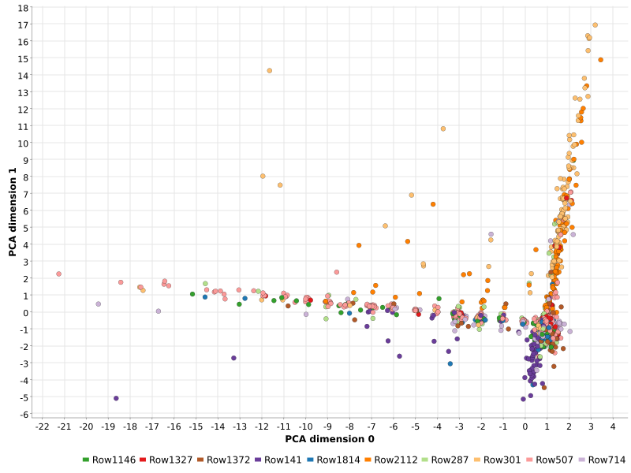

```{r setup, include=F}
knitr::opts_chunk$set(echo = FALSE)
library(knitr)
```

# Introducción

En esta página vamos a estudiar cómo podemos utilizar la herramienta
de minería de datos KNIME para hacer análisis de textos. En
particular, estaremos interesados en averiguar qué información se está
trasmitiendo ahora mismo a través de los principales medios
informativos del mundo (concretamente, periódicos con versión
online). Para ello, utilizaremos la tecnología RSS, que es una
especificación estándar basada en XML para la difusión de información
actualizada. El funcionamiento de esta tecnología es el siguiente. Los
medios difusores de contenido (en primera instancia se inventó esta
tecnología para la difusión de noticias, pero se ha diversificado en
los últimos años), crean canales en los que vuelcan sus noticias en
este formato estándar, de forma que no tienen que preocuparse por cómo
se muestra la información al cliente, si no sólo de estructurar dicha
información conforme a la especificación. El cliente, por otro lado,
utilizando sistemas agregadores de RSS, puede suscribirse a los
canales en los que esté interesado. De esta forma, el agregador de RSS
se encargará de descargar las noticias de los canales a los que el
usuario esté suscrito, y mostrarle toda la información de forma
conjunta dentro del sistema, sin necesidad de consultar cada uno de
los medios de forma individual. De esta manera, se puede recibir
información de fuentes de información diversas de manera centralizada.

En concreto, utilizaremos la funcionalidad de KNIME para la descarga
automática de feeds RSS. Dado que estamos hablando de una información
almacenada de forma estructurada (el XML tiene una serie de campos
predefinidos, en los que se especifica la URL de origen, el título de
la noticia, el cuerpo de la misma, la hora de descarga y de
publicación de la noticia...), la extensión TextProcessing de KNIME
proporciona un nodo que recibe como entrada una tabla de URLS que
apuntan a feeds RSS, y descarga automáticamente las noticias que haya
disponibles en todos esos canales, unificándolas en una única tabla, y
poniendo por columnas cada uno de los campos del XML. Además, crea una
columna en formato de documento, la cual contiene información del
título y del cuerpo de la noticia agrupada, que es el campo que
querremos estudiar en el resto de la práctica. Finalmente, también se
nos proporciona una columna con el XML completo, sin descomponer en
columnas, para que sea el usuario el que parsee el contenido de forma
manual. No obstante, nosotros descartaremos esta información ya que se
sale de los objetivos de esta práctica.

# Recolección y limpieza de datos

En primer lugar, comentaremos cómo hemos recogido la información con
la que se trabajará durante el resto de la práctica. Los feeds RSS que
se han registrado son las ediciones de prensa internacional de los
principales periódicos del mundo. La lista de fuentes de información con
la que hemos trabajado es la siguiente:

- BBC News
- New York Times
- BuzzFeed
- CNN
- Washington Post
- Reuters
- TIME
- The Independent
- ABC News
- EuroNews
- Global News
- The Daily Telegraph
- CBN
- The Local
- Al Jazeera
- The Guardian
- CNBC
- NDTV News
- Sputnik News
- Der Spiegel
- El País

Para todos estos periódicos, se ha cogido la sección de noticias
internacional, siempre que tuviesen edición en inglés, para evitar que
se solapasen idiomas dentro de la misma base de datos. Una vez
ejecutado el nodo de parseo RSS, obtenemos como resultado la tabla que
se muestra en la figura 1.

Como podemos observar en la imagen, se nos descargan una gran cantidad
de columnas en las que no estamos interesados. En particular,
trabajaremos exclusivamente con la columna _Document_, la cual
almacena en modo texto conjuntamente las columnas _Title_ y
_Description_. En particular, podemos ver la información almacenada en
estos documentos haciendo uso del nodo _Document Reader_, de la
extensión TextProcessing, el cual nos permite visualizar esta
información como se muestra en la figura 2.

Lo que haremos a continuación será, por tanto, eliminar las columnas
que no nos interesan, utilizando un filtro por columnas, en la que
sólo conservaremos la columna _Document_, para no arrastrar
información innecesaria. Además, como podemos apreciar en la segunda
figura, la información puede venir sucia, ya que tenemos cierto
formato propio de HTML que no nos interesa conservar. Esta información
es útil para el lector de RSS, ya que le aporta información sobre cómo
tiene que formatear el texto para enseñárselo al usuario, pero que
a nosotros no nos aporta ninguna información relevante. Aprovecharemos
el nodo _Markup Tag Filter_ para limpiar los documentos de estos tags
innecesarios de forma automática.


Una vez hemos realizado esta primera etapa obtenemos una colección de
2151 documentos, que será el conjunto de datos con el que trabajemos a
lo largo de la práctica. Una vez tenemos la información en bruto,
podemos empezar a trabajar con ella desde el punto de vista del
análisis de textos.

Comenzamos comentando la etapa de preprocesamiento llevada a cabo.

# Preprocesamiento de la información

Debido a que estamos hablando de información no estructurada, la fase
de preprocesamiento resulta fundamental para establecer cierta
homogeneidad en los datos con los que estamos trabajando. Las etapas
de preprocesamiento que se han llevado a cabo son las siguientes:

- _Part of Speech Tagging_: Se señalan la función que cumple cada
palabra en el discurso, para poder discriminar el pasos posteriores
- Lematización: Utilizando el nodo _Stanford Lemmatizer_, se
normalizan las palabras eliminando plurales, formas verbales, etc.
Este paso es importante porque dichas modificaciones no aportan
significación al discurso, son herramientas de cohesión. Al querer
extraer los temas sobre los que se está hablando en los periódicos,
esta información es sobrante.
- Eliminación de partículas discursivas: Observamos que algunas marcas
del discurso (en especial, comillas de diversa índole) no se eliminan
correctamente con el nodo de eliminación de puntuación que se explica
a continuación. Para eliminarlas, se ha construido un metanodo que
contiene varios nodos del tipo _Replace_, que filtran las distintas
comillas encontradas sustituyéndolas por la cadena vacía (quedando así
eliminadas).
- Eliminación de puntuación: Los puntos, comas y otras marcas
discursivas no aportan significado, y al formar parte de la cadena de
texto que les precede, introducen ruido en el conjunto de datos, de
forma que se consideran como distintas palabras que en realidad son
iguales. Por esto, también las hemos eliminado del conjunto de
documentos. Este nodo se coloca después del anterior porque, aunque
en las primeras pruebas se colocaron al revés, se detectó que el
genitivo sajón no se eliminaba correctamente, y quedaban algunas
letras S al final de algunas palabras produciendo ruido. Estas marcas
del genitivo se han eliminado también en el filtrado de partículas
anterior.
- Filtro de elementos del discurso: Nos quedamos exclusivamente con
los sustantivos, ya que son las palabras que aportan significado sobre
los temas que se tratan en las noticias
- Filtro de longitud de palabras: Debido a que con el procesamiento
que hemos hecho es probable que se hayan quedado partículas sobrantes
en algún punto, se eliminan todas las cadenas de caracteres de
longitud menor que 3.
- Conversión de mayúsculas: Para evitar que se interpreten como
distintas dos palabras idénticas, cuya única diferencia radica en la
primera letra (mayúscula y minúscula), se convierten todas las letras
a minúscula.

Una vez hemos llevado a cabo todo este proceso, los documentos
resultantes tienen el aspecto que se muestra en la figura 3.


Una vez preprocesado el documento, podemos aplicar técnicas de
descubrimiento de conocimiento para tratar de identificar los temas
más relevantes. Comenzamos formando nubes de conceptos para
identificar los sustantivos más repetidos.

# Nubes de conceptos

En este apartado, mostraremos las nubes de conceptos que se forman a
partir de los documentos que hemos recolectado y preprocesado.
Mostraremos dos nubes de conceptos correspondientes a la utilización
de dos medidas distintas.

Estas medidas nos van a dar el tamaño de las palabras que forman la
nube, de forma que palabras que consigan una puntuación más alta
aparecerán en mayor tamaño, mientras que las que consigan una
puntuación menor aparecerán más pequeñas. Las dos medidas que
utilizaremos serán la frecuencia de documento (para cada término, el
número de documentos que lo utilizan), y la métrica TF-IDF. Esta
segunda métrica es una medida de cuán importante es una palabra dentro
de un documento. Utilizando esta métrica, podremos identificar las
palabras más relevantes dentro del conjunto de noticias.

Comenzamos mostrando la nube de conceptos relativa a la frecuencia de
términos. Lo que hacemos en primer lugar es crear la bolsa de palabras
del conjunto de documentos completo. Una vez tenemos la bolsa de
términos construida, contamos el número de repeticiones de cada
elemento dentro de dicho conjunto.


En primer lugar, podemos observar, como podía ser esperable, que el
tema principal del que se está hablando estos días es el coronavirus.
Es, con diferencia, el término que aparece en mayor tamaño. Además,
aparece también el término covid-19 (nombre científico que se le da al
virus). Aparecen también en gran tamaño el nombre de Trump, lo cual
puede indicar un sesgo en las fuentes, que tiendan a hablar más del
Estados Unidos que de otras partes del mundo, y podemos observar
también gran cantidad de términos médicos (hospital, virus, outbreak
(epidemia), lockdown (confinamiento), health (salud)), o relacionados
con el estado y la economía, ya que se predice que van a verse
fuertemente afectados (crisis, country, government,
president). Podemos observar también que aparecen los nombres de los
principales lugares en los que se está desarrollando la pandemia
(Spain, Italy, China, New York, aunque aparecen como palabras
separadas).

También podemos observar que el sistema ha incurrido en algunos
fallos. A la hora de utilizar el lematizador y el POS Tagger, algunas
palabras poco conocidas se marcan en distintas ocasiones como
elementos discursivos distintos. En particular, el término coronavirus
se marca como nombre común o nombre propio (incorrectamente)
dependiendo de la frase, y es por esto por lo que se muestra en dos
ocasiones. No obstante, hemos conservado el tag asignado a cada
palabra para poder colorear la nube de conceptos. Se ha estudiado la
resolución de este problema intentando cambiar en primer lugar todo el
texto a minúsculas, pero en ese caso se perdía el significado de otras
palabras, que pasaban a no considerarse nombre propio cuando realmente
lo son.

Otro problema que se ha identificado, y que no ha sabido resolverse
con KNIME, es el hecho de agrupar conjuntamente nubes de conceptos que
incluyan palabras sueltas y conceptos formados por varias palabras
(N-gramas). Por ejemplo, resulta interesante en este contexto plantearse
los bigramas que aparecen, como se puede mostrar en el siguiente mapa
de conceptos:


Vemos que muchos conceptos de los que reconocimos en el mapa
conceptual de elementos individuales aparecen también por parejas. Por
ejemplo, New York, que antes aparecía separadamente y con un tamaño
relativamente pequeño, ahora aparece como concepto principal, siendo
el de mayor tamaño de todos los que observamos. De esta misma forma
nos aparece el concepto _Death Toll_, que significa número de víctimas
en inglés, o la Casa Blanca (White House). Para estos elementos,
resulta más interesante estudiarlos en parejas que de forma
individual. También podemos encontrar aquí los nombres de algunos
políticos importantes (Joe Biden, Bernie Sanders o Donald Trump).
Sería interesante poder agrupar estas dos nubes de conceptos en una
sola, pero desde KNIME no hemos sido capaces de unificar toda esta
información para mostrarla conjuntamente.

Una vez hemos visto estas nubes de conceptos, vamos a generar una
similar, pero utilizando la métrica TF-IDF. Veremos así cómo cambia
el resultado obtenido en función de utilizar una u otra métrica.

En particular, para esta métrica tenemos que hacer ciertos ajustes
previos. El problema de esta métrica es que está definida para una
palabra en un documento, es decir, la misma palabra en dos documentos
distintos nos produce valores distintos. Por este motivo, tenemos que
ver cómo agrupamos esta información para poder construir el mapa. En
nuestro caso, hemos utilizado dos estrategias de agrupamiento. Por un
lado, hemos cogido el máximo de los valores que toma la palabra. Por
otro, la suma de todas sus puntuaciones. Para ambos casos, hemos
seleccionado sólamente los primeros 50 elementos, para evitar tener
un mapa conceptual demasiado grande. El resultado es el siguiente:


Podemos observar que el uso de una u otra política de agrupamiento nos
produce resultados muy dispares. Además, en el caso de la primera nube
parece que los resultados obtenidos no son demasiado representativos.
En el caso de la segunda nube, obtenemos resultados más parecidos a lo
que obtuvimos con el conteo de frecuencias puro, debido a que, aunque
estemos sumando cantidades pequeñas en muchos casos, debido a la gran
cantidad de repeticiones de algunos de los términos, aunque
individualmente no tengan puntuaciones muy altas, en conjunto sí que
consiguen unos valores importantes.

Teniendo en cuenta el problema que hemos escogido, parece que es más
adecuada la primera vía estudiada. Al estar hablando de noticias, un
término se considera más importante cuantas más veces aparezca en
noticias distintas. Precisamente, la métrica TF-IDF penaliza a las
palabras que aparecen en muchos documentos distintos, justo en contra
de lo que nos interesaría en este caso. De hecho, a pesar de que
sabemos sobradamente que ahora mismo el tema central de las noticias a
nivel mundial es el coronavirus, en la primera nube construida con
TF-IDF ni siquiera aparece el término ni términos similares. En la
segunda nos aparece pero por lo que hemos comentado previamente. Debido
a la cantidad de veces que la palabra aparece en una gran cantidad
de noticias, la puntuación TF-IDF individual es muy baja, pero al
sumarla se convierte en muy relevante.

Otro problema que tenemos aquí viene del preprocesamiento tan fuerte
que hemos hecho. Las noticias son documentos relativamente cortos, y
con la gran cantidad de información que hemos eliminado de ellas (sólo
nos hemos quedado con los sustantivos), la puntuación TF estará muy
sesgada por culpa de las noticias cortas. Es muy probable que palabras
con una puntuación alta en esta métrica se deban a estar situadas en
noticias muy cortas, más que por aparecer repetidas varias veces.

Por estos motivos expuestos anteriormente, se concluye que para el
estudio que estamos haciendo, la nube de conceptos basada en la
frecuencia de documentos en los que aparece cada palabra resulta más
adecuada que la basada en TF-IDF.

Una vez hemos visto cómo podemos construir nubes de conceptos a partir
de nuestros documentos, vamos a intentar aplicar una técnica de
clustering para agrupar estas noticias por temáticas.

# Clustering de noticias

Ahora, trataremos de aplicar una técnica de aprendizaje automático
para agrupar las noticias del día por temáticas. En particular,
aplicaremos el método de clustering de los k-medioides, el cual nos
permitirá agrupar las noticias alrededor de varias noticias
representativas. De esta manera, si conseguimos una buena
representación de los documentos, podremos obtener información
sobre las principales temáticas tratadas en nuestros documentos
de entrada.

La política que seguiremos es la siguiente. En primer lugar,
extraeremos los cinco términos más relevantes de cada documento. Una
vez tenemos dichos términos, calcularemos el vector de apariciones
para cada uno de los documentos con los que estamos trabajando. Una
vez tenemos calculada esa información, simplemente tenemos que
utilizar cada uno de esos vectores como vectores de entrada para
nuestro algoritmo de agrupamiento.

Como hemos dicho anteriormente, utilizaremos el algoritmo de los
k-mediodes. La ventaja que nos aporta este algoritmo es que utiliza
como centroides de los clusters elementos del propio conjunto de
entrada. De esta manera, podemos obtener elementos representantes de
los grupos, los cuales nos darán una idea de los términos que se
repiten en los grupos, lo que significa a fin de cuentas los temas que
tratan las noticias agrupadas bajo dicho cluster.

El problema de utilizar este método es que no tenemos conocimiento a
priori del número de conjuntos en que nos interesa agrupar la
información. Debido a que no tenemos más información empezaremos
agrupando la información en 10 grupos distintos.

A la hora de calcular las distancias entre los vectores, para evitar
un sesgo con los términos que más se nos repiten, hemos decidido
excluir estas columnas de los cálculos. De esta manera, el nodo que
calcula las distancias no tendrá dichas columnas en cuenta. En concreto,
se excluyen todas las columnas que tienen relación con el coronavirus
(coronavirus, corona, covid-19 y covid). Se había detectado un sesgo
importante al tener estas columnas en cuenta, ya que al final el
agrupamiento se producía en función del número de veces que se
repetía esta palabra en el conjunto.

Además, en lugar de calcular la distancia euclídea estándar, hemos
escogido la distancia del coseno en lugar de la distancia euclídea, ya
que ofrece mejores resultados con vectores que representan
ocurrencias.

Una vez calculados los agrupamientos, utilizaremos distintas formas de
visualización para estudiar los grupos formados. En primer lugar, para
observar los grupos obtenidos, emplearemos dos tipos de proyecciones
para reducir la dimensionalidad de los vectores de características y
poder representarlos en el plano. Por un lado, hemos aplicado PCA
sobre los vectores de características, extrayendo así las dos
direcciones principales. Por otro, hemos aplicado una técnica de
reducción de dimensionalidad ligeramente más potente, conocida como
t-SNE, la cual busca reducir la dimensionalidad de los puntos del
conjunto de entrada respetando el vecindario de cada dato lo máximo
posible, de forma que puntos cercanos en el espacio original estarán
probablemente cercanos en el espacio resultante, así como puntos
lejanos en origen lo estarán en el resultado. Dadas estas dos
reducciones de dimensionalidad, representamos los puntos obtenidos en
unos ejes de coordenadas, y coloreamos los puntos en función de
cluster al que se han asociado dichos elementos. Comenzamos mostrando
el resultado tras PCA:

{width=70%}

Como podemos observar, se aprecian claramente las direcciones
principales de los puntos, pero no podemos apreciar claramente los
grupos que se han formado. Debido a que estamos hablando de una
reducción de dimensionalidad importante, parece que esta proyección
no almacena suficiente variabilidad de los datos, y aparecen la
mayoría de puntos agrupados en la parte inferior derecha. Esta no
parece, por tanto, una buena opción para visualizar los documentos.
Utilizando la proyección t-SNE, el resultado obtenido es el siguiente:

{width=70%}

Parece que esta representación sí que es más adecuada para el problema
que nos ocupa. Ahora sí podemos observar los distintos clusters que se
han formado con el algoritmo de los k-medioides. Tenemos, en primer
lugar, un cluster mayoritario, que engloba a la mayoría de las
noticias (es el que puede verse en un tono rosa claro, y representado
por la noticia 507). Después, tenemos otros grupos de noticias más o
menos pequeños, pero mucho más compactos. Por ejemplo, las noticias en
naranja, representadas por la noticia 2112, forman un grupo de puntos
a la derecha del gráfico, bastante compacto. Esta representación nos
permite deducir, con más o menos certeza (hay que tener en cuenta que
esta proyección es probabilística), que los grupos pequeños de
noticias van a tratar temas similares, mientras que el conjunto grande
va a estar formado por muchas noticias diversas, siendo por tanto
menos cohesivo.

Ahora vamos a estudiar las noticias que hacen de prototipo de los
grupos obtenidos. El nodo que calcula los k-medioides en KNIME tiene
como uno de los puertos de salida los elementos que han sido
considerados centroides, así como el tamaño de los grupos que se han
formado. Vamos a observar esa información. La tabla de salida obtenida
(tras eliminar las columnas de atributos, las cuales ya no interesan)
es la siguiente:


Como ya apreciamos anteriormente, tenemos un grupo de noticias de gran
tamaño, seguido de multitud de grupos más pequeños. Podemos deducir
algunos de los temas que se están tratando en ellos. Por ejemplo, la
noticia de la fila 1814 habla del repunte de casos que ha tenido lugar
en España por la relajación del confinamiento y la vuelta a la
actividad productiva del lunes 13. También podemos observar noticias
relacionadas con la evolución del virus en Asia, tanto India como
China. Podemos observar cómo algunas noticias prototipo hablan de
temas similares, por lo que es posible que en realidad el número de
grupos sea menor.

Ahora, podemos explorar las noticias prototipo desde su fuente
original, utilizando para ello el visor de documentos. El campo de
documento contiene información en forma de metadatos, lo que nos
permite acceder directamente a la fuente de la que se descargó la
noticia. Por ejemplo, la última de las noticias que aparecen habla de
un aumento de muertes en el epicentro de la pandemia:


Finalmente, nos quedaría explorar los resultados obtenidos por el
algoritmo de clustering, es decir, observar si efectivamente las
noticias agrupadas dentro de un mismo cluster contienen información
parecida. Para ello, se ha preparado un nodo filtro que permite
seleccionar el valor de la columna de cluster que interese estudiar (a
fin de cuentas, seleccionar todas las noticias pertenecientes a un
cluster) y mostrar dichos documentos a continuación. Por ejemplo, se
muestra el resultado obtenido para las noticias que se han agrupado
en el último cluster, cuyo prototipo es el que hemos mostrado anteriormente:


Como podemos observar, por un lado, tenemos aquí una gran cantidad de
noticias con información sobre el conteo de muertos. No obstante,
existen otra gran cantidad de noticias cuya relación no parece tan
fácil de visualizar a simple vista. Probablemente, el uso de
distancias más apropiadas, las cuales contengan información semántica
de los términos (la distancia que hemos utilizado no tiene en cuenta
en ningún momento el significado de las palabras que se comparan),
habría producido unos resultados más adecuados. No obstante, los
resultados son razonablemente buenos para los métodos que se han
utilizado

# Conclusión y trabajo futuro

En esta práctica hemos visto cómo podemos emplear KNIME para hacer
minería de textos. Concretamente, hemos tomado feeds RSS de los
principales periódicos del mundo y hemos extraído las últimas noticias
publicadas, con la intención de entender cuáles eran los principales
temas de los que se estaba hablando en el momento.

Hemos tomado dos aproximaciones distintas, por un lado, se han creado
nubes de conceptos con los temas que más se repetían en todas las
noticias, observando que el tema principal de estos días es la
pandemia que se está viviendo a nivel mundial, así como los principales
actores políticos que la gestionan.

Por otro lado, hemos intentado agrupar estas noticias por temáticas,
utilizando vectores de repetición de palabras clave en dichas noticias
y utilizando algoritmos de clústering.

Se han encontrado algunos problemas a lo largo de la práctica, los
cuales sugieren posibles vías de actuación para continuar con el
trabajo. Por un lado, se han identificado algunos problemas de
funcionamiento en ciertos nodos de KNIME, que invitan a tomar otras
aproximaciones. Por ejemplo, el POS Tagger ha etiquetado la misma
palabra de diversas formas, lo cual introduce cierto ruido en las
nubes de conceptos. Sería interesante estudiar qué produce este
problema e intentar solucionarlo.

También se ha observado que el resultado del clustering, aunque es
relativamente bueno, puede ser mejorado utilizando otras métricas.
Las distancias utilizadas entre los documentos que se han utilizado de
base para el agrupamiento no tienen en cuenta el significado de las
palabras que contienen, simplemente si hay palabras repetidas o no.
El hecho de utilizar funciones de distancia más sofisticadas, las
cuales aprovechen la información semántica de las palabras clave del
documento producirá probablemente una mejora en los resultados
obtenidos.
