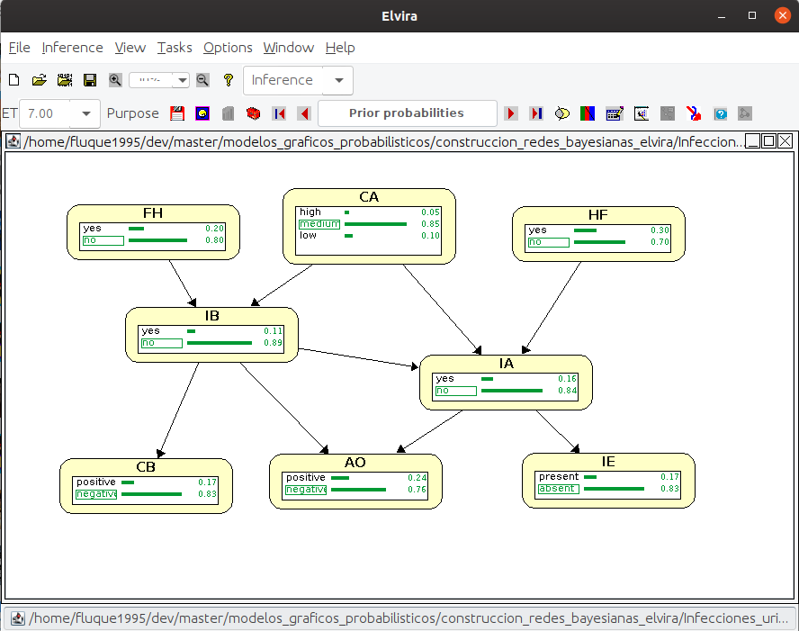

```{r setup, include=F}
knitr::opts_chunk$set(echo = TRUE)
set.seed(0)

## Package import
library(gRain)
library(bnlearn)
library(knitr)
```

# Introducción

En esta práctica se mostrará la modelización de redes bayesianas
utilizando las librerías `gRain` y `bnlearn` de R. Partiremos del
enunciado de un problema de pequeño tamaño que puede modelarse
utilizando redes bayesianas.

La práctica está basada en el problema que definimos para la práctica
anterior. En dicho problema, establecimos un enunciado en el que se
relacionaban infecciones de las vías urinarias con diversos factores
de riesgo y algunas pruebas médicas. El contexto médico es un ámbito
de aplicación directo de las redes bayesianas, y es por esto por lo
que decidimos modelar un problema en este contexto.

En esta práctica vamos a llevar la implementación de dicha red
bayesiana a R. Utilizaremos dos librerías que nos permiten trabajar
con este tipo de modelos. En una primera sección, especificaremos el
problema con el que vamos a trabajar, y mostraremos la red bayesiana
que lo modela, así como las tablas de probabilidades que necesitamos
para trabajar. En una segunda etapa, mostraremos qué secuencia de
órdenes tenemos que especificar en R para crear esta estructura de red
y especificar las probabilidades. Finalmente, pondremos algunos
ejemplos de cálculo de probabilidades tanto con métodos exactos como
con métodos probabilísticos, y comprobaremos la d-separación de
algunas de nuestras variables.

Comenzamos dando el enunciado del problema que vamos a modelar.

# Enunciado del problema

El problema con el que trabajaremos es el siguiente:

\begin{displayquote}
Existen dos tipos principales de infecciones del aparato urinario, la
infección de las vías urinarias bajas y de las vías urinarias
altas. Ambas infecciones están fuertemente relacionadas con el consumo
de agua diario, siendo más probables cuando dicho consumo es demasiado
bajo o demasiado alto. Además, la infección de las vías bajas puede
producirse por falta de higiene. La predisposición a sufrir una
infección en las vías altas tiene cierto componente genético, así que
el historial familiar resulta relevante. Por otro lado, no es extraño
que una infección en las vías bajas produzca una infección en las
altas.

Existen varias pruebas que nos permiten discernir si se está sufriendo
alguna enfermedad urinaria. En primer lugar, un análisis de orina nos
muestra la presencia de infección en alguna de las vías. De forma más
concreta, se puede hacer un cultivo de una biopsia para confirmar la
infección en las vías inferiores. Para las vías superiores, puede
observarse cierta inflamación tras realizar una ecografía.
\end{displayquote}

# Descripción de la red

Dado el enunciado anterior, vamos a describir la red de forma
cualitativa (especificando la estructura de una red que represente
todas las condiciones especificadas anteriormente) y de forma
cuantitativa (asignando las probabilidades necesarias para describir
completamente el problema). No detallaremos en profundidad la
construcción de la red, ya que no es el objetivo de esta práctica.

## Descripción cualitativa

Comenzamos identificando las variables involucradas (por orden de
aparición):

- Infección de las vías bajas (IB)
- Infección de las vías altas (IA)
- Consumo de agua (CA)
- Falta de higiene (FH)
- Historial familiar (HF)
- Análisis de orina (AO)
- Cultivo de la biopsia (CB)
- Inflamación en la ecografía (IE)

Establecemos el orden en el que introducimos las variables en el
grafo. Como ya sabemos, se deben introducir comenzando por las causas,
de forma que cuando se va a introducir una variable ya se han
introducido todas aquellas de las que depende. Un posible orden
de introducción de nuestras variables es el siguiente:

\[ CA \rightarrow FH \rightarrow HF \rightarrow IB \rightarrow IA
\rightarrow AO \rightarrow CB \rightarrow IE
\]

Tenemos las tres primeras, que hacen referencia a los factores
de riesgo y que son independientes de todos los demás nodos, después
las dos infecciones (metemos la de las vías bajas primero porque la
de las vías altas también depende de ésta), y por último las tres
posibles pruebas, cuyos resultados estarán influenciados por ambas
enfermedades. Una vez introducidas todas las variables en el grafo
y colocadas todas las relaciones de dependencia, el grafo final queda
de la siguiente manera:


A continuación, especificamos las tablas de probabilidades que
necesitamos para definir el sistema completo.

## Descripción cuantitativa

Para dar la descripción completa de una red bayesiana tenemos que
especificar, además de la estructura de la red, las tablas de
probabilidad de cada uno de los nodos. Para cada nodo, tenemos que dar
la probabilidad de cada uno de los posibles valores que puede tomar,
condicionado a todas las posibles combinaciones de los valores de los
padres. Comenzamos dando las tablas de probabilidad de los factores de
riesgo, los cuales no dependen de ningún otro nodo de la red, y por
tanto tendremos que especificar la probabilidad de cada uno de los
valores que toman. Dichas tablas son las siguientes:

\begin{table}[H]
\parbox{.3\linewidth}{
\centering
\begin{tabular}{cc}
\toprule
    FH = Sí & FH = No \\
\midrule
    0.2 & 0.8 \\
\bottomrule
\end{tabular}
\caption{Falta de higiene}
}
\hfill
\parbox{.38\linewidth}{
\centering
\begin{tabular}{ccc}
\toprule
    CA = Bajo & CA = Medio & CA = Alto \\
\midrule
    0.1 & 0.85 & 0.05 \\
\bottomrule
\end{tabular}
\caption{Consumo de agua}
}
\hfill
\parbox{.3\linewidth}{
\centering
\begin{tabular}{cc}
\toprule
    HF = Sí & HF = No \\
\midrule
    0.3 & 0.7 \\
\bottomrule
\end{tabular}
\caption{Historial familiar}
}
\end{table}

Ahora, tenemos que definir las probabilidades para las enfermedades.
Tenemos que especificar las probabilidades condicionadas a todas las
posibles parejas de valores de los padres. Comenzamos con la infección
de las vías bajas. Los dos padres son la falta de higiene y el consumo
de agua. La primera toma dos valores y la segunda, tres. Tendremos,
por tanto, seis combinaciones posibles, y para cada uno de estos seis
valores, tendremos que especificar la probabilidad de sí y no, dando
lugar a un total de 12 valores:

\begin{table}[H]
\centering
\begin{tabular}{lcccccc}
\toprule
    & FH = Sí & FH = No & FH = Sí & FH = No & FH = Sí & FH = No \\
    & CA = Alto & CA = Alto & CA = Medio & CA = Medio & CA = Bajo & CA = Bajo \\
\midrule
IB = Sí & 0.4 & 0.35 & 0.2 & 0.05 & 0.3 & 0.25 \\
IB = No & 0.6 & 0.65 & 0.8 & 0.95 & 0.7 & 0.75 \\
\bottomrule
\end{tabular}
\caption{Probabilidades condicionadas de la infección en las vías bajas}
\end{table}

Pasamos ahora a la definición de las probabilidades para las vías
altas. Ahora tenemos tres padres. Dado que el tamaño de la tabla
aumenta significativamente (tenemos que especificar 24 valores
distintos), vamos a separar la información en dos tablas distintas. En
una tabla pondremos los valores de las probabilidades de padecer una
infección en las vías altas, y en la otra las de no padecerla.  Es
conveniente observar que una de las tablas es redundante con la otra,
debido a que por el teorema de la probabilidad total se puede obtener
toda la información. De la misma manera, en la tabla anterior, una
fila habría sido suficiente. No obstante, especificaremos todas las
probabilidades en todos los casos para hacer más explícita la
información:

\begin{table}[H]
\centering
\begin{tabular}{lcccccc}
\toprule
\multirow{2}{*}{IA = Sí} & HF = Sí & HF = No & HF = Sí & HF = No & HF = Sí & HF = No \\
    & CA = Alto & CA = Alto & CA = Medio & CA = Medio & CA = Bajo & CA = Bajo \\
\midrule
IB = Sí & 0.6 & 0.35 & 0.5 & 0.15 & 0.4 & 0.35 \\
IB = No & 0.5 & 0.25 & 0.35 & 0.03 & 0.3 & 0.15 \\
\bottomrule
\end{tabular}
\caption{Probabilidades condicionadas para el caso Sí en la infección en las vías altas}
\end{table}

\begin{table}[H]
\centering
\begin{tabular}{lcccccc}
\toprule
\multirow{2}{*}{IA = No} & HF = Sí & HF = No & HF = Sí & HF = No & HF = Sí & HF = No \\
    & CA = Alto & CA = Alto & CA = Medio & CA = Medio & CA = Bajo & CA = Bajo \\
\midrule
IB = Sí & 0.4 & 0.65 & 0.5 & 0.85 & 0.6 & 0.65 \\
IB = No & 0.5 & 0.75 & 0.65 & 0.97 & 0.7 & 0.85 \\
\bottomrule
\end{tabular}
\caption{Probabilidades condicionadas para el caso No en la infección en las vías altas}
\end{table}

Finalmente, queda especificar las tablas de las tres pruebas. En el
caso de la biopsia y la ecografía, tendremos que dar 4 valores de
probabilidad, dado que ambas pueden tomar dos valores, al igual que
sus padres. Para el análisis de orina, serán 8 en total:

\begin{table}[H]
\parbox{.45\linewidth}{
\centering
\begin{tabular}{lcc}
\toprule
    & IB = Sí & IB = No \\
\midrule
CB = Sí & 0.97 & 0.07 \\
CB = No & 0.03 & 0.93 \\
\bottomrule
\end{tabular}
\caption{Cultivo de la biopsia}
}
\hfill
\parbox{.45\linewidth}{
\centering
\begin{tabular}{lcc}
\toprule
    & IA = Sí & IA = No \\
\midrule
IE = Sí & 0.95 & 0.02 \\
IE = No & 0.05 & 0.98 \\
\bottomrule
\end{tabular}
\caption{Inflamación en la ecografía}
}
\end{table}

\begin{table}
\centering
\begin{tabular}{lcccc}
\toprule
    & IA = Sí & IA = No & IA = Sí & IA = No \\
    & IB = Sí & IB = Sí & IB = No & IB = No \\
\midrule
AO = Sí & 0.99 & 0.94 & 0.88 & 0.03 \\
AO = No & 0.01 & 0.06 & 0.12 & 0.97 \\
\bottomrule
\end{tabular}
\caption{Análisis de orina}
\end{table}

Ya tenemos completamente definida nuestra red bayesiana, con todas las
probabilidades necesarias especificadas. En la siguiente sección vamos
a traducir esta red a una red en R utilizando `gRain`.

# Implementación de la red en R

Como hemos dicho anteriormente, vamos a proceder a la implementación
de esta red en R. Para ello, utilizaremos el paquete `gRain`.

Comenzamos definiendo la lista de variables, así como de las variables
de las que dependen, y convertimos dicha lista en un grafo dirigido
acíclico:

```{r}
## Problem list of variables and conditions definition
problem.list <- list(~FH, ~CA, ~HF, ~IB | CA:FH, ~IA | CA:HF:IB,
                     ~CB | IB, ~AO | IB:IA, ~IE |IA)

problem.network <- dagList(problem.list)
```
Ahora, definimos para cada variable los posibles estados que puede
tomar:

```{r}
## Variables states definition
FH.st <- c("Si", "No")
CA.st <- c("Alto", "Medio", "Bajo")
HF.st <- c("Si", "No")
IB.st <- c("Si", "No")
IA.st <- c("Si", "No")
CB.st <- c("Positivo", "Negativo")
AO.st <- c("Positivo", "Negativo")
IE.st <- c("Presente", "Ausente")
```
Y construimos las tablas de probabilidad:

```{r}
## PROBABILITIES DEFINITION

## Risk factors
FH.CPT <- cptable(~FH, values=c(0.2, 0.8), levels=FH.st)
CA.CPT <- cptable(~CA, values=c(0.05, 0.85, 0.1), levels=CA.st)
HF.CPT <- cptable(~HF, values=c(0.3, 0.7), levels=HF.st)

## Diseases
IB.CPT <- cptable(
    ~IB+FH+CA,
    values=c(0.4, 0.6, 0.35, 0.65, 0.2, 0.8, 0.05, 0.95, 0.3, 0.7, 0.25, 0.75),
    levels=FH.st
)
IA.CPT <- cptable(
    ~IA+CA+HF+IB,
    values=c(0.6, 0.4, 0.5, 0.5, 0.4, 0.6, 0.35, 0.65, 0.15, 0.85, 0.35, 0.65,
             0.5, 0.5, 0.35, 0.65, 0.3, 0.7, 0.25, 0.75, 0.03, 0.97, 0.15, 0.85),
    levels=IA.st)

## Diagnostic tests
CB.CPT <- cptable(~CB+IB, values=c(0.97, 0.03, 0.07, 0.93), levels=CB.st)
AO.CPT <- cptable(
    ~AO+IA+IB,
    values=c(0.99, 0.01, 0.94, 0.06, 0.88, 0.12, 0.03, 0.97),
    levels=AO.st
)
IE.CPT <- cptable(~IE+IA, values=c(0.95, 0.05, 0.02, 0.98), levels=IE.st)
```

Construimos las tablas de probabilidades condicionadas de todo el
modelo, y comprobamos que en efecto los valores que hemos introducido
coinciden con las tablas que definimos en el enunciado del problema
(mostramos una única tabla):

```{r}
## Table compilation
potential.list <- compileCPT(list(FH.CPT, CA.CPT, HF.CPT, IB.CPT,
                                  IA.CPT, CB.CPT, AO.CPT, IE.CPT))

## Checking the correctness of introduced information (only one node shown)
potential.list$AO
```

Podemos comprobar que el resultado parece correcto, así que hemos
introducido la información correctamente en la red. La introducción de
las probabilidades en la red puede no ser trivial, ya que depende del
orden en el que se especifiquen las variables. Una vez creadas las
tablas de probabilidades, convertimos dicha información a un objeto
de tipo red bayesiana:

```{r}
## Creation of grain object
bayesian.network <- grain(potential.list)
bayesian.network.compiled <- compile(bayesian.network)
```

Ahora, podemos hacer consultas sobre las probabilidades en nuestra
red:

```{r, results="hold"}
## Exact queries over the network (no evidence)
querygrain(bayesian.network.compiled, nodes="IA")
querygrain(bayesian.network.compiled, nodes="IB")
```

En la consulta anterior, podemos ver cómo se ha aplicado la operación
de marginalización para producir los resultados. Aunque nosotros no
hemos especificado explícitamente estas probabilidades en ningún momento,
sí que hemos especificado las probabilidades condicionadas de estas dos
variables a todas las posibles combinaciones de sus padres, así como las
probabilidades completas para los padres. Esto hace que la probabilidad
de estas dos variables se pueda calcular por completo. Para comprobar
la corrección de la información que hemos introducido, mostramos la red
que implementamos en Elvira para la práctica anterior, en la que se puede
observar que las probabilidades para estas dos variables coinciden en
ambos casos, si redondeamos los valores anteriores a dos decimales:



A continuación, mostraremos cómo podemos realizar consultas sobre la red
que hemos construido, una vez fijamos algunas observaciones.

# Consultas sobre la red bayesiana

En este apartado vamos a estudiar cómo introducir evidencia en nuestra
red, y calcular probabilidades fijadas dichas observaciones. En primer
lugar, estudiaremos cómo se modifican las probabilidades de padecer
las dos enfermedades en función de los resultados en algunas pruebas.
Comenzamos fijando nuestra evidencia, la cual será haber dado positivo
en las prueba del cultivo de la biopsia y el análisis de orina:

```{r}
## Evidence introduction
evidence.1 <- setEvidence(
    bayesian.network.compiled,
    nodes=c("CB", "AO"), states=c("Positivo", "Positivo")
)
```

Una vez introducida dicha evidencia, podemos calcular las
probabilidades de padecer las enfermedades, tanto viendo las
marginales para cada variable como la distribución conjunta:

```{r}
## Query, both joint and marginal, for diseases (exact method)
querygrain(evidence.1, nodes = c("IA", "IB"), type = "joint")
querygrain(evidence.1, nodes = c("IA", "IB"), type = "marginal")
```

Podemos observar cómo, dada la evidencia de las dos pruebas que nos
permiten conocer si existe una infección en las vías bajas, la
probabilidad de padecer dicha enfermedad ha crecido muchísimo. Además,
dado que la infección de las vías altas está influenciada por la de
las vías bajas, también ha aumentado la probabilidad de dicha
infección, aunque de forma menos significativa.

Podemos llegar a los mismos resultados utilizando otras técnicas.
A continuación, mostramos cómo podemos usar los métodos de Montecarlo
para obtener las mismas probabilidades. En particular, obtendremos
la probabilidad, dada la evidencia anterior, de padecer las dos
enfermedades simultáneamente. Utilizaremos ahora `bnlearn`, por lo
que tenemos que transformar nuestro modelo:

```{r}
## We have to transform our net to a bn.fit object from bnlearn
bnl.network <- as.bn.fit(bayesian.network.compiled)

## Same query, using Montecarlo
cpquery(bnl.network, event = (IA == "Si") & (IB == "Si"),
        evidence = ((CB == "Positivo") & (AO == "Positivo")), n=10^6)
```

Lo que se hace en este caso es simular el experimento un número `n` de
veces (en nuestro caso $10^6$), y calcular la frecuencia en la que se
observa el evento que hemos especificado. Si en alguna de las
simulaciones no se da la evidencia que hemos especificado, dicha
simulación se descarta y se repite el experimento. Podemos observar
cómo este método nos da unos resultados más o menos similares a los
que conseguimos con la inferencia exacta, pero no completamente
precisos. En este contexto puede parecer que esta forma de calcular
probabilidades no es adecuada, pero tiene la ventaja de ser mucho más
eficiente que el método exacto de cálculo, por lo que si la red tiene
una complejidad muy alta, puede no ser viable el cálculo exacto, y hay
que recurrir a métodos como este.

Otra posible forma de hacer este cálculo, para obtener los resultados
más completos, consiste en simular experimentos y calcular las tablas
por nuestra parte, en lugar de establecer específicamente el evento
en el que estamos interesados:

```{r}
## Same query, using random sampling and table of probabilities
IAxIB <- cpdist(bnl.network, nodes = c("IB", "IA"),
                evidence = ((CB == "Positivo") & (AO == "Positivo")), n=10^6)
prop.table(table(IAxIB))
```

De esta forma hemos obtenido $10^6$ muestras del experimento, y hemos
calculado las tablas de combinaciones que obtenemos. Después hemos
convertido esos resultados absolutos en tantos por 1, y obtenemos las
probabilidades.

Resulta interesante observar cómo, si el número de experimentos no es
suficientemente grande, las probabilidades calculadas por el método de
Montecarlo pierden precisión significativamente. Con $10^6$ muestras
obtenemos una precisión cercana a los 2 decimales. Si reducimos el
número de muestras a 100:

```{r}
## Same query, using random sampling and table of probabilities
IAxIB <- cpdist(bnl.network, nodes = c("IB", "IA"),
                evidence = ((CB == "Positivo") & (AO == "Positivo")), n=10^2)
prop.table(table(IAxIB))
```

El resultado empeora significativamente. Esto pone de manifiesto la
importancia de tener un número de muestras considerablemente alto.

Pasamos a estudiar un experimento distinto. Ahora, introduciremos
información sobre el consumo de agua, antecedentes familiares, y
presencia de inflamación en la ecografía:

```{r}
## Evidence introduction
evidence.2 <- setEvidence(
    bayesian.network.compiled,
    nodes=c("CA", "HF", "IE"), states=c("Bajo", "Si", "Presente")
)
```

De nuevo, calculamos las probabilidades de padecer las enfermedades
por los tres métodos:

```{r, results="hold"}
## Query, both joint and marginal, for diseases (exact method)
print("Método exacto")
querygrain(evidence.2, nodes = c("IA", "IB"), type = "joint")
querygrain(evidence.2, nodes = c("IA", "IB"), type = "marginal")

## Same query, using Montecarlo
print("Método de montercarlo para un valor")
cpquery(bnl.network, event = (IA == "Si") & (IB == "Si"),
        evidence = ((CA == "Bajo") & (HF == "Si") & (IE == "Presente")), n=10^6)

## Same query, using random sampling and table of probabilities
print("Muestreo aleatorio sobre la red y tablas de frecuencias")
IAxIB <- cpdist(bnl.network, nodes = c("IB", "IA"),
                evidence = ((CA == "Bajo") & (HF == "Si") & (IE == "Presente")),
                n=10^6)
prop.table(table(IAxIB))
```

Donde podemos observar que los resultados que obtenemos son muy
similares. Tenemos que dados los factores de riesgo y el positivo en
la prueba de la ecografía, la probabilidad de padecer una infección en
las vías superiores es muy alta.

Finalmente, vamos a utilizar el muestreo de Montecarlo para calcular
probabilidades de sucesos más complejos. En particular, calcularemos
la probabilidad de nuestras enfermedades en una unión de
sucesos. Tendremos que la evidencia es haber dado positivo en el
cultivo de la biopsia y saber que el consumo de agua es alto, o
conocer que el consumo de agua es bajo y que hay inflamación en la
ecografía. Como podemos observar, esta unión de sucesos es mucho más
compleja de expresar en la inferencia exacta, pero su expresión es
sencilla cuando utilizamos el enfoque probabilístico. No significa
esto que no pueda calcularse dicha probabilidad de forma exacta, lo
cuál sí es posible, pero requiere de cálculos más complejos. Con el
enfoque probabilístico, calculamos esta probabilidad de la siguiente
forma:

```{r results="hold"}
print("Método de montecarlo para un valor")
cpquery(bnl.network, event = (IA == "Si") & (IB == "Si"),
        evidence = ((CB == "Positivo") & (CA == "Alto")) |
            ((CA == "Bajo") & (IE == "Presente")),
        n=10^6)

## Same query, using random sampling and table of probabilities
print("Muestreo sobre la red y construcción de tabla de frecuencias")
IAxIB <- cpdist(bnl.network, nodes = c("IA", "IB"),
                evidence = ((CB == "Positivo") & (CA == "Alto")) |
                    ((CA == "Bajo") & (IE == "Presente")),
                n=10^6)
prop.table(table(IAxIB))
```

Finalmente, vamos a aplicar el criterio de D-separación sobre nuestras
variables. Esto nos permite conocer la independencia que existe entre
las mismas. Comenzamos comprobando que los factores de riesgo, cuando
el resto del grafo es desconocido, son independientes, ya que en todos
los caminos que los unen hay algún patrón cabeza-cabeza con todas las
variables sin observaciones:

```{r, results="hold"}
## Given no information about the other variables, causes are independent
## due to head-to-head relations
dsep(bnl.network, x="FH", y="CA")
dsep(bnl.network, x="HF", y="CA")
dsep(bnl.network, x="HF", y="FH")
```

En cambio, en cuanto metemos información sobre alguna variable en el
sistema, dejan de ser d-separables (no tiene por qué ser directamente
el nodo en el que se produce la colisión, puede ser alguno de sus
descendientes):

```{r}
## Given any other variable, d-separation gets broken
dsep(bnl.network, x="HF", y="CA", z="AO")
```

Por otra parte, no existe d-separación entre los factores de riesgo y
las pruebas:

```{r}
## Causes and consequences are dependent
dsep(bnl.network, x="HF", y="AO")
```

De hecho, dada la relación que existe entre las dos enfermedades, el
incluir una de ellas en el sistema sigue sin producir d-separación
entre algunos pares de factores de riesgo y pruebas:

```{r}
## Depending on the selected pair, the ovidence in one infection is
## not enough to establish d-separation
dsep(bnl.network, x="HF", y="AO", z=c("IB"))
dsep(bnl.network, x="HF", y="AO", z=c("IA"))
```

En cambio, observadas ambas infecciones, sí se establece el criterio
de d-separación entre ambos grupos de variables:

```{r}
## Setting both diseases induces d-separation
dsep(bnl.network, x="HF", y="AO", z=c("IA", "IB"))
```
