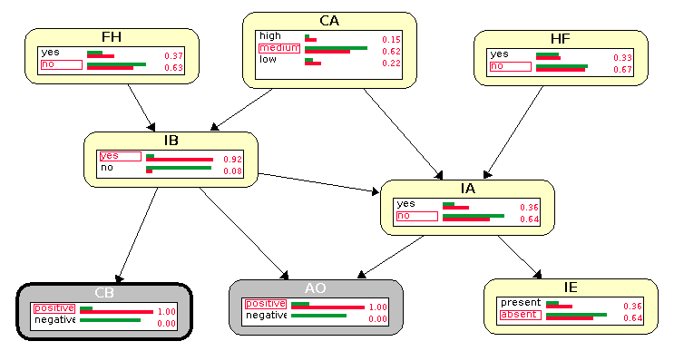

# Introducción

En esta práctica se mostrará la modelización de redes bayesianas
utilizando el software Elvira. Partiremos del enunciado de un problema
de pequeño tamaño que puede modelarse utilizando redes bayesianas.

En una primera etapa, resolveremos el problema creando manualmente una
estructura de red bayesiana que represente las dependencias del
enunciado propuesto, y dando las tablas de probabilidades necesarias
para definir completamente el problema.

Una vez resuelto el apartado anterior, pasaremos a implementar dicha
red con el software Elvira, y finalmente utilizaremos dicha implementación
para calcular algunas probabilidades interesantes sobre el problema que
hemos propuesto

# Enunciado del problema

El problema con el que trabajaremos es el siguiente:

\begin{displayquote} Existen dos tipos principales de infecciones del
aparato urinario, la infección de las vías urinarias bajas y de las
vías urinarias altas. Ambas infecciones están fuertemente relacionadas
con el consumo de agua diario, siendo más probables cuando dicho
consumo es demasiado bajo o demasiado alto. Además, la infección de
las vías bajas puede producirse por falta de higiene. La
predisposición a sufrir una infección en las vías altas tiene cierto
componente genético, así que el historial familiar resulta
relevante. Por otro lado, no es extraño que una infección en las vías
bajas produzca una infección en las altas.

Existen varias pruebas que nos permiten discernir si se está sufriendo
alguna enfermedad urinaria. En primer lugar, un análisis de orina nos
muestra la presencia de infección en alguna de las vías. De forma más
concreta, se puede hacer un cultivo de una biopsia para confirmar la
infección en las vías inferiores. Para las vías superiores, puede
observarse cierta inflamación tras realizar una ecografía.
\end{displayquote}

# Descripción de la red

Dado el enunciado anterior, vamos a tratar de describir la red de
forma cualitativa (especificando la estructura de una red que
represente todas las condiciones especificadas anteriormente) y de
forma cuantitativa (asignando las probabilidades necesarias para
describir completamente el problema).

## Descripción cuailitativa

Comenzamos identificando las variables involucradas (por orden de
aparición):

- Infección de las vías bajas (IB)
- Infección de las vías altas (IA)
- Consumo de agua (CA)
- Falta de higiene (FH)
- Historial familiar (HF)
- Análisis de orina (AO)
- Cultivo de la biopsia (CB)
- Inflamación en la ecografía (IE)

Ahora, tenemos que establecer el orden en el que vamos a introducir
las variables en la red. Como ya sabemos, nos convendrá introducir en
primer lugar las variables que representen causas. En nuestro caso,
podemos identificar

- Consumo de agua
- Falta de higiene
- Historial familiar

A continuación, tenemos las consecuencias. En nuestro problema, las
consecuencias son las dos infecciones. Hay que tener cuidado en el
orden en el que las introducimos en el grafo, ya que se sugiere que
que una infección en las vías bajas puede producir una infección en
las vías altas, y por tanto tenemos otra relación de causa y
consecuencia. Conviene entonces tomar entonces las variables en este
orden:

- Infección en las vías bajas
- Infección en las vías altas

Por último, tenemos las tres pruebas médicas. No existe ninguna
relación causal directa entre ellas, por lo que podemos introducirlas
en cualquier orden:

- Análisis de orina
- Cultivo de la biopsia
- Inflamación en la ecografía

Pasamos a mostrar el proceso de construcción. Comenzamos introduciendo
las tres primeras variables. Dado que no existe ninguna relación causal
entre ellas, introducimos simplemente los nodos, sin añadir ningún eje:

Una vez colocados los tres nodos, pasamos a incluir las dos enfermedades.
Introducimos en primer lugar la infección de las vías bajas, que como
sabemos está influenciada por el consumo de agua y la falta de higiene:

Introducimos ahora las vías altas, que está influenciada por el historial
familiar, el consumo de agua y la infección en las vías bajas:

Finalmente, quedan por incluir las tres pruebas médicas. El resultado de
la biopsia sólo se ve afectado por la infección en las vías bajas, la
inflamación en la ecografía por la inflamación en las vías altas, y en
el análisis de orina tenemos influencia de ambas patologías:

Por tanto, tenemos ya terminada la red. Una vez terminada la parte
cualitativa, pasamos a especificar la parte cuantitativa del problema.
Tendremos que especificar las tablas de probabilidad para todas las
variables, condicionadas a los valores de probabilidad de sus padres.

## Descripción cuantitativa

Comenzamos por las variables más simples, que son aquellas en las que
no tenemos condicionamientos de los padres. En este caso, son las tres
causas que contemplamos. Comenzamos por la falta de higiene. Esta
variable puede tomar dos valores, Sí y No. Dado que no se nos
especifica a priori, podemos suponer que en la mayoría de los casos no
hay una falta de higiene, así que estableceremos la probabilidad de la
falta de higiene en $0.2$ (la probabilidad de su ausencia viene dada
por el teorema de la probabilidad total, $0.8$). Para el consumo de
agua, se nos dice que aumenta la probabilidad de padecer la enfermedad
si el consumo es alto o bajo. Consideraremos entonces que hay también
un nivel de consumo normal, y tendremos tres posibles valores. La
mayor parte de la gente tendrá un consumo de agua normal, un
porcentaje pequeño pero considerable tenderá a consumir poca agua, y
un porcentaje todavía menor a consumir en exceso. Finalmente, en
cuanto al historial familiar, las infecciones del tracto urinario son
relativamente comunes, así que consideraremos que hay una probabilidad
del $0.3$ de tener antecedentes familiares. Las tablas de probabilidades
quedarían entonces así:

\begin{table}[H]
\parbox{.3\linewidth}{
\centering
\begin{tabular}{cc}
\toprule
    FH = Sí & FH = No \\
\midrule
    0.2 & 0.8 \\
\bottomrule
\end{tabular}
\caption{Falta de higiene}
}
\hfill
\parbox{.38\linewidth}{
\centering
\begin{tabular}{ccc}
\toprule
    CA = Bajo & CA = Medio & CA = Alto \\
\midrule
    0.1 & 0.85 & 0.05 \\
\bottomrule
\end{tabular}
\caption{Consumo de agua}
}
\hfill
\parbox{.3\linewidth}{
\centering
\begin{tabular}{cc}
\toprule
    HF = Sí & HF = No \\
\midrule
    0.3 & 0.7 \\
\bottomrule
\end{tabular}
\caption{Historial familiar}
}
\end{table}

Ahora, tenemos que definir las probabilidades para las enfermedades.
En ambos casos, tenemos que los posibles valores a tomar por estas
variables son Sí y No. Tendremos que especificar las probabilidades
condicionadas a todas las posibles parejas de valores de los
padres. Comenzamos con la infección de las vías bajas. Los dos padres
son la falta de higiene y el consumo de agua. La primera toma dos
valores y la segunda, tres. Tendremos, por tanto, seis combinaciones
posibles, y para cada uno de estos seis valores, tendremos que
especificar la probabilidad de sí y no, dando lugar a un total de
12 valores:

\begin{table}[H]
\centering
\begin{tabular}{lcccccc}
\toprule
    & FH = Sí & FH = No & FH = Sí & FH = No & FH = Sí & FH = No \\
    & CA = Alto & CA = Alto & CA = Medio & CA = Medio & CA = Bajo & CA = Bajo \\
\midrule
IB = Sí & 0.4 & 0.35 & 0.2 & 0.05 & 0.3 & 0.25 \\
IB = No & 0.6 & 0.65 & 0.8 & 0.95 & 0.7 & 0.75 \\
\bottomrule
\end{tabular}
\caption{Probabilidades condicionadas de la infección en las vías bajas}
\end{table}

Pasamos ahora a la definición de las probabilidades para las vías
altas. Como vimos en la gráfica, ahora tenemos tres padres. Dado que
el tamaño de la tabla aumenta significativamente (tenemos que
especificar 24 valores distintos), vamos a separar la información en
dos tablas distintas. En una tabla pondremos los valores de las
probabilidades de padecer una infección en las vías altas, y en la
otra las de no padecerla.  Es conveniente observar que una de las
tablas es redundante con la otra, debido a que por el teorema de la
probabilidad total se puede obtener toda la información. De la misma
manera, en la tabla anterior, una fila habría sido suficiente. No
obstante, especificaremos todas las probabilidades en todos los casos
para hacer más explícita la información:

\begin{table}[H]
\centering
\begin{tabular}{lcccccc}
\toprule
\multirow{2}{*}{IA = Sí} & HF = Sí & HF = No & HF = Sí & HF = No & HF = Sí & HF = No \\
    & CA = Alto & CA = Alto & CA = Medio & CA = Medio & CA = Bajo & CA = Bajo \\
\midrule
IB = Sí & 0.6 & 0.35 & 0.5 & 0.15 & 0.4 & 0.35 \\
IB = No & 0.5 & 0.25 & 0.35 & 0.03 & 0.3 & 0.15 \\
\bottomrule
\end{tabular}
\caption{Probabilidades condicionadas para el caso Sí en la infección en las vías altas}
\end{table}

\begin{table}[H]
\centering
\begin{tabular}{lcccccc}
\toprule
\multirow{2}{*}{IA = No} & HF = Sí & HF = No & HF = Sí & HF = No & HF = Sí & HF = No \\
    & CA = Alto & CA = Alto & CA = Medio & CA = Medio & CA = Bajo & CA = Bajo \\
\midrule
IB = Sí & 0.4 & 0.65 & 0.5 & 0.85 & 0.6 & 0.65 \\
IB = No & 0.5 & 0.75 & 0.65 & 0.97 & 0.7 & 0.85 \\
\bottomrule
\end{tabular}
\caption{Probabilidades condicionadas para el caso No en la infección en las vías altas}
\end{table}

Se puede comprobar cómo la probabilidad de Sí más la probabilidad de
No para cualquier combinación de valores de los padres es igual a 1,
como ha de ocurrir si las probabilidades están bien definidas. Ahora,
queda especificar las tablas de las tres pruebas. En el caso de la
biopsia y la ecografía, tendremos que dar 4 valores de probabilidad,
dado que ambas pueden tomar dos valores, al igual que sus padres. Para
el análisis de orina, serán 8 en total:

\begin{table}[H]
\parbox{.45\linewidth}{
\centering
\begin{tabular}{lcc}
\toprule
    & IB = Sí & IB = No \\
\midrule
CB = Sí & 0.97 & 0.07 \\
CB = No & 0.03 & 0.93 \\
\bottomrule
\end{tabular}
\caption{Cultivo de la biopsia}
}
\hfill
\parbox{.45\linewidth}{
\centering
\begin{tabular}{lcc}
\toprule
    & IA = Sí & IA = No \\
\midrule
IE = Sí & 0.95 & 0.02 \\
IE = No & 0.05 & 0.98 \\
\bottomrule
\end{tabular}
\caption{Inflamación en la ecografía}
}
\end{table}

\begin{table}
\centering
\begin{tabular}{lcccc}
\toprule
    & IA = Sí & IA = No & IA = Sí & IA = No \\
    & IB = Sí & IB = Sí & IB = No & IB = No \\
\midrule
AO = Sí & 0.99 & 0.94 & 0.88 & 0.03 \\
AO = No & 0.01 & 0.06 & 0.12 & 0.97 \\
\bottomrule
\end{tabular}
\caption{Análisis de orina}
\end{table}

Ya tenemos completamente definida nuestra red bayesiana, con todas las
probabilidades necesarias especificadas. Una vez definida por completo,
vamos a introducir esta misma estructura en el programa Elvira, para
tratar de calcular probabilidades de algunos sucesos

# Implementación de la red en Elvira

Una vez hemos especificado la estructura completa de la red, pasamos
a implementarla en Elvira. En el modo de edición, una vez hemos colocado
todos los nodos y las flechas, obtenemos la siguiente estructura:

Ahora, haciendo click en cada nodo, podemos especificar los valores
que toma cada variable, y las tablas de probabilidad que hemos
construido anteriormente. Por ejemplo, mostramos la tabla de
probabilidades condicionadas del análisis de orina en función de los
valores de las dos infecciones:

Una vez hemos definido todas las tablas de probabilidades para todos
los nodos, podemos pasar al modo de inferencia, y observar cómo han
quedado distribuidas las probabilidades:

Como podemos observar, el problema ha calculado automáticamente las
probabilidades de padecer ambas enfermedades, así como de dar positivo
y negativo en las pruebas. Estas probabilidades a priori pueden
calcularse por completo sin necesidad de más información que la que
hemos provisto hasta el momento. La probabilidad de padecer una
infección en las vías bajas, por ejemplo, puede calcularse por
marginalización a partir de su tabla de distribuciones condicionadas y
las tablas de probabilidades del consumo de agua y falta de higiene.
Una vez calculada esta tabla de forma exacta, podemos aprovechar esa
información para calcular la de las vías altas, y con estas dos tablas
el cálculo de las probabilidades de las pruebas es igualmente inmediato.

Vamos ahora a utilizar la red para calcular algunas probabilidades. Lo
que haremos será introducir observaciones en el sistema, y
comprobaremos cómo cambian las probabilidades anteriores.

# Cálculo de probabilidades condicionadas

Ahora, vamos a introducir observaciones en nuestra red bayesiana para
ver cómo se alteran las probabilidades del resto de nodos. El primer
estudio que haremos consistirá en ver cómo se alteran las probabilidades
de padecer la infección dependiendo de los valores que obtengamos en
las pruebas. Por ejemplo, si introducimos que el análisis de orina ha
dado positivo, las probabilidades se alteran de la siguiente manera:

Han cambiado las probabilidades de todo el sistema, pero en particular,
las de ambas infecciones. De hecho, dado que el análisis de orina ha
dado positivo, es más probable que se presente una infección en las
vías altas que su ausencia. Para las vías bajas, por el contrario,
sigue siendo más probable la ausencia, aunque se han compensado mucho
las probabilidades.

Si ahora añadimos positivo en el cultivo:

Ahora, la probabilidad de tener una infección en las vías bajas es
prácticamente segura, mientras que ya no es tan probable tenerla en
las altas. Aún así, ha aumentado significativamente para las vías
altas también, si consideramos el sistema sin ninguna observación.

Aparece una condición curiosa en este contexto. Si observamos las
probabilidades de las causas (los tres nodos superiores), para los dos
nodos de la izquierda cambian las probabilidades de forma
significativa, pero el nodo del historial familiar sufre una
modificación importante en las probabilidades. Dado que es
prácticamente seguro que existe una infección en la vías inferiores,
ha aumentado mucho la probabilidad de que exista un hábito perjudicial
entre las causas que contemplamos. Aquí podemos observar cómo las
relaciones de dependencia son en realidad bidireccionales, aunque el
hecho de marcarlas con una flecha nos pueda hacer pensar lo contrario.

Vamos a simular otro caso. Suponiendo que sabemos que el individuo
consume poca agua, las probabilidades se modifican de la siguiente
manera:

Podemos observar que las probabilidades de las demás causas no se han
modificado. Esto se debe a que entre esta causa y las demás siempre
hay un patrón cabeza-cabeza, y no hay ningún nodo más observado. De
esta forma, las causas son independientes desconocido el resto del
grafo. El resto del grafo sí que se ve alterado, aumentando la
probabilidad de ambas enfermedades. De la misma manera, si añadimos el
antecedente familiar:

Se modifican las probabilidades de la infección en la vía alta y en
los dos tests que la diagnostican (la ecografía y el análisis). En la
infección de las vías bajas, la falta de higiene y el cultivo, las
probabilidades se mantienen invariantes. Esto deja de ocurrir si
observamos alguno de los nodos hijos de los patrones cabeza-cabeza
que nos producían la independencia:

Ahora sí que se modifican significativamente todas las variables.
En especial, dados los dos factores de riesgo en la familia y
el positivo en la ecografía, la infección en las vías altas tiene
una probabilidad prácticamente segura de encontrarse presente.
