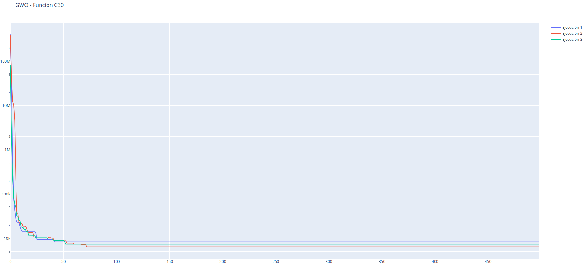
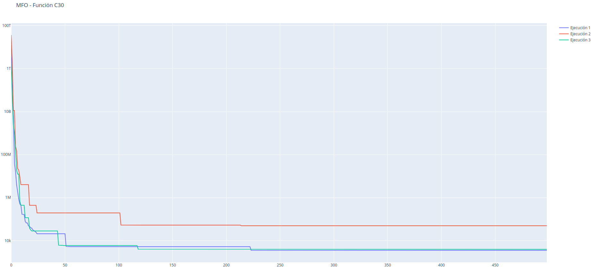
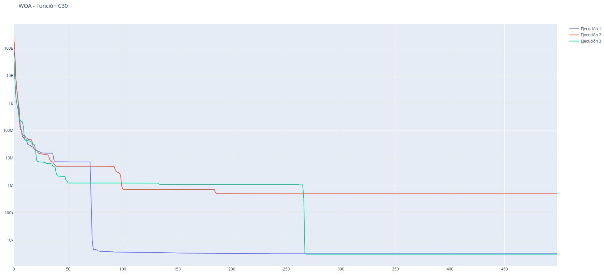

# Introducción

En este trabajo se va a desarrollar un estudio comparativo sobre
algoritmos basados en colmenas para optimización numérica (_swarm
optimization_). Estos algoritmos utilizan un modelo de optimización
numérica basado en evaluación y búsqueda de soluciones no analítico.
El funcionamiento de estos algoritmos se basa en la exploración del
espacio de soluciones por medio de una población en la que cada
individuo representa una solución posible. Estas soluciones se van
desplazando por el espacio, utilizando la información del resto
para explorar.

En particular, estaremos interesados en el empleo de estos modelos
para la minimización de funciones reales y unimodales de variable
real. Esto significa que tendremos una función $f: \mathbb{R}^D \to
\mathbb{R}$, y estaremos interesados en encontrar $\mathbf{x}^* \in
\mathbb{R}^D$ tal que $f(\mathbf{x}^*) \leq f(\mathbf{x}) \; \forall
\; \mathbf{x} \in \mathbb{R}^D$. Nuestra intención es, por tanto,
encontrar el mínimo de la función $f$ dentro de nuestro espacio
de búsqueda.

Para realizar nuestro estudio, utilizaremos un conjunto de funciones
reales de variable real, que nos permitirán estudiar la calidad de
nuestros algoritmos sobre las mismas. Concretamente, utilizaremos el
conjunto de funciones de la competición CEC 2014 en optimización de
parámetros reales de objetivo único (Por su nombre en inglés, _CEC
2014 Competition on Real-Parameter Single Objective Optimization_).

Comenzamos definiendo un marco teórico genérico para el desarrollo
de algoritmos basados en enjambres.

# Algoritmos basados en enjambres

En esta sección, daremos un marco teórico para el desarrollo de algoritmos basados en enjambres.

Sea $f: \mathbb{R}^D \to \mathbb{R}$ una función de coste a minimizar
(claramente, si el problema a resolver es un problema de maximización,
es suficiente con tomar $g(\mathbf{x}) = - f(\mathbf{x})$ y minimizar
la función $g$). La función $f$ toma como argumento un vector
$D$-dimensional de valores reales y produce como resultado un valor
real. Supongamos que el gradiente de la función $f$ no puede ser
calculado, y por tanto no podremos utilizar técnicas clásicas de
optimización por métodos analíticos. Nuestro objetivo es encontrar el
mínimo global de la función $f$, esto es, encontrar $\mathbf{x}^* \in
\mathbb{R}^D$ tal que $\forall \mathbf{x} \in \mathbb{R}^D$ se tiene
que $f(\mathbf{x}^*) \leq f(\mathbf{x})$. Se dice entonces que
$\mathbf{x}$ es un mínimo global de la función $f$.

Sea $S$ el enjambre de soluciones. Entonces, $S = \{\mathbf{x}_1, ...,
\mathbf{x}_k\}$ un conjunto de $k$ posibles soluciones en el espacio
de búsqueda, es decir, $\mathbf{x}_i \in \mathbb{R}^D, i=1,...,k$, las
cuales se inicializan de forma aleatoria uniforme en el espacio de
búsqueda (usualmente, en lugar de trabajar en $\mathbb{R}^D$,
trabajaremos en un subconjunto compacto del mismo, definido como $[a,
b]^D$, con $a, b \in \mathbb{R}, a < b$).

\begin{algorithm}[H]
\DontPrintSemicolon
\SetAlgoLined

\BlankLine
    Inicializar aleatoriamente la población\;
    Evaluar la población con la función objetivo\;
    Obtener los mejores individuos en función de la evaluación $S_{best}$\;
    \While{No se cumpla el criterio de parada}{
        \For{Cada partícula en $S$}{
            Actualizar su posición en función de su posición actual y los individuos en $S_{best}$\;
            Evaluar la nueva solución obtenida\;
        }
        Actualizar los mejores individuos de la población en $S_{best}$\;
        Guardar el mejor individuo obtenido hasta el momento\;
    }
    Devolver el mejor individuo obtenido junto con el valor de la función de evaluación en ese punto\;
\caption{Optimización basada en enjambres}
\end{algorithm}

Por tanto, el esqueleto de un algoritmo de optimización basado en
enjambres está definido de forma genérica, y cada algoritmo particular
estará definido por una serie de parámetros que lo diferenciará del
resto. Estos parámetros son los siguientes:

- Condición de parada del algoritmo: Indica cuándo se considera que el
  proceso de optimización ha terminado. Usualmente se utiliza como
  condición de parada un número prefijado de evaluaciones de la
  función objetivo, y así lo tendremos definido en nuestro caso. Más
  adelante especificaremos cuál es esa condición de parada, que viene
  impuesta por el propio _benchmark_ de evaluación.
- La forma de seleccionar los mejores individuos: En función del
  algoritmo que estemos utilizando, dicho conjunto estará formado por
  el mejor individuo de la población (aquél que consigue un menor
  valor de la función de evaluación), o un subconjunto de los mismos
- Las ecuaciones de movimiento para actualizar la posición de los
  individuos: Este suele ser el principal punto de diversidad de los
  distintos algoritmos, ya que es el principal factor que define cómo
  se explora el espacio de soluciones.

Usualmente, las ecuaciones de movimiento y la forma de selección de
los mejores individuos tienen una inspiración en modelos biológicos de
comportamiento de diversas poblaciones animales, y es por esto por lo
que se le da el nombre de optimización basada en enjambres. En
particular, uno de los primeros algoritmos que se diseñaron con esta
inspiración es el que se conoce como _Particle Swarm Optimization_
(PSO) [@kennedy1995particle], los cuales tomaron como inspiración el
comportamiento social de colonias de aves y peces para su propuesta de
optimización. Desde aquel momento, se han dado nuevas propuestas
basadas en el comportamiento de otras especies, con la intención de
obtener algoritmos que obtengan mejores resultados en el proceso de
optimización, mejorando la velocidad de convergencia a buenas
soluciones, tratando de evitar que el algoritmo converja
prematuramente en mínimos locales que no son mínimos globales de la
función, o buscando robustez en el proceso de optimización (que se el
resultado no sea fuertemente dependiente de la ejecución, y se
obtengan resultados razonables en todas las ejecuciones).

En este contexto, han aparecido algoritmos con inspiraciones muy
diversas. Existen propuestas basadas en la organización de colmenas de
abejas, en las cuales las soluciones toman el rol de abejas
recolectoras, trabajadoras o reinas, propuestas basadas en colonias de
hormigas en las cuales las soluciones dejan un rastro de feromonas en
función de la calidad de las soluciones que visitan, colonias de gatos
que se distribuyen en la búsqueda de comida, etc. En particular, en
este trabajo se van a estudiar e implementar tres algoritmos, los
cuales se basan en tres poblaciones distintas; Whale Optimization
Algorithm (WOA) [@mirjalili2016whale], cuya inspiración aparece en
cómo se comunican entre sí las ballenas jorobadas en el proceso de
captura de bancos de peces, Grey Wolf Optimizer (GWO)
[@mirjalili2014grey], en el que la inspiración se toma de la caza del
lobo gris, y Moth-Flame Optimization Algorithm (MFO)
[@mirjalili2015moth], basado en el movimiento de las polillas al
acercarse a una fuente de luz. Describiremos estas metaheurísticas con
más detalle en secciones posteriores.

Pasamos a continuación a describir el _benchmark_ sobre el que hemos
evaluado los algoritmos de optimización.

#  CEC 2014 Competition on Real-Param Single Objective Optimization

Para comprobar la calidad de los algoritmos propuestos, se ha decidido
utilizar los mismos para resolver un problema de optimización
propuesto como competición en el congreso de computación evolutiva del
IEEE del año 2014 (CEC 2014: IEEE Congress on Evolutionary
Computation) [@liang2013problem]. Esta competición consiste en una
_suite_ compuesta por 30 funciones de optimización distintas, todas
ellas definidas como una función real de variable real. La intención
de este conjunto de funciones es medir la capacidad de los algoritmos
de optimización de minimizarlas, cuando las funciones a optimizar
tienen propiedades que dificultan en gran medida la obtención del
mínimo. De esta manera, nos encontramos con funciones con múltiples
mínimos locales, grandes mesetas (zonas del espacio en el que el valor
de la función es constante o varía muy poco), funciones que toman el
mínimo en un punto rodeado por zonas en las que el valor de la función
es muy grande, funciones no derivables en todos sus puntos,
etc. Además, se definen un conjunto de funciones base, y se construyen
funciones más complejas como combinación de dichas funciones base. No
entraremos en más detalle de las 30 funciones definidas, ya que pueden
consultarse las mismas en [@liang2013problem], aunque a continuación
mostramos dos figuras de la representación gráfica de dos de las
funciones en dos dimensiones (la función de Ackley, función 5 a
optimizar, y la función de Rastrigin, número 8), para dar una idea del
tipo de funciones al que nos enfrentamos. Ambas imágenes han sido extraídas de [@liang2013problem].

\begin{figure}[H]
\centering
\begin{subfigure}{0.5\textwidth}
 \centering
  \includegraphics[width=\textwidth]{imgs/F5.png}
  \caption{Función de Ackley}
  \label{fig:sub1}
\end{subfigure}%
\begin{subfigure}{.5\textwidth}
  \centering
  \includegraphics[width=\textwidth]{imgs/F8.png}
  \caption{Función de Rastrigin}
  \label{fig:sub2}
\end{subfigure}
\caption{Ejemplo de dos funciones extraídas del CEC2014 en dos dimensiones}
\label{fig:test}
\end{figure}

Como podemos observar en las dos imágenes anteriores, el proceso de
optimización de las mismas puede ser realmente complejo, por lo que
necesitamos algoritmos de optimización de cierta potencia para
afrontar la tarea de minimización.

Como dijimos anteriormente, el _benchmark_ impone ciertas condiciones
de ejecución para los problemas. Concretamente, en la competición
original se exigía resolver el problema de optimización para las
30 funciones definidas bajo las siguientes condiciones:

- Dimensiones del problema: 10, 30, 50 y 100
- Ejecuciones: 51 por problema
- Máximo número de evaluaciones de la función objetivo: 10000
  multiplicado por el tamaño del problema (100000 para dimensión 10,
  300000 para dimensión 30, etc)
- Dominio del problema: $[-100, 100]^D$, donde $D$ es la dimensión del
  problema.
- Inicialización de la población: Aleatoria uniforme en el espacio de
  búsqueda.

Como podemos observar, los requisitos de ejecución son bastante
fuertes, y nosotros relajaremos un poco las condiciones previas,
debido a que no queremos simular la competición completamente, si no
hacer un estudio comparativo entre tres algoritmos. Concretamente,
sólo ejecutaremos los problemas de tamaño 10, 30 y 50, y realizaremos
25 ejecuciones para cada caso (15 para el problema de tamaño 50 debido
a que el número de evaluaciones y el tamaño del problema ralentizan
enormemente los cálculos). De esta manera, tendremos 25 (o 15)
resultados obtenidos por cada algoritmo para cada función en cada
tamaño del problema, lo que nos permitirá sacar ciertas estadísticas
de la calidad de las soluciones, y que los resultados obtenidos sean
más fiables que al realizar una única ejecución.

A continuación, pasamos a describir las tres metaheurísticas a
estudiar de forma teórica.

# Descripción de los algoritmos

En esta sección, daremos una explicación teórica de los tres
algoritmos implementados. Estas tres metaheurísticas fueron
propuestas por el mismo investigador, Seyedali Mirjalili, en
tres años consecutivos. Las expondremos, por tanto, en orden
cronológico. Comenzamos de esta manera con GWO, continuamos con
MFO, y terminaremos con WOA.

## Grey Wolf Optimizer

Grey Wolf Optimizer (GWO) [@mirjalili2014grey] es una metaheurística
propuesta en 2014, cuya inspiración aparece en la técnica de caza de
las manadas del lobo gris, en las que hay una serie de individuos
dominantes, que guían al resto de la manada para rodear a las
presas. En nuestro contexto, cada solución representará a un "lobo",
que será más o menos importante en la manada en función de la calidad
de la solución que representa. Concretamente, tendremos cuatro tipos
de lobos en la manada:

- Lobo alfa ($\alpha$): Es el lobo más fuerte de la manada,
  representado por la mejor solución.
- Lobo beta ($\beta$): Es el segundo lobo más fuerte de la manada,
  representado por la segunda mejor solución.
- Lobo beta ($\delta$): Es el tercer lobo más fuerte de la manada,
  representado por la tercera mejor solución.
- Lobos omega ($\omega$): El resto de lobos de la manada.

Por tanto, en la búsqueda de soluciones, el proceso de búsqueda estará
guiado por los lobos $\alpha, \beta$ y $\delta$, y el resto de lobos
seguirán las directrices de los lobos más importantes en cuanto a la
exploración del espacio de búsqueda para intentar "cazar a la presa"
(es decir, encontrar el mínimo de la función objetivo).

Además, el proceso de búsqueda estará constituido por tres etapas
distintas, las cuales representan las tres fases en las que se
articula la caza de este lobo:

- Búsqueda, persecución y acercamiento a la presa
- Rodeo de la presa
- Ataque a la presa

Una vez explicados los principales elementos que definen el proceso de
caza del lobo, se trata de modelar matemáticamente este
comportamiento, y trasladarlo a las ecuaciones de movimiento que guíen
el proceso de búsqueda de soluciones en el espacio de búsqueda.

Como hemos dicho anteriormente, tendremos a los tres lobos más
importantes (las tres mejores soluciones) como guía en el proceso de
búsqueda. En cada iteración del algoritmo, estos tres individuos
constituirán el conjunto de mejores soluciones, que al principio
denominamos $S_{best}$ en el pseudocódigo. Las ecuaciones de
movimiento para cada individuo dependerán entonces de $\alpha, \beta$
y $\delta$.

Para simular las tres etapas del proceso de búsqueda, se tendrá un
valor $a$, que decrecerá linealmente entre 2 y 0 en las distintas
etapas del algoritmo. Además, para cada individuo tendremos dos
vectores aleatorios, $r_1$ y $r_2$ con componentes en el intervalo
$[0,1]$, que tratarán de simular el comportamiento propio de cada
individuo en cada etapa. De esta forma, cada lobo guiará su movimiento
en dirección a la presa de la siguiente manera. Suponiendo que
conocemos la posición de la presa en una iteración $t$, la dirección
que tomará el lobo será un acercamiento hacia la presa, en el que el
vector aleatorio $r_2$ simulará cierto comportamiento de giro
alrededor de la misma. El vector de dirección se calcula como:

\[ D = \lvert C*X_p(t) - X(t) \rvert \]

Donde $X_p(t)$ indica la posición de la presa en el instante $t$,
$X(t)$ indica la posición del individuo, y el vector $C$ se calcula
como

\[ C = 2*r_2 \]

De esta manera, el lobo se acercará en dirección a la presa, pero en
lugar de hacerlo en la dirección exacta a la misma, tomará cierta
dirección aleatoria, en función de $r_2$. Finalmente, la nueva
posición del individuo se calcula como

\[ X(t+1) = X_p(t) - A \times D \]

Donde $A = 2 \times a \times r_1 - a$, donde a es el valor que
decrementamos linealmente en función de la etapa del algoritmo. De
esta forma, permitimos que los lobos se muevan en distancias mayores
al principio del algoritmo (lo que simula la búsqueda de la presa),
mientras que en las últimas etapas estos movimientos son más cortos
(simulando el proceso de ataque).

El problema que presentan las ecuaciones anteriores es que asumen
conocida la posición de la presa, es decir, requieren del mínimo que
estamos buscando. Como esto no es posible, se modifican ligeramente
las ecuaciones anteriores para escribirlas en función de los lobos
$\alpha$, $\beta$ y $\delta$. Se considera que estos tres lobos son
los que tienen un mejor conocimiento de la posición de la presa, por
lo que las ecuaciones anteriores se calculan para estos tres
individuos. De esta forma, tenemos tres posiciones hacia las que
movernos, $X_{\alpha}(t), X_{\beta}(t)$ y $X_{\gamma}(t)$, la posición
final para cada individuo será la media de estos tres vectores,
es decir:

\[ X(t+1) = X_{\alpha}(t) + X_{\beta}(t) + X_{\gamma}(t) / 3 \]

El pseudocódigo del algoritmo quedaría, por tanto, de la siguiente
manera:

\begin{algorithm}[H]
\DontPrintSemicolon
\SetAlgoLined

\BlankLine
    Inicializar aleatoriamente la población\;
    Evaluar la población con la función objetivo\;
    Obtener los lobos $\alpha$, $\beta$ y $\delta$\;
    \While{No se cumpla el criterio de parada (nº iteraciones)}{
        Actualizar $a$\;
        \For{Cada lobo en la manada}{
            Generar los vectores aleatorios $r_1$ y $r_2$\;
            Calcular $A$ y $C$\;
            Calcular las direcciones hacia los lobos $\alpha$, $\beta$ y $\delta$\;
            Calcular las nuevas posiciones $X_\alpha, X_\beta, X_\delta$\;
            Actualizar la posición del lobo en función de las tres anteriores\;
        }
        Recalcular los lobos $\alpha$, $\beta$ y $\delta$\;
    }
    Devolver el lobo $\alpha$ y el valor de la función en ese punto
\caption{Grey Wolf Optimizer}
\end{algorithm}

Una vez hemos descrito el proceso de optimización basado en manada
de lobos, pasamos a estudiar la siguiente metaheurística, basada en
un enjambre de polillas.

## Moth-Flame Optimization Algorithm

Moth-Flame Optimization Algorithm (MFO) [@mirjalili2015moth] fue
propuesta en el año 2015, y el proceso de optimización se basa ahora
en el comportamiento de las polillas cuando se acercan a una fuente de
luz. La fuente de inspiración aparece a partir del movimiento en
espiral que realizan este tipo de insectos al acercarse a luces
incandescentes. En este algoritmo, la población estará dividida en dos
tipos de individuos, las llamas, que representarán a las mejores
soluciones obtenidas, y las polillas, que representarán al resto. En
este caso, las llamas permanecerán quietas en cada iteración, y las
polillas intentarán acercarse a las mismas describiendo un movimiento
en espiral.

En función de la etapa del algoritmo, se irá ajustando el número de
individuos que se consideran polillas y el número de individuos que se
consideran llamas. Al principio, el número de llamas será alto, para
favorecer el proceso de exploración de distintas zonas del espacio de
búsqueda, y en etapas sucesivas se irá reduciendo el tamaño de este
conjunto, para favorecer la búsqueda de zonas cercanas a las mejores
soluciones encontradas. En este caso, tendremos por tanto un conjunto
de mejores individuos $S_{best}$, de tamaño variable durante la
ejecución del algoritmo, formado por las llamas en cada iteración. El
tamaño de este conjunto decrecerá linealmente a partir de la fórmula:

\[ N(t) = \lfloor N_0 - t * \frac{N_0-1}{T} \rfloor \]

Donde $N_0$ es el número inicial de llamas, y $T$ el número total de
iteraciones. Como podemos observar, en las primeras etapas este valor
es alto, y decrece linealmente en sucesivas etapas, redondeando al
entero inferior.

Una vez tenemos definido el conjunto de llamas, tenemos que definir
las ecuaciones de movimiento de las polillas a partir de las llamas.
En este caso, cada polilla se acercará a una única fuente de calor.
Para ello, se establece un emparejamiento basado en el orden de la
calidad de las soluciones. Dados los dos conjuntos ordenados, el de
las llamas y el de las polillas, la mejor polilla se acercará a la
mejor llama, la segunda polilla a la segunda mejor llama, etc. Debido
a que el número de polillas aumenta y el de llamas decrementa, llegará
un instante en el que el número de polillas supere al de llamas, y por
tanto no se podrá realizar el emparejamiento anterior. En este caso,
todas las polillas sin emparejamiento se dirigirán a la mejor de las
llamas encontradas hasta el momento.

Ahora, tenemos que establecer la ecuación que determina el movimiento
de cada polilla en dirección a la llama que se le ha asignado. En
primer lugar, necesitamos definir dos parámetros, que determinarán el
movimiento de la polilla. Estos parámetros son $r$, que es una
variable real que se decrementa linealmente en el intervalo [-2, -1],
y $t$ un valor aleatorio uniforme en el intervalo $[r, 1]$. Una vez
tenemos estos dos valores definidos, cada polilla $P_i$, que se mueve
en la dirección de la llama $F_j$, se mueve siguiendo las siguientes
ecuaciones:

\[ D = \lvert F_j(t) - P_i(t) \rvert \]

\[ P_i (t+1) = D* e^{bt}*cos(2 \pi t) + F_j(t) \]

El parámetro $b$ define la amplitud de la espiral logarítmica, y en el
artículo que define el modelo se asigna como $b=1$, que será el valor
con el que nosotros experimentaremos. En la siguiente imagen, extraída
directamente del artículo [@mirjalili2015moth], se puede observar cuál
es la trayectoria que sigue la polilla al acercarse a la llama que le
corresponde:

{width=40%}

Tenemos ya definidos todos los elementos necesarios para el desarrollo
completo del algoritmo. El pseudocódigo del mismo es el que sigue:

\begin{algorithm}[H]
\DontPrintSemicolon
\SetAlgoLined
\BlankLine
    Inicializar aleatoriamente la población\;
    Evaluar la población con la función objetivo\;
    \While{No se cumpla el criterio de parada (nº iteraciones)}{
        \If{primera iteración}{
            Ordenar la población inicial por calidad\;
        } \Else {
            Juntar la población de la iteración anterior con las nuevas
            polillas\;
            Ordenar la población combinada\;
            Seleccionar una población del mismo tamaño que la original,
            formada por los mejores individuos\;
        }
        Actualizar el número de polillas en función de la iteración, N(i)\;
        Seleccionar los N(i) mejores individuos como llamas y el resto como polillas\;
        Actualizar el valor $r$ linealmente en función de la iteración\;
        \For{Cada polilla en el enjambre}{
            Generar el valor aleatorio $t$\;
            Calcular el vector director a su llama correspondiente\;
            Calcular la nueva posición con la espiral logarítmica\;
        }
    }
    Devolver el mejor individuo del conjunto y la función de pérdida en dicho punto\;
\caption{Moth-Flame Optimization Algorithm}
\end{algorithm}

Una vez hemos descrito este algoritmo de optimización, pasamos a
describir la última de las metaheurísticas estudiadas.

## Whale Optimization Algorithm

Es la metaheurística más reciente de las tres, definida en el
año 2016. Esta metaheurística se basa en el movimiento de las colonias
de ballenas cuando intentan cazar bancos de peces. Según explica el
autor en la propuesta, las ballenas cazan en grupos, comunicándose
unas con otras para informar sobre la posición de las presas por medio
de ultrasonidos. Además, una vez está localizada la presa, las
ballenas se acercan a las mismas por medio de movimientos en espiral,
desde el fondo del océano y capturando a peces que se encuentran
cercanos a la superficie. Además, algunas ballenas pueden presentar un
comportamiento errático, explorando nuevas zonas en busca de
presas. Por tanto, en este caso tendremos también tres fases
diferentes en el algoritmo:

- Exploración del espacio de búsqueda
- Comunicación con otros individuos para perseguir a las presas
- Ataque en espiral

Cada una de las etapas anteriores estará determinada por un tipo de
movimiento diferente, y cada uno de estos movimientos se llevará a
cabo en una cierta etapa del algoritmo en función de una serie de
probabilidades. En primer lugar, dado que la presa viene representada
por el óptimo global de la función, el cual es desconocido a priori,
se define como presa la mejor posición encontrada hasta el
momento. Describimos los tres movimientos por separado.

### Persecución de las presas

En la persecución de las presas, las ballenas intentarán acercarse a
la presa de dicha iteración. Como hemos dicho anteriormente, la presa
está representada por la mejor solución obtenida. Las ecuaciones
que marcan dicho movimiento son las siguientes:

\[ D = \lvert C*X_p(t) - X(t) \rvert \]
\[ X(t+1) = X_p(t) - A \times D \]

Donde $C$ y $A$ se definen de la siguiente manera:

\[ A = 2 a r - a \]
\[ C = 2 r \]

$r$ es un vector aleatorio con componentes en el intervalo [0,1], y
$a$ es un factor que se decrementa linealmente entre 2 y 0. Como
podemos observar, estas ecuaciones son muy similares a las que regían
el movimiento de los lobos en la búsqueda de presas.

### Ataque en espiral

Otro de los posibles movimientos que llevan a cabo las ballenas es un
ataque en espiral rodeando a la presa. De nuevo, con $D$ calculado de
la misma forma que en el apartado anterior, en la dirección de la
presa, la actualización del movimiento es la que sigue:

\[ X (t+1) = D* e^{bl}*cos(2 \pi l) + X_p(t) \]

Donde $l$ es un número aleatorio en el intervalo $[-1,1]$. Como
podemos observar, este movimiento es similar al que tenían las
polillas al acercarse a las llamas.

Según el autor, las ballenas utilizan esta forma de caza
alternativamente, por lo que para decidir el movimiento de cada
ballena en una determinada iteración, se genera un número aleatorio
uniforme en el intervalo $[0,1]$, y en función de si es mayor o menor
que 0.5, se decide utilizar una ecuación de actualización de la
posición u otra.

### Búsqueda de presas

En último lugar, nos queda definir cómo exploran las ballenas el
espacio de búsqueda para encontrar zonas con soluciones prometedoras.
En este caso, en lugar de moverse en la dirección a la presa, la
ballena se dirige en la dirección de otra ballena aleatoria de la
población, utilizando las mismas ecuaciones que se utilizaban en la
persecución a la presa. La decisión entre un tipo de movimiento u otro
(hacia la presa o hacia otra ballena aleatoria) viene determinada por
la norma del vector $A$. Si recuperamos su definición, $A = 2*a*r -
a$, con $r$ un vector aleatorio con componentes en $[0,1]$, y $a$ un
factor que decrece linealmente entre 2 y 0. De esta manera, en las
primeras etapas del algoritmo, se espera que el vector $A$ tenga una
norma relativamente grande, mientras que al final de la ejecución esta
norma irá tendiendo a 0. De esta manera, se decide si explorar el
espacio de búsqueda o dirigirse a cazar a una presa en función de si
la norma de $A$ es mayor o menor que 1. Así, al principio del
algoritmo, cuando la norma del vector se espera mayor, la probabilidad
de elegir la exploración del espacio de búsqueda es alta, y
posteriormente esta probabilidad va decreciendo, mientras aumenta
la probabilidad de dirigirse a cazar a la presa.

Una vez tenemos todas las ecuaciones de movimiento definidas, podemos
listar el pseudocódigo del algoritmo:

\begin{algorithm}[H]
\DontPrintSemicolon
\SetAlgoLined
\BlankLine
    Inicializar aleatoriamente la población\;
    Evaluar la población con la función objetivo\;
    \While{No se cumpla el criterio de parada (nº iteraciones)}{
        Calcular la mejor solución, que representará a la presa\;
        Actualizar $a$\;
        \For{Cada ballena en la colonia}{
            Generar el vector aleatorio $r$, y el valor aleatorio $p$\;
            Calcular los vectores $A$ y $C$\;
            \If{|A| > 1}{
                Actualizar la posición en dirección a una ballena aleatoria\;
            } \Else {
                \If{p < 0.5} {
                    Actualizar la posición en dirección lineal a la presa\;
                } \Else {
                    Actualizar la posición hacia la presa siguiendo un ataque
                    en espiral\;
                }
            }
        }
        Comprobar si alguna ballena se ha salido de los límites del
        espacio de búsqueda y subsanarlo\;
    }
    Devolver a la presa y la función de pérdida en dicho punto\;
\caption{Whale Optimization Algorithm}
\end{algorithm}

Como podemos observar, este algoritmo guarda muchas similitudes con
los dos algoritmos anteriores. Realmente, estamos hablando de una
sofisticación de los dos algoritmos anteriores, combinándolos de forma
más o menos inteligente para tratar de eliminar posibles problemáticas
que estos presentan. Además, implementa una política nueva, que no
estaba presente en los dos primeros algoritmos de una forma tan clara,
y es la exploración aleatoria del espacio de búsqueda. En lugar de
dirigirse simplemente en la dirección de las mejores soluciones, se
permite que en las primeras etapas del algoritmo las soluciones
empeoren al dirigirse hacia soluciones aleatorias. De esta forma, se
afronta en cierta medida la posibilidad de que existan zonas
prometedoras que no se han detectado en la inicialización aleatoria.

En la siguiente sección, se describe el proceso de implementación de
las metaheurísticas que se ha llevado a cabo, así como la
configuración de la experimentación teórica.

# Aspectos de implementación y ejecución de experimentos

En esta sección se describen los aspectos de implementación del
trabajo, así como la configuración de los experimentos que se llevan a
cabo. Todo el código ha sido desarrollado en Python 3.6, utilizando
como base para cómputo la librería `numpy`. Esta librería ofrece un
conjunto de directivas para trabajar con vectores y matrices de forma
eficiente, acelerando significativamente los cálculos, ya que Python
se caracteriza por la facilidad a la hora de desarrollar código, pero
a costa de ser poco eficiente en comparación con otros lenguajes de
más bajo nivel, como C o C++.

Como se ha descrito previamente, para evaluar las metaheurísticas se
va a utilizar el conjunto de funciones de la competición
CEC 2014. Para ello, se ha encontrado una implementación de las mismas
en
(https://github.com/thieunguyen5991/metaheuristics/blob/master/utils/FunctionUtil.py).
Debido a que la implementación que se ofrece aquí es relativamente
poco eficiente, se ha utilizado el esqueleto de las mismas, pero se
han modificado ciertas partes del código para optimizar los cálculos.

Para la implementación de las metaheurísticas, se ha implementado una
clase básica que actúa como interfaz, llamada `Algorithm`. Dicha clase
contiene la funcionalidad básica común para todas las metaheurísticas,
como generar una población de individuos aleatoria, evaluar las
soluciones sobre una función de pérdida, corregir soluciones que se
hayan salido de los márgenes del espacio de búsqueda, etc. Las
metaheurísticas implementadas sólo tienen que heredar de dicha clase e
implementar el método `train`. De esta manera, tenemos una interfaz
común que nos permite poder aplicar cualquier proceso de optimización
de manera sencilla. Aunque en este trabajo sólo se han implementado
metaheurísticas basadas en optimización por enjambre, la interfaz
desarrollada es genérica para cualquier tipo de metaheurística, por lo
que el código desarrollado es fácilmente extensible para permitir la
comparación de estos métodos con otros tipos de aproximaciones, como
pueden ser algoritmos genéticos, evolución diferencial, etc.

En cuanto a la configuración de la experimentación, para tratar de
realizar una comparación lo más justa posible, se ha trabajado siempre
con poblaciones de tamaño 100 para todos los algoritmos. Dado que en
la competición se fijaba de antemano el número máximo de evaluaciones
de la función objetivo, pero nuestros algoritmos funcionan a base de
iteraciones sobre la población, hemos calculado el número de
iteraciones del algoritmo como el número máximo de evaluaciones
dividido entre el tamaño de la población.

Para cada algoritmo, se han realizado 25 ejecuciones por cada función
del _benchmark_ para las dimensiones del problema 10 y 30, y 15
ejecuciones para el problema de tamaño 50. Aunque en la propuesta
original se exigían 51 ejecuciones, y se contemplaba también el
problema de tamaño 100, hemos considerado excesiva dicha
experimentación, y hemos preferido reducir ligeramente las condiciones
del problema, para acelerar los cálculos. No obstante, consideramos
que 25 ejecuciones son suficientes para evaluar la robustez de los
algoritmos.

Para cada algoritmo y cada función, se mostrarán el mínimo alcanzado
en las 25 ejecuciones, el máximo, la mediana, la media y la desviación
típica. Se considera que estos estadísticos son suficientes para
extraer conclusiones sobre la calidad de los algoritmos con los que se
ha trabajado. El mínimo y el máximo nos darán una idea de la mejor y
la peor de las ejecuciones del algoritmo, lo que nos permitirá, por un
lado, ver si el algoritmo es capaz de llegar al mínimo de la función,
y por otro, si este resultado es robusto, es decir, si no existen
ejecuciones en las que el resultado se dispara y es muy malo. La media
y la mediana son medidas de centralidad, que nos darán una idea de
cómo se comporta el algoritmo en términos generales. La desviación
típica es de nuevo una medida de la robustez del optimizador. Si la
desviación es baja, significa que los resultados obtenidos por la
metaheurística son más o menos similares en todos los casos. Si es
alta, por el contrario, podremos concluir que los resultados son poco
estables, y que dependen fuertemente de la ejecución.

Adicionalmente, se estudiará la velocidad de convergencia de los
algoritmos tomando la función C30, que es supuestamente la más
compleja de optimizar, para el tamaño del problema 50. Se realizarán 3
ejecuciones para cada una, y se tomarán 500 muestras del mejor valor
de la función objetivo en distintas etapas del algoritmo. Dicha
información se mostrará gráficamente para realizar un estudio
comparativo.

Pasamos a mostrar el estudio de resultados obtenidos.

# Resultados experimentales obtenidos

En este apartado, mostraremos los resultados obtenidos por los tres
algoritmos sobre las treinta funciones que componen la base de datos.
Para facilitar el análisis de resultados, ya que nos encontramos ante
tablas de un tamaño considerable, vamos a dividir las funciones en
cuatro grupos, acorde con lo que se indica en la definición original
del problema:

- Funciones simples unimodales: Funciones 1 a 3, son funciones con un
único punto mínimo local, que coincide con el mínimo global.
- Funciones simples multimodales: Funciones 4 a 16, son funciones con
múltiples mínimos locales, con un único punto mínimo global.
- Funciones híbridas: Funciones 17 a 22, son funciones construidas a
partir de la división del vector solución en varios fragmentos, los
cuales se evalúan sobre algunas de las funciones simples anteriores, y
se suman sus resultados.
- Funciones compuestas: Funciones 23 a 30, similares a las anteriores,
pero se añaden sesgos a las funciones simples para dificultar la
obtención del mínimo.

Por la construcción de las funciones, el mínimo de cada una está en el
valor $100i$, donde $i$ es el índice de dicha función. Así, el mínimo
de la primera función es $f_1(x^*) = 100$, el de la segunda $f_2(x^*)
= 200$, y así sucesivamente. Comenzamos con los resultados obtenidos
sobre el problema de tamaño 10

## Resultados sobre el problema de tamaño 10

A continuación se muestran las tablas de resultados para el problema
de tamaño 10:

\begin{longtable}{llrrrrr}
\caption{Resultados obtenidos en las tres primeras funciones. D = 10}\\
\toprule
   &     &     min &      50\% &       mean &         max &         std \\
\midrule
C1 & GWO & 184.195 &  539.631 &    642.621 &    1270.813 &     292.915 \\
   & MFO & 100.001 &  100.442 &    197.122 &    1027.846 &     228.963 \\
   & WOA & 121.017 &  277.264 &    286.514 &     486.201 &      95.799 \\
\midrule
C2 & GWO & 201.001 &  201.256 &    201.277 &     201.729 &       0.150 \\
   & MFO & 200.812 & 2623.667 & 476917.436 & 4673875.008 & 1290197.322 \\
   & WOA & 211.733 &  226.585 &    254.867 &     723.322 &     105.911 \\
\midrule
C3 & GWO & 305.984 &  307.802 &    307.671 &     309.249 &       0.790 \\
   & MFO & 300.000 &  300.019 &    300.995 &     312.836 &       3.078 \\
   & WOA & 304.191 &  333.367 &    335.460 &     399.305 &      26.431 \\
\bottomrule
\end{longtable}

Como podemos observar, para el grupo de funciones simples, el
algoritmo que parece arrojar un mejor comportamiento es el MFO, que
consigue quedarse a menos de una unidad del óptimo en los tres casos,
si consideramos el mínimo obtenido por los optimizadores. No obstante,
si nos fijamos en la media y la mediana de los resultados, podemos
observar que este algoritmo se comporta de forma poco robusta para la
función C2, donde rápidamente empieza a sufrir un empeoramiento
notable. El optimizador basado en manadas de lobos parece ser el más
estable en las funciones 2 y 3, como se refleja en la desviación
típica de los resultados. Por otra parte, WOA es el algoritmo más
estable en general, aunque los resultados que obtiene no son
especialmente buenos en ningún caso. Los resultados parecen mostrar
que WOA es el algoritmo que se comporta bien en un contexto amplio de
funciones, mientras que los otros dos optimizadores consiguen grandes
resultados en algunos casos, pero tienden a ser menos robustos.

Pasamos a ver el siguiente grupo de funciones:

\begin{longtable}{llrrrrr}
\caption{Resultados obtenidos sobre el segundo grupo de funciones. D = 10} \\
\toprule
    &     &      min &      50\% &     mean &      max &     std \\
\midrule
C4 & GWO &  400.001 &  401.217 &  400.929 &  401.431 &   0.494 \\
    & MFO &  403.143 &  407.327 &  407.184 &  409.606 &   1.744 \\
    & WOA &  400.000 &  400.000 &  400.000 &  400.002 &   0.001 \\
\midrule
C5 & GWO &  500.001 &  502.056 &  501.662 &  502.872 &   0.887 \\
    & MFO &  520.000 &  520.014 &  520.020 &  520.121 &   0.027 \\
    & WOA &  500.000 &  500.011 &  500.404 &  503.223 &   0.845 \\
\midrule
C6 & GWO &  600.000 &  600.000 &  600.000 &  600.000 &   0.000 \\
    & MFO &  600.000 &  603.667 &  602.804 &  605.717 &   2.208 \\
    & WOA &  600.000 &  600.000 &  600.000 &  600.000 &   0.000 \\
\midrule
C7 & GWO &  700.085 &  700.178 &  700.177 &  700.284 &   0.052 \\
    & MFO &  700.017 &  700.108 &  700.149 &  700.571 &   0.133 \\
    & WOA &  700.046 &  700.149 &  700.191 &  700.522 &   0.125 \\
\midrule
C8 & GWO &  800.000 &  800.000 &  800.021 &  800.516 &   0.103 \\
    & MFO &  802.985 &  809.950 &  809.997 &  818.907 &   4.572 \\
    & WOA &  800.000 &  800.000 &  800.160 &  801.003 &   0.374 \\
\midrule
C9 & GWO &  900.000 &  900.000 &  900.041 &  900.516 &   0.143 \\
    & MFO &  903.981 &  911.958 &  913.361 &  934.868 &   7.938 \\
    & WOA &  900.000 &  900.000 &  900.080 &  901.004 &   0.277 \\
\midrule
C10 & GWO & 1000.000 & 1000.000 & 1000.500 & 1012.506 &   2.501 \\
    & MFO & 1075.048 & 1962.041 & 1951.266 & 2709.050 & 416.630 \\
    & WOA & 1000.000 & 1000.663 & 1009.673 & 1122.234 &  24.678 \\
\midrule
C11 & GWO & 1100.000 & 1100.000 & 1100.500 & 1112.506 &   2.501 \\
    & MFO & 1200.029 & 2035.908 & 2027.484 & 2674.896 & 374.419 \\
    & WOA & 1100.001 & 1100.096 & 1103.083 & 1130.431 &   7.087 \\
\midrule
C12 & GWO & 1200.001 & 1200.022 & 1200.026 & 1200.078 &   0.021 \\
    & MFO & 1200.000 & 1200.000 & 1200.000 & 1200.000 &   0.000 \\
    & WOA & 1200.004 & 1200.472 & 1200.705 & 1202.029 &   0.573 \\
\midrule
C13 & GWO & 1300.253 & 1300.369 & 1300.369 & 1300.514 &   0.063 \\
    & MFO & 1300.048 & 1300.215 & 1300.203 & 1300.435 &   0.102 \\
    & WOA & 1300.185 & 1300.397 & 1300.377 & 1300.579 &   0.105 \\
\midrule
C14 & GWO & 1400.280 & 1400.454 & 1400.436 & 1400.497 &   0.063 \\
    & MFO & 1400.176 & 1400.245 & 1400.258 & 1400.415 &   0.058 \\
    & WOA & 1400.057 & 1400.159 & 1400.156 & 1400.252 &   0.052 \\
\midrule
C15 & GWO & 1500.000 & 1500.023 & 1500.055 & 1500.296 &   0.081 \\
    & MFO & 1500.127 & 1500.542 & 1500.631 & 1501.635 &   0.402 \\
    & WOA & 1500.000 & 1500.114 & 1500.195 & 1501.303 &   0.287 \\
\midrule
C16 & GWO & 1600.000 & 1600.823 & 1600.747 & 1600.824 &   0.188 \\
    & MFO & 1600.819 & 1600.983 & 1601.276 & 1602.329 &   0.514 \\
    & WOA & 1600.000 & 1600.685 & 1600.669 & 1602.181 &   0.629 \\
\bottomrule
\end{longtable}

Para este grupo de funciones, los resultados parecen ser bastante
adecuados. Los tres algoritmos son capaces de acercarse
significativamente al mínimo en prácticamente todas las funciones. Los
únicos valores que pueden resultar anormalmente altos son los que
obtiene MFO sobre la función 11, que se queda a 100 unidades del
mínimo, y en la función 10, que se queda a 75 puntos. El resto de
ejecuciones obtienen resultados muy adecuados en cuanto al valor
mínimo. En muchos casos, incluso el valor máximo (correspondiente a la
peor ejecución), sólo se queda a escasas unidades del óptimo, lo que
indica que los algoritmos se comportan especialmente bien en este
grupo de funciones. En particular, WOA y GWO consiguen alcanzar el
valor óptimo de la función C6 en sus 25 ejecuciones, y MFO lo hace
para la función C12.

Analizando globalmente los algoritmos, parece que MFO es el que peor
se comporta en este grupo de funciones, y es el menos robusto de los
tres algoritmo. La desviación típica de sus ejecuciones suele ser
significativamente más alta que la de las otras dos metaheurísticas, y
los valores de la función que alcanza son ligeramente más altos. GWO y
WOA parecen tener un comportamiento más o menos similar, y resulta
difícil establecer cuál de los dos algoritmos tiene mejor
comportamiento. Sus resultados son muy similares en todos los
estadísticos extraídos, siendo quizás ligeramente peores los de WOA en
algunos aspectos, pero de forma poco significativa (puede observarse
por ejemplo que en C10 el comportamiento de WOA es ligeramente peor que
el de GWO, dado que la media, el máximo y la desviación típica son
más altas en WOA).

Pasamos a observar el primer grupo de funciones compuestas:

\begin{longtable}{llrrrrr}
\caption{Resultados obtenidos sobre el tercer grupo de funciones. D = 10} \\
\toprule
    &     &      min &      50\% &     mean &       max &      std \\
\midrule
C17 & GWO & 1703.889 & 1704.380 & 1708.239 &  1736.001 &    9.290 \\
    & MFO & 1700.000 & 1704.984 & 1730.605 &  1922.262 &   64.640 \\
    & WOA & 1701.037 & 1717.645 & 1718.903 &  1750.629 &   13.569 \\
\midrule
C18 & GWO & 1805.073 & 1805.593 & 1806.869 &  1818.131 &    3.013 \\
    & MFO & 1800.492 & 1810.428 & 1812.372 &  1842.913 &    9.670 \\
    & WOA & 1823.451 & 2027.193 & 2133.306 &  2782.722 &  286.910 \\
\midrule
C19 & GWO & 1901.247 & 1901.728 & 1901.922 &  1905.458 &    0.838 \\
    & MFO & 1901.551 & 1902.940 & 1908.959 &  1957.303 &   14.068 \\
    & WOA & 1901.011 & 1905.421 & 1921.064 &  1999.764 &   29.603 \\
\midrule
C20 & GWO & 2004.070 & 2020.588 & 2021.448 &  2046.107 &   14.014 \\
    & MFO & 2001.021 & 2002.469 & 2004.932 &  2024.023 &    5.042 \\
    & WOA & 2017.279 & 2074.714 & 3243.148 & 14379.682 & 2971.426 \\
\midrule
C21 & GWO & 2102.261 & 2105.258 & 2104.631 &  2106.916 &    1.504 \\
    & MFO & 2100.084 & 2103.207 & 2128.306 &  2335.819 &   61.495 \\
    & WOA & 2101.863 & 2120.803 & 2380.289 &  5334.219 &  818.717 \\
\midrule
C22 & GWO & 2200.123 & 2200.272 & 2204.919 &  2220.012 &    8.523 \\
    & MFO & 2200.033 & 2220.197 & 2217.602 &  2220.977 &    6.584 \\
    & WOA & 2200.077 & 2200.617 & 2204.927 &  2220.778 &    7.964 \\
\bottomrule
\end{longtable}

Para este conjunto de funciones podemos observar un comportamiento
similar al que tuvimos al principio, en el que MFO resultaba ser el
mejor de los algoritmos a la hora de alcanzar el mínimo, pero luego
resultaba ser poco estable. Podemos observar que, a pesar de ser el
algoritmo que mejores resultados obtiene cuando observamos el mínimo,
se ve ampliamente superado por GWO para casi todas las funciones
cuando comprobamos el máximo, lo cual significa que GWO es más
estable.  Resulta curioso observar el mal comportamiento que presenta
aquí WOA, que consigue unos resultados bastante pobres en términos de
estabilidad, como puede observarse a partir de la desviación típica de
sus resultados.

Pasamos al último grupo de funciones.

\begin{longtable}{llrrrrr}
\caption{Resultados obtenidos sobre el último grupo de funciones. D = 10} \\
\toprule
    &     &      min &       50\% &      mean &       max &       std \\
\midrule
C23 & GWO & 2300.565 &  2300.608 &  2300.604 &  2300.632 &     0.018 \\
    & MFO & 2300.733 &  2310.389 &  2323.506 &  2380.343 &    25.897 \\
    & WOA & 2300.967 &  2301.290 &  2301.374 &  2302.180 &     0.323 \\
\midrule
C24 & GWO & 2400.022 &  2400.036 &  2403.949 &  2448.948 &    13.543 \\
    & MFO & 2614.142 &  2728.300 &  2793.511 &  3072.754 &   136.827 \\
    & WOA & 2400.328 &  2400.705 &  2404.956 &  2489.958 &    17.949 \\
\midrule
C25 & GWO & 2500.022 &  2500.041 &  2501.732 &  2542.280 &     8.448 \\
    & MFO & 2670.091 &  2698.879 &  2692.284 &  2700.067 &    11.018 \\
    & WOA & 2500.243 &  2500.560 &  2500.652 &  2501.909 &     0.329 \\
\midrule
C26 & GWO & 2600.037 &  2600.068 &  2600.071 &  2600.100 &     0.018 \\
    & MFO & 2798.260 &  2826.263 &  2827.448 &  2879.085 &    19.835 \\
    & WOA & 2600.517 &  2600.835 &  2600.881 &  2601.886 &     0.276 \\
\midrule
C27 & GWO & 2705.048 &  2705.070 &  2708.077 &  2780.219 &    15.030 \\
    & MFO & 3044.032 &  3051.756 &  3052.736 &  3070.403 &     5.137 \\
    & WOA & 2705.546 &  2706.165 &  2706.159 &  2706.849 &     0.371 \\
\midrule
C28 & GWO & 3256.246 &  3513.456 &  3489.406 &  3565.133 &    71.231 \\
    & MFO & 3189.123 &  3191.600 &  3191.742 &  3194.162 &     1.233 \\
    & WOA & 2801.130 &  2801.609 &  2809.363 &  2911.129 &    26.190 \\
\midrule
C29 & GWO & 3331.107 &  3621.242 &  4806.800 &  7376.930 &  1647.233 \\
    & MFO & 3101.795 &  3118.867 &  3145.981 &  3649.500 &   108.917 \\
    & WOA & 3043.539 & 10912.608 &  9856.720 & 16463.023 &  3776.045 \\
\midrule
C30 & GWO & 3102.647 &  3196.122 &  3192.124 &  3259.085 &    42.237 \\
    & MFO & 3220.064 &  3220.636 &  3223.838 &  3237.215 &     6.779 \\
    & WOA & 3040.212 &  3218.649 & 10388.001 & 68136.200 & 17201.162 \\
\bottomrule
\end{longtable}

Comentamos los resultados sobre el último grupo de funciones. Por un
lado, aquí podemos observar que el optimizador que mejores resultados
obtiene es WOA en términos del mínimo, por lo que parece que para
funciones más complejas es el optimizador más adecuado. Podemos
observar que ahora MFO sí que tiene una pérdida de rendimiento
importante, y se queda lejos del mínimo para muchas de las funciones.
De la misma manera, GWO queda lejos del óptimo en las últimas 3
funciones. WOA, por el contrario, se queda bastante cerca en todos los
casos, a excepción de la función C29, que la mejor ejecución global
está a más de 100 puntos del mínimo. En cuanto a la estabilidad de las
soluciones, WOA y GWO presentan un comportamiento bastante adecuado en
general, a excepción de las dos últimas funciones, en las que la
desviación típica se dispara. MFO, aunque con peor rendimiento en
general, no sufre de esos repuntes tan bruscos en ninguna ejecución.
Resulta especialmente preocupante el peor resultado obtenido por WOA
en las dos últimas funciones, que llega a obtener valores del orden de
60000, lo cual está muy alejado del mínimo a alcanzar. Aquí puede
vislumbrarse uno de los principales problemas que tienen los modelos
de optimización basados en poblaciones. Aunque la probabilidad de
obtener unos resultados tan malos es bastante baja, existe la
posibilidad de que el resultado quede muy lejos del óptimo de la
función.  Es por esto por lo que, cuando se utilizan estos
optimizadores en la resolución de problemas reales, se recomiende
ejecutar los mismos varias veces, para eliminar en parte la componente
aleatoria que los gobierna.

Una vez hemos terminado de estudiar los resultados sobre el problema
en tamaño 10, pasamos a estudiar los resultados obtenidos sobre el
problema de tamaño 30.

## Resultados sobre el problema de tamaño 30

Ahora, tenemos disponible un mayor número de ejecuciones, a cambio de
trabajar con vectores de mayor tamaño. Esto hace que el tamaño del
espacio de búsqueda sea significativamente más grande, a cambio de
permitir que los algoritmos tengan más tiempo para converger a buenas
soluciones. Aun así, no estamos hablando de un aumento de tamaño
excesivo, por lo que se espera que los algoritmos conserven una buena
capacidad para obtener soluciones adecuadas.

Comenzamos estudiando los resultados sobre las funciones simples:

\begin{longtable}{llrrrrr}
\caption{Resultados obtenidos sobre el primer grupo de funciones. D = 30}\\
\toprule
   &     &        min &         50\% &         mean &           max &          std \\
\midrule
C1 & GWO &  24496.601 &   27556.616 &    33739.274 &     55876.159 &     8540.628 \\
   & MFO &    157.658 &   12483.003 &   358432.466 &   7318174.513 &  1454948.435 \\
   & WOA &    460.295 &     871.206 &      841.747 &      1225.291 &      248.417 \\
\midrule
C2 & GWO &    201.501 &     202.625 &   400202.217 &   2000201.469 &   577350.152 \\
   & MFO & 101793.925 & 3333525.893 & 15647334.681 & 113943958.548 & 25885235.998 \\
   & WOA &    321.192 &     487.925 &      488.582 &       698.717 &       95.120 \\
\midrule
C3 & GWO &    325.807 &     327.070 &      327.198 &       328.598 &        0.841 \\
   & MFO &    300.074 &     342.456 &      646.628 &      6966.255 &     1321.098 \\
   & WOA &    309.127 &     319.665 &      318.943 &       327.729 &        5.696 \\
\bottomrule
\end{longtable}

Lo primero que podemos observar es que los resultados obtenidos
empiezan a perder calidad rápidamente. Sólo estamos contemplando un
problema de tamaño 30, y ya empezamos a ver con cierta regularidad que
algunos algoritmos no son capaces de encontrar el óptimo para algunas
de las funciones simples. Aquí podemos observar como ninguno de los
algoritmos ha llegado al óptimo de ninguna de las funciones en ningún
caso. Cuando ejecutamos para el problema de tamaño 10, sí que se
consiguió dicho óptimo en alguna ocasión, pero ahora todos los
algoritmos quedan relativamente alejados. Se pueden destacar las
mejores ejecuciones de GWO para C2 y MFO Para C3, pero en ningún caso
se consigue un error de menos de una unidad, como teníamos
anteriormente.

Además, podemos ver cómo los resultados empiezan a ser cada vez menos
robustos. El resultado obtenido es cada vez más dependiente de la
ejecución, lo que ha venido provocado también por el aumento de la
dimensionalidad. Por ejemplo. podemos observar que MFO, que es el
algoritmo que se queda más cerca del mínimo de C1 en su mejor
ejecución, también es el algoritmo que se queda más alejado en la peor
de sus ejecuciones, con una diferencia de varios órdenes de magnitud.
Es destacable ahora el papel de WOA, lo cual justifica que sea el
modelo más maduro de los 3. Aunque su comportamiento no es el mejor en
términos de mínimos en ningún caso, sí que es el algoritmo que
devuelve resultados más estables, y consigue la mejor de las
soluciones para las tres funciones cuando nos referimos a su peor
ejecución. Esta propiedad la hace deseable para su uso en aplicaciones
reales, donde prima el buen comportamiento en términos generales por
encima de resultados brillantes muy específicos.

Pasamos a estudiar el resultados para el siguiente grupo de funciones:

\begin{longtable}{llrrrrr}
\caption{Resultados obtenidos sobre el segundo grupo de funciones. D = 30}\\
\toprule
    &     &      min &      50\% &     mean &      max &      std \\
\midrule
C4 & GWO &  401.801 &  403.162 &  403.608 &  405.751 &    1.292 \\
    & MFO &  400.850 &  428.735 &  429.779 &  477.574 &   13.645 \\
    & WOA &  400.000 &  400.000 &  400.000 &  400.000 &    0.000 \\
\midrule
C5 & GWO &  502.984 &  503.266 &  503.253 &  503.391 &    0.091 \\
    & MFO &  520.001 &  520.031 &  520.078 &  520.494 &    0.113 \\
    & WOA &  500.000 &  500.012 &  500.038 &  500.638 &    0.125 \\
\midrule
C6 & GWO &  600.000 &  600.000 &  600.001 &  600.005 &    0.002 \\
    & MFO &  600.002 &  604.212 &  606.825 &  626.147 &    7.510 \\
    & WOA &  600.000 &  600.000 &  600.000 &  600.000 &    0.000 \\
\midrule
C7 & GWO &  700.007 &  700.650 &  700.538 &  701.026 &    0.366 \\
    & MFO &  700.127 &  700.579 &  701.014 &  708.275 &    1.604 \\
    & WOA &  700.004 &  700.030 &  700.032 &  700.084 &    0.025 \\
\midrule
C8 & GWO &  800.000 &  800.516 &  800.557 &  801.547 &    0.514 \\
    & MFO &  825.905 &  849.775 &  850.556 &  888.328 &   16.402 \\
    & WOA &  800.000 &  800.000 &  800.240 &  804.985 &    1.009 \\
\midrule
C9 & GWO &  900.000 &  900.516 &  900.722 &  902.063 &    0.557 \\
    & MFO &  926.255 &  947.796 &  949.508 &  986.610 &   17.546 \\
    & WOA &  900.000 &  900.000 &  900.040 &  901.001 &    0.200 \\
\midrule
C10 & GWO & 1000.000 & 1025.013 & 1020.510 & 1050.025 &   16.097 \\
    & MFO & 2693.950 & 4611.274 & 4617.299 & 5830.286 &  790.365 \\
    & WOA & 1000.003 & 1000.007 & 1000.243 & 1002.265 &    0.616 \\
\midrule
C11 & GWO & 1100.000 & 1112.507 & 1115.508 & 1137.519 &   12.651 \\
    & MFO & 2605.927 & 4646.246 & 4846.523 & 6777.401 & 1066.587 \\
    & WOA & 1100.001 & 1100.007 & 1100.134 & 1101.526 &    0.410 \\
\midrule
C12 & GWO & 1200.131 & 1200.458 & 1200.438 & 1200.745 &    0.186 \\
    & MFO & 1200.000 & 1200.000 & 1200.000 & 1200.000 &    0.000 \\
    & WOA & 1200.000 & 1200.078 & 1200.699 & 1207.662 &    1.651 \\
\midrule
C13 & GWO & 1300.507 & 1300.654 & 1300.663 & 1300.750 &    0.061 \\
    & MFO & 1300.262 & 1300.445 & 1300.442 & 1300.736 &    0.106 \\
    & WOA & 1300.178 & 1300.382 & 1300.373 & 1300.566 &    0.115 \\
\midrule
C14 & GWO & 1400.402 & 1400.474 & 1400.463 & 1400.490 &    0.027 \\
    & MFO & 1400.215 & 1400.293 & 1400.364 & 1401.256 &    0.245 \\
    & WOA & 1400.109 & 1400.199 & 1400.198 & 1400.392 &    0.063 \\
\midrule
C15 & GWO & 1502.874 & 1503.570 & 1503.688 & 1504.808 &    0.508 \\
    & MFO & 1502.331 & 1509.614 & 1510.513 & 1526.674 &    5.382 \\
    & WOA & 1500.000 & 1500.023 & 1500.503 & 1504.318 &    1.092 \\
\midrule
C16 & GWO & 1602.469 & 1605.649 & 1605.188 & 1606.431 &    1.003 \\
    & MFO & 1603.625 & 1605.683 & 1605.818 & 1610.894 &    1.661 \\
    & WOA & 1600.000 & 1603.266 & 1602.905 & 1606.757 &    2.405 \\
\bottomrule
\end{longtable}

Aquí seguimos manteniendo un comportamiento similar al que tuvimos
para el problema de tamaño 10. Las tres metaheurísticas consiguen
resultados de gran calidad para casi todas estas funciones. Podemos
observar que los problemas que empezó a presentar MFO para algunas
funciones en menor dimensión ahora se han visto acrecentados. Por
ejemplo, para la función C10 en dimensión menor se obtenían resultados
del orden de 70 unidades más altos que el mínimo. Aquí, se aumenta
hasta más de 1000 unidades. De la misma forma ocurre con la función
C11. GWO y WOA, por el contrario, consiguen resultados muy buenos en
todos los casos, como ocurría previamente.

Pasamos a analizar el tercer grupo de funciones:

\begin{longtable}{llrrrrr}
\caption{Resultados obtenidos sobre el tercer grupo de funciones. D = 30}\\
\toprule
    &     &      min &      50\% &      mean &         max &        std \\
\midrule
C17 & GWO & 2441.738 & 3068.786 &  3117.640 &    5939.527 &    652.160 \\
    & MFO & 1755.910 & 2121.688 &  2289.919 &    3910.438 &    509.051 \\
    & WOA & 1750.686 & 1904.462 &  1889.218 &    2009.130 &     72.224 \\
\midrule
C18 & GWO & 1813.005 & 1813.019 &  1813.022 &    1813.045 &      0.012 \\
    & MFO & 1861.831 & 2638.261 & 48798.155 & 1096938.722 & 218530.961 \\
    & WOA & 1850.696 & 2305.881 &  2805.853 &    7237.825 &   1409.967 \\
\midrule
C19 & GWO & 1907.980 & 1910.005 &  1910.764 &    1915.954 &      1.922 \\
    & MFO & 1909.464 & 2006.658 &  2772.686 &   12857.886 &   2231.172 \\
    & WOA & 1905.823 & 1911.765 &  1949.578 &    2735.948 &    166.200 \\
\midrule
C20 & GWO & 2099.265 & 2180.707 &  2175.045 &    2233.223 &     37.523 \\
    & MFO & 2049.179 & 2347.206 &  6845.320 &   64298.066 &  12992.546 \\
    & WOA & 2033.953 & 2096.358 &  2141.975 &    2691.244 &    143.288 \\
\midrule
C21 & GWO & 3008.286 & 3632.363 &  3708.598 &    5930.056 &    563.990 \\
    & MFO & 2109.960 & 2769.499 &  3857.342 &   12094.950 &   2423.205 \\
    & WOA & 2140.514 & 2182.072 &  2186.443 &    2309.400 &     37.628 \\
\midrule
C22 & GWO & 2204.409 & 2204.418 &  2204.427 &    2204.529 &      0.026 \\
    & MFO & 2222.666 & 2233.541 &  2342.141 &    2795.791 &    172.399 \\
    & WOA & 2206.417 & 2208.890 &  2211.238 &    2249.365 &      8.340 \\
\bottomrule
\end{longtable}

Al igual que nos ocurrió con el grupo anterior de funciones, empezamos
a observar un empeoramiento notorio debido al aumento de la
dimensionalidad. Volvemos a quedarnos relativamente lejos de los
mínimos en todos los casos, y los máximos errores cometidos se
disparan, especialmente para el algoritmo MFO. De nuevo, WOA parece
ser el algoritmo más estable de los tres, y que mejores resultados
obtiene en general. No obstante, para la función C18 tiene un
comportamiento bastante mejorable, como ya le ocurría en dimensiones
menores. No obstante, para la función C20 ha habido una mejora
sensible.

Resulta curioso observar cómo GWO tiene un comportamiento tan dispar
entre unas funciones y otras. Para algunas de las funciones consigue
unos resultados de gran calidad, como C18 o C22, en las que consigue
una desviación típica inferior a 0.1, y con resultados que no se
alejan más que unas pocas unidades de la media, mientras que en otras,
como C17, se queda muy alejado del valor mínimo, y la variabilidad
entre ejecuciones es notable (aquí tenemos una desviación típica de
652).

Pasamos a comentar el último grupo de funciones.

\begin{longtable}{llrrrrr}
\caption{Resultados obtenidos sobre el cuarto grupo de funciones. D = 30}\\
\toprule
    &     &       min &       50\% &       mean &        max &        std \\
\midrule
C23 & GWO &  2301.777 &  2301.839 &   2327.709 &   2367.121 &     27.752 \\
    & MFO &  2383.551 &  2520.687 &   2496.941 &   2582.320 &     56.086 \\
    & WOA &  2302.623 &  2303.053 &   2303.060 &   2303.437 &      0.213 \\
\midrule
C24 & GWO &  2400.035 &  2454.038 &   2445.208 &   2497.505 &     30.652 \\
    & MFO &  3228.908 &  3686.178 &   3710.915 &   4105.497 &    214.001 \\
    & WOA &  2400.462 &  2400.707 &   2401.012 &   2402.822 &      0.691 \\
\midrule
C25 & GWO &  2500.031 &  2540.133 &   2535.025 &   2552.388 &     15.303 \\
    & MFO &  2700.125 &  2700.166 &   2700.196 &   2700.482 &      0.089 \\
    & WOA &  2500.449 &  2500.850 &   2500.915 &   2502.146 &      0.371 \\
\midrule
C26 & GWO &  2600.070 &  2653.105 &   2631.449 &   2668.591 &     31.236 \\
    & MFO &  2887.289 &  2993.004 &   3018.630 &   3203.861 &     85.122 \\
    & WOA &  2600.809 &  2601.263 &   2601.304 &   2601.834 &      0.267 \\
\midrule
C27 & GWO &  3201.889 &  3209.888 &   3209.794 &   3214.690 &      2.727 \\
    & MFO &  3048.847 &  3069.582 &   3071.771 &   3109.177 &     19.155 \\
    & WOA &  2706.953 &  2707.714 &   2707.754 &   2709.065 &      0.569 \\
\midrule
C28 & GWO &  3643.995 &  4143.780 &   4161.412 &   4392.069 &    164.347 \\
    & MFO &  3194.011 &  3197.432 &   3198.190 &   3207.836 &      2.884 \\
    & WOA &  2802.960 &  2804.141 &   3056.641 &   4492.613 &    558.605 \\
\midrule
C29 & GWO & 22195.888 & 49082.981 &  47042.146 &  65197.766 &  13671.405 \\
    & MFO &  3109.523 &  4110.292 &  28243.572 & 493063.685 &  97310.020 \\
    & WOA &  3135.011 &  4721.988 &  14992.348 & 114664.655 &  26468.756 \\
\midrule
C30 & GWO &  3950.462 &  4476.289 &   4414.194 &   4554.287 &    177.136 \\
    & MFO &  3226.147 &  3363.749 &   5939.578 &  66622.747 &  12643.451 \\
    & WOA &  3119.362 &  3332.257 & 167928.398 & 754950.919 & 249074.119 \\
\bottomrule
\end{longtable}

Para este grupo de funciones podemos observar lo que veníamos
apreciando en grupos de funciones anteriores. Se reproducen los malos
comportamientos que teníamos para algunas funciones con determinados
algoritmos, acrecentados ahora por el aumento de la dimensionalidad
del problema. Por ejemplo, WOA, que ya tenía un mal comportamiento en
cuanto a la estabilidad para la función 30, vuelve a tener aquí un mal
comportamiento, quedándose bastante alejado del mínimo para alguna de
las ejecuciones. Ahora, el hecho de que el espacio de búsqueda tenga 3
veces más elementos, ha provocado que el error cometido sea 10 veces
más grande, lo que supone una pérdida de rendimiento notable.

Aún así, si nos fijamos en las funciones de la 13 a la 28, podemos
observar que esta técnica de optimización vuelve a ser la que mejores
resultados obtiene, quedándose cerca del mínimo en todos los casos.
MFO parece ser el algoritmo menos consistente, y queda lejos de los
mínimos en prácticamente todos los casos (el mejor resultado en todo
el grupo de funciones es para C23, y aún así está a 83 unidades del
mínimo). GWO tiene un comportamiento más deseable, aunque no tan bueno
como WOA. No obstante, para la función 30, es la única metaheurística
con resultados más o menos estables. Entre su mejor y su peor
ejecución sólo hay unas 600 unidades de diferencia, y no del orden de
decenas o cientos de miles, como ocurre en los otros dos casos. En
contraposición, queda más alejada del mínimo que las otras dos en
términos de la mejor ejecución.

Finalmente, vamos a estudiar los resultados obtenidos por los
algoritmos para el problema de tamaño 50.

## Resultados sobre el problema de tamaño 50

Tenemos ahora un problema de una dimensionalidad importante, en el
cual se permite un número de evaluaciones de la función objetivo
bastante más alto que en los dos casos anteriores. No obstante, como
ya observamos en el caso del problema de tamaño 30, es esperable que
se produzca un empeoramiento importante de los resultados, debido a
que el aumento en las iteraciones no es suficiente para compensar el
aumento de tamaño del problema.

Comenzamos viendo el resultado obtenido sobre el primer grupo de
funciones:

\begin{longtable}{llrrrrr}
\caption{Resultados obtenidos sobre el primer grupo de funciones. D = 50}\\
\toprule
   &     &         min &          50\% &          mean &           max &           std \\
\midrule
C1 & GWO &   86637.968 &   144531.927 &    144506.741 &    198351.060 &     26964.764 \\
   & MFO &    7340.090 &   106328.590 &   1124675.968 &   9250240.578 &   2522950.045 \\
   & WOA &     656.730 &     1127.191 &      1234.361 &      2053.439 &       410.376 \\
\midrule
C2 & GWO & 8000202.041 & 10000202.528 &  10056892.262 &  12850550.962 &   1560134.367 \\
   & MFO & 3730084.479 & 46332597.325 & 111447960.555 & 591142612.604 & 151305885.831 \\
   & WOA &     631.216 &      862.830 &       856.318 &      1238.088 &       173.525 \\
\midrule
C3 & GWO &     344.591 &      347.458 &       347.134 &       348.606 &         1.014 \\
   & MFO &     326.770 &      575.035 &      1532.955 &      8342.291 &      2081.052 \\
   & WOA &     307.309 &      309.639 &       312.286 &       325.701 &         5.485 \\
\bottomrule
\end{longtable}

Ahora sí que podemos observar empeoramientos significativos para los
resultados sobre las funciones simples. A excepción de WOA, que se
comporta de forma más o menos similar a como lo hacía para la
dimensión 30, los valores que se llegan a obtener son bastante peores
que previamente. La función C3 parece ser la más simple de las 3
expuestas, ya que en ella sí que se tiene un comportamiento aceptable. En
las otras dos, sin embargo, los resultados están muy alejados del mínimo
tanto para GWO como para MFO, especialmente.

Pasamos a observar el segundo grupo de funciones.

\begin{longtable}{llrrrrr}
\caption{Resultados obtenidos sobre el segundo grupo de funciones. D = 50}\\
\toprule
    &     &      min &      50\% &     mean &       max &      std \\
\midrule
C4 & GWO &  407.137 &  407.510 &  407.773 &   409.384 &    0.670 \\
    & MFO &  412.260 &  480.050 &  482.852 &   560.618 &   38.027 \\
    & WOA &  400.000 &  400.000 &  400.000 &   400.000 &    0.000 \\
\midrule
C5 & GWO &  503.424 &  503.459 &  503.461 &   503.498 &    0.021 \\
    & MFO &  520.000 &  520.109 &  520.117 &   520.272 &    0.095 \\
    & WOA &  500.003 &  500.012 &  500.012 &   500.033 &    0.008 \\
\midrule
C6 & GWO &  600.022 &  600.030 &  600.029 &   600.037 &    0.004 \\
    & MFO &  600.460 &  607.880 &  612.043 &   650.464 &   11.929 \\
    & WOA &  600.000 &  600.000 &  600.000 &   600.000 &    0.000 \\
\midrule
C7 & GWO &  701.062 &  701.108 &  701.099 &   701.117 &    0.018 \\
    & MFO &  700.719 &  701.364 &  702.755 &   706.755 &    2.266 \\
    & WOA &  700.006 &  700.009 &  700.021 &   700.106 &    0.026 \\
\midrule
C8 & GWO &  804.125 &  805.672 &  805.572 &   806.703 &    0.733 \\
    & MFO &  854.612 &  884.020 &  887.478 &   939.629 &   22.958 \\
    & WOA &  800.000 &  800.001 &  800.134 &   801.997 &    0.515 \\
\midrule
C9 & GWO &  903.094 &  905.672 &  905.347 &   907.219 &    1.196 \\
    & MFO &  955.744 &  985.800 &  986.026 &  1031.066 &   22.095 \\
    & WOA &  900.000 &  900.000 &  900.267 &   902.009 &    0.705 \\
\midrule
C10 & GWO & 1100.050 & 1137.568 & 1138.388 &  1175.087 &   24.698 \\
    & MFO & 4553.909 & 7625.989 & 7387.636 &  9587.502 & 1651.248 \\
    & WOA & 1000.007 & 1000.010 & 1000.137 &  1001.696 &    0.435 \\
\midrule
C11 & GWO & 1175.038 & 1225.062 & 1227.315 &  1275.087 &   24.746 \\
    & MFO & 5114.025 & 8256.555 & 7849.490 & 10382.520 & 1567.247 \\
    & WOA & 1100.008 & 1100.011 & 1100.035 &  1100.266 &    0.066 \\
\midrule
C12 & GWO & 1200.005 & 1200.523 & 1200.421 &  1200.776 &    0.230 \\
    & MFO & 1200.000 & 1200.000 & 1200.000 &  1200.000 &    0.000 \\
    & WOA & 1200.002 & 1200.410 & 1200.452 &  1200.847 &    0.241 \\
\midrule
C13 & GWO & 1300.697 & 1300.767 & 1300.755 &  1300.811 &    0.036 \\
    & MFO & 1300.320 & 1300.495 & 1300.550 &  1300.910 &    0.169 \\
    & WOA & 1300.100 & 1300.323 & 1300.345 &  1300.736 &    0.140 \\
\midrule
C14 & GWO & 1400.410 & 1400.481 & 1400.469 &  1400.488 &    0.024 \\
    & MFO & 1400.186 & 1400.292 & 1400.517 &  1401.247 &    0.424 \\
    & WOA & 1400.145 & 1400.203 & 1400.225 &  1400.328 &    0.060 \\
\midrule
C15 & GWO & 1508.975 & 1509.791 & 1509.802 &  1510.588 &    0.469 \\
    & MFO & 1515.497 & 1536.837 & 1547.235 &  1647.795 &   34.911 \\
    & WOA & 1500.000 & 1500.025 & 1500.303 &  1501.229 &    0.434 \\
\midrule
C16 & GWO & 1611.027 & 1612.755 & 1613.110 &  1616.211 &    1.457 \\
    & MFO & 1605.986 & 1610.862 & 1611.443 &  1620.944 &    4.142 \\
    & WOA & 1600.000 & 1600.001 & 1602.348 &  1611.172 &    3.365 \\
\bottomrule
\end{longtable}

Para este grupo de funciones seguimos teniendo un comportamiento
bastante bueno en todos los casos. A excepción de algunas funciones
para MFO, que ya tuvieron un comportamiento cuestionable en dimensión
30, los resultados se han mantenido más o menos estables, por lo que
este grupo de funciones no merece más comentario.

Mostramos los resultados para el primer grupo de funciones compuestas

\begin{longtable}{llrrrrr}
\caption{Resultados obtenidos sobre el tercer grupo de funciones. D = 50}\\
\toprule
    &     &      min &         50\% &            mean &              max &             std \\
\midrule
C17 & GWO & 9696.982 &   12544.769 &       13138.131 &        17640.264 &        3243.363 \\
    & MFO & 2361.489 &    3258.101 &        4267.238 &        12140.455 &        2549.650 \\
    & WOA & 1781.364 &    2062.831 &        2037.476 &         2228.100 &         133.315 \\
\midrule
C18 & GWO & 1821.025 &    1821.048 &        1821.050 &         1821.083 &           0.018 \\
    & MFO & 2459.413 &   11282.461 &      299061.738 &      2861149.469 &      784592.380 \\
    & WOA & 1899.998 &    1966.835 &        2066.248 &         3331.945 &         356.092 \\
\midrule
C19 & GWO & 1918.992 &    1920.547 &        1921.116 &         1923.172 &           1.567 \\
    & MFO & 1996.930 &   12055.396 &      860807.942 &     11385836.202 &     2921768.959 \\
    & WOA & 1909.415 &    1917.663 &        1917.875 &         1928.069 &           5.855 \\
\midrule
C20 & GWO & 2245.087 &    2377.677 &        2391.514 &         2569.839 &          79.235 \\
    & MFO & 8649.389 & 4676163.108 & 10645303478.337 & 155706942487.871 & 40134800763.874 \\
    & WOA & 2076.673 &    2154.523 &        2171.026 &         2412.528 &          79.359 \\
\midrule
C21 & GWO & 7924.488 &    8888.413 &        9091.047 &        11072.736 &         932.708 \\
    & MFO & 2913.483 &    4778.138 &       24397.641 &       264763.756 &       66836.222 \\
    & WOA & 2206.822 &    2258.393 &        2269.726 &         2365.960 &          51.097 \\
\midrule
C22 & GWO & 2205.017 &    2205.169 &        2205.402 &         2207.913 &           0.711 \\
    & MFO & 2225.316 &    2540.568 &        2912.796 &         6815.980 &        1155.403 \\
    & WOA & 2212.075 &    2217.189 &        2234.946 &         2425.796 &          54.880 \\
\bottomrule
\end{longtable}

De nuevo se nos replican los resultados que obtuvimos para el problema
de tamaño 30, acrecentados por el aumento de dimensionalidad. MFO deja
de ser un algoritmo competitivo que consigue acercarse a los mínimos
relativamente en sus mejores ejecuciones, pero que rápidamente pierde
calidad en los resultados obtenidos. Podemos observar cómo la mediana
de sus ejecuciones se dispara en tres de las seis funciones que
componen este conjunto, y cómo los valores obtenidos en las peores
ejecuciones están muy alejados. Algo similar le ocurre a GWO, aunque a
mucha menor escala. Este algoritmo es mucho más estable que el
anterior, pero tiene la problemática de quedarse relativamente alejado
del mínimo para las funciones C17 y C21, como ya nos ocurría en
dimensión 30 en menor medida. WOA empieza a verse como un algoritmo de
optimización de mucha calidad, que consigue resultados bastante
adecuados a pesar de la dificultad de las funciones y el aumento de la
dimensión del problema.

Pasamos a ver el último grupo de funciones:

\begin{longtable}{llrrrrr}
\caption{Resultados obtenidos sobre el cuarto grupo de funciones. D = 50}\\
\toprule
    &     &        min &        50\% &        mean &          max &         std \\
\midrule
C23 & GWO &   2380.576 &   2393.953 &    2391.902 &     2397.977 &       4.657 \\
    & MFO &   2504.427 &   2573.624 &    2569.313 &     2602.064 &      24.082 \\
    & WOA &   2304.069 &   2304.417 &    2304.455 &     2304.847 &       0.181 \\
\midrule
C24 & GWO &   2593.628 &   2604.249 &    2604.844 &     2620.855 &       8.945 \\
    & MFO &   3756.129 &   4540.210 &    4603.911 &     5131.838 &     332.079 \\
    & WOA &   2400.613 &   2400.793 &    2407.359 &     2495.500 &      24.394 \\
\midrule
C25 & GWO &   2563.179 &   2575.511 &    2574.335 &     2586.101 &       7.112 \\
    & MFO &   2700.201 &   2700.306 &    2700.357 &     2700.765 &       0.175 \\
    & WOA &   2500.689 &   2500.886 &    2501.020 &     2501.895 &       0.380 \\
\midrule
C26 & GWO &   2696.951 &   2708.000 &    2705.313 &     2717.189 &       6.997 \\
    & MFO &   3100.479 &   3349.738 &    3368.750 &     3614.933 &     133.342 \\
    & WOA &   2601.120 &   2601.516 &    2601.530 &     2602.001 &       0.203 \\
\midrule
C27 & GWO &   3324.256 &   3325.981 &    3326.607 &     3331.343 &       2.007 \\
    & MFO &   3051.057 &   3114.683 &    3125.273 &     3205.228 &      46.154 \\
    & WOA &   2708.204 &   2709.502 &    2709.806 &     2713.706 &       1.458 \\
\midrule
C28 & GWO &   4638.490 &   5111.304 &    5136.920 &     5609.236 &     246.038 \\
    & MFO &   3197.606 &   3199.854 &    3200.690 &     3206.841 &       2.612 \\
    & WOA &   2804.550 &   2805.576 &    3183.138 &     6400.855 &    1032.203 \\
\midrule
C29 & GWO & 104417.400 & 181734.746 &  180738.939 &   288916.258 &   38699.696 \\
    & MFO &   3706.090 &  33357.741 & 2776955.799 & 31453835.740 & 8092319.611 \\
    & WOA &   3131.745 &   3899.558 &   11225.452 &   110683.719 &   27523.698 \\
\midrule
C30 & GWO &   5987.358 &   6985.098 &    8191.470 &    23999.954 &    4459.820 \\
    & MFO &   3245.814 &   3792.072 &   82051.267 &  1174454.223 &  302205.218 \\
    & WOA &   3122.934 &   3281.697 &  308671.107 &  1415625.124 &  480022.003 \\
\bottomrule
\end{longtable}

Finalmente, tenemos los resultados para las últimas funciones
compuestas de dimensión 50. Nos volvemos a encontrar con las mismas
conclusiones que habíamos extraído hasta el momento. El aumento de la
dimensión del problema. GWO y WOA consiguen acercarse relativamente al
mínimo para muchas de las funciones contempladas (WOA se queda cerca
del mínimo en sus mejores ejecuciones para todas las funciones hasta
la 28, y GWO lo hace para las funciones hasta la 26). MFO queda más
alejada en todos los casos, siendo además el menos estable de los
algoritmos. Para las funciones 29 y 30, los resultados son bastante
peores, especialmente para MFO. También podemos observar cómo WOA para
la función 30 consigue unos resultados decentes en más de la mitad de
las ejecuciones (la mediana es bastante baja), pero luego se comporta
de forma muy poco estable, siendo el optimizador que peor valor
consigue en su peor ejecución, y teniendo por tanto un valor medio
también alto (lo cual indica que probablemente no sea sólo la peor
ejecución la que ha ido mal, y haya otras en las que se queda lejos
del mínimo).

En términos generales, y a excepción de la función 30, como ya hemos
comentado, WOA vuelve a ser el algoritmo más estable y que mejores
resultados consigue, como hemos venido observando durante el análisis
de resultados completo. Además, hemos podido apreciar cómo este
algoritmo iba marcando diferencias importantes cuando el tamaño del
problema aumentaba. En las ejecuciones para tamaño 10, no se
apreciaban diferencias muy significativas, e incluso podría concluirse
que este algoritmo es peor que los otros en determinadas ocasiones.
No obstante, cuando hemos trabajado con tamaño 30 y 50, la potencia de
este optimizador sobre los otros dos se ha ido haciendo más y más
notable.

Antes de extraer las conclusiones finales del estudio, haremos un
pequeño análisis de la evolución del proceso de optimización de los
algoritmos sobre la última función.

# Análisis de convergencia de los algoritmos

Para tratar de justificar los resultados obtenidos a través de un
estudio de la velocidad de convergencia de los algoritmos a las
soluciones óptimas, se han realizado tres ejecuciones de cada
algoritmo para el problema de tamaño 50 y la función C30, y se
han registrado los valores mínimos que había alcanzado cada algoritmo
en dicha etapa del proceso de optimización. Mostramos a continuación
las gráficas obtenidas. Comenzamos representando el proceso de
optimización de GWO:

El mejor valor obtenido en estas tres ejecuciones se consigue en la
segunda ejecución, llegándose a 6403. Como podemos observar, el
proceso de optimización en los tres casos ha sido muy similar, con una
bajada muy abrupta al principio (hay que tener en cuenta que la escala
del eje y es logarítmica, por lo que en realidad la caída es mucho más
rápida de lo que se aprecia en la gráfica. Una caída visualmente
lineal en una gráfica con el eje logarítmico equivale a una caída
exponencial en una gráfica normal), que se estabiliza muy rápidamente.
En concreto, en la medida número 50 (que equivale al 10 % del proceso
de búsqueda) se ha llegado ya prácticamente al valor mínimo en las
tres ejecuciones. Esto significa que esta metaheurística converge muy
rápidamente a los valores bajos que encuentra. Otro punto a remarcar
es que la mayoría del tiempo de búsqueda de la heurística está
desperdiciado, ya que se gasta casi el 90 % del tiempo del algoritmo
sin mejorar sus resultados. Esto es indicativo de que la capacidad de
exploración del espacio de búsqueda del algoritmo puede estar un poco
limitada. La capacidad de explotación, en cambio, parece ser adecuada
(esta capacidad hace referencia a la mejora de soluciones buenas por
medio de búsquedas en su entorno cercano).

Pasamos a ver cómo ha evolucionado el proceso de búsqueda para MFO:

En este caso el valor mínimo alcanzado ocurre en la primera ejecución,
con un valor de 3526. Ahora, podemos observar también una convergencia
rápida a buena soluciones, pero ligeramente más relajada que en el
caso anterior. De hecho, se siguen produciendo algunas mejoras
significativas incluso pasadas las 200 mediciones, lo cual representa
casi la mitad del proceso de optimización. Parece que este algoritmo
es ligeramente mejor a la hora de explorar el espacio de búsqueda y
localizar zonas más prometedoras que el anterior, que rápidamente se
colocaba. Aún así, hay una parte importante del tiempo en el que los
resultados no mejoran. No obstante, debido a que nos quedamos bastante
cerca del mínimo en dos de las tres ejecuciones, es normal que se
produzca este comportamiento, ya que resulta muy difícil mejorar
resultados de tanta calidad.

Pasamos a ver el proceso de optimización de WOA:

Aquí podemos apreciar un algoritmo de convergencia relativamente más
lenta. Podemos observar claramente que para los tres casos la curva
obtenida es menos abrupta que las obtenidas previamente. Esto suele
ser indicativo de algoritmos que exploran en mayor profundidad las
zonas del espacio de búsqueda. Estos algoritmos son capaces de
encontrar zonas del espacio más prometedoras, y afinar los resultados
en etapas posteriores del algoritmo. La segunda ejecución, a pesar de
no haber conseguido acercarse al mínimo de la función, es un buen
ejemplo de búsqueda de zonas del espacio. Hay varios puntos en los que
el algoritmo sufre una estabilización de la función de coste, pero se
encuentra una nueva zona prometedora (la cual puede distinguirse por
un salto abrupto) y se explora dicha zona. En la ejecución tercera, la
zona del espacio más prometedora se localiza incluso pasada la mitad
de las ejecuciones. Tanto MFO como GWO localizaban su zona más
prometedora en etapas muy tempranas del algoritmo, lo cual suele
significar una convergencia prematura a un mínimo local. De hecho, la
mejor ejecución de WOA alcanza el valor 3107, que es el más bajo de
todos los encontrados en este apartado, por lo que es de nuevo el
mejor de los algoritmos.

# Conclusiones y trabajo futuro

En este trabajo se han estudiado cómo pueden utilizarse modelos de
metaheurísticas basados en enjambres para solucionar problemas de
optimización numérica de funciones reales de variable real. Estos
modelos tienen como base una población de soluciones, las cuales
exploran el espacio por medio de mecanismos de movimiento, los cuales
utilizan información de otros elementos del enjambre para dirigir la
búsqueda. En particular, se ha estudiado la capacidad de obtener
buenas soluciones de tres de estos algoritmos, los cuales tienen
inspiración en familias de distintos animales, sobre un conjunto de
funciones _benchmark_ empleadas en distintas competiciones de
optimización numérica. De este estudio pueden derivarse ciertas
conclusiones:

- Esta clase de modelos parecen ser una herramienta potente para la
optimización de funciones para las que el cálculo del gradiente no es
posible o resulta demasiado costoso. Esto se ha puesto de manifiesto
con los buenos resultados obtenidos por los tres algoritmos en la
mayoría de funciones que componen el _benchmark_.
- Es importante que los algoritmos de optimización ofrezcan mecanismos
variados y compensados que permitan tanto explorar el espacio de
búsqueda para localizar zonas prometedoras, como explotar el entorno
de esas zonas y encontrar la mejor solución del entorno. Como hemos
visto en los resultados, WOA, que era el modelo más diverso y que más
empeño ponía en que el movimiento de los agentes estuviese compensado,
ha sido el mejor algoritmo en términos generales.
- La dimensionalidad del espacio de búsqueda es un factor importante a
la hora de medir la dificultad de obtener buenas soluciones. Las
soluciones obtenidas por los algoritmos han ido empeorando
significativamente a medida que el tamaño del problema aumentaba, a
pesar de permitirse procesos de búsqueda más largos.
- Existe aún espacio para la mejora de los resultados. En el análisis
de convergencia de los algoritmos, hemos visto que en una parte
importante del tiempo de ejecución no se producía una mejora de los
resultados, especialmente para GWO, que en menos del 10 % de las
etapas de ejecución ya estaba muy cerca del valor mínimo que iba a
encontrar finalmente.

Además de estas conclusiones, se han identificado ciertas direcciones
de trabajo futuro posibles.

* En este trabajo no hemos centrado en las metaheurísticas basadas en
enjambres, pero no hemos comparado este tipo de enfoques con otras
metaheurísticas, como pueden ser los modelos evolutivos. Se puede
realizar un estudio de este tipo para comprobar si el empleo de unas
técnicas u otras ofrece resultados significativamente distintos.
* El conjunto de funciones sobre el que se han hecho las pruebas son
un conjunto de funciones _benchmark_ utilizadas en competiciones, las
cuales no tienen por qué reflejar correctamente las problemáticas que
pueden encontrarse en un problema de optimización real. La aplicación
de estos modelos para la resolución de problemas reales es otra
dirección de estudio interesante.
* Hemos estudiado un problema de optimización sin restricciones. Otro
posible estudio se deriva de la aplicación de estos procesos de
búsqueda sobre problemas con restricciones en la entrada, o con
codificaciones de la solución distintas.

# Referencias
