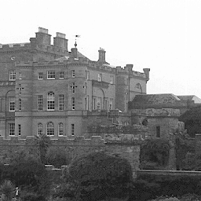
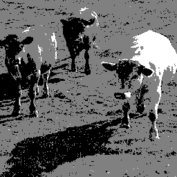

# Introducción

En este trabajo vamos a estudiar una técnica de ocultación de
información conocida como esteganografía. Este área del conocimiento
trata de ocultar mensajes u objetos dentro de otros objetos, llamados
portadores, de forma que a simple vista no pueda percibirse el mensaje
oculto en el objeto portador. Esta técnica, al igual que la
criptografía, tiene como objetivo ocultar un mensaje de manera que un
agente intermedio que lo interceptase no tuviese forma de leerlo,
aunque el enfoque entre ellas es completamente distinta. Mientras que
la criptografía trata de codificar el mensaje de forma que éste no
pueda entenderse aunque se localice, la esteganografía trata de
ocultar el mensaje al interceptor de forma que no se de cuenta de que
el mismo está presente, aunque si lo encontrase sería capaz de
entenderlo sin problemas.

En particular, estaremos interesados en la esteganografía digital de
imágenes. Esto significa que tendremos una imagen que contiene oculta
otra imagen distinta. No es el único tipo de esteganografía que
existe, hay numerosos ejemplos a lo largo de la historia de sistemas
esteganográficos para la ocultación de mensajes. Un ejemplo típico son
las tintas invisibles, las cuales no se manifiestan en el papel a no
ser que se expongan a ciertos productos químicos una vez que se han
secado. Otro ejemplo clásico consiste en ocultar un mensaje corto en
otro más largo, utilizando para ello las primeras letras de las
palabras del mensaje largo para formar el corto.

El sistema que utilizaremos nosotros consiste en la modificación de
los bits menos significativos. En la siguiente sección explicamos cómo
funciona dicho sistema, así como los resultados que obtenemos.

# Esteganografía basada en la modificación del bit menos significativo

Este método consiste en ocultar una imagen en otra por medio de la
modificación de los bits menos significativos de la imagen portadora a
partir de los valores de la imagen a ocultar. Cuanto más compleja sea
la información que almacenemos, más apreciable será la modificación en
la imagen resultante. No obstante, si utilizamos solamente tres o
cuatro valores de gris distintos en la imagen a ocultar, la diferencia
entre la imagen portadora original y la imagen portadora con el mensaje
será imperceptible para el ojo humano.

En nuestro caso, la operación que nos permitirá realizar el
ocultamiento de la información es la operación XOR, conocida también
como OR excluyente. Esta operación lógica se comporta de la siguiente
manera. Dadas dos variables binarias $X$, $Y$, la tabla de verdad de
la operación XOR es la que sigue:

| X | Y | XOR(X,Y) |
|:-:|:-:|:--------:|
| 0 | 0 | 0        |
| 0 | 1 | 1        |
| 1 | 0 | 1        |
| 1 | 1 | 0        |

Es decir, esta operación devuelve un 1 cuando los bits son distintos y 0
cuando son iguales.

La principal ventaja que tiene esta operación es que, dados dos
números cualesquiera, al aplicar bit a bit la operación sobre estos
dos números, podemos recuperar cualquiera de los tres valores (los dos
números originales o su XOR bit a bit) a partir de los otros dos.
Ilustremos este hecho con un ejemplo. Supongamos que tenemos el número
125 y el número 7. Si los consideramos como números de 8 bits, sus
representaciones son 01111101 y 00000111. Si hacemos la operación XOR
entre estos dos valores, nos aparece el resultado:

\begin{table}[H]
\centering
\begin{tabular}{cccccccc}
0 & 1 & 1 & 1 & 1 & 1 & 0 & 1 \\
0 & 0 & 0 & 0 & 0 & 1 & 1 & 1 \\
\midrule
0 & 1 & 1 & 1 & 1 & 0 & 1 & 0 \\
\end{tabular}
\end{table}

Que es el valor 122. Ahora, es sencillo comprobar que XOR(125, 122) = 7
y que XOR(122, 7) = 125. En definitiva, esta operación tiene la propiedad
de que puedes reconstruir la información del número que falta a partir
de los otros dos.

Podemos aprovechar esta propiedad anterior en nuestro beneficio. Si
tenemos una imagen en niveles de gris con valores entre 0 y 255, que
nos servirá de imagen portadora, y otra imagen con pocos niveles de
gris, podemos numerar estos pocos niveles de gris con valores bajos,
tomar la representación binaria de los valores de 0 a 255 y de las
numeraciones, y hacer la operación XOR bit a bit de la imagen
portadora con el mapa de numeración niveles de gris. De esta manera,
como la numeración que demos a los niveles de gris sólo afectará a los
bits menos significativos de la imagen portadora, el valor del nivel
de gris en cada pixel variará muy poco, de forma imperceptible al ojo
humano. Cuantos más niveles de gris distintos necesitemos transmitir,
mayor será la modificación introducida, lo que producirá ruido en la
imagen portadora, hasta el punto de poder llegar a ser detectable si
el cambio es suficientemente significativo.

Una vez se tiene la imagen portadora tanto original como con el
mensaje, se transmiten ambas, y mediante la operación XOR entre estas
dos imágenes, podemos obtener de nuevo el mapa de tonos de gris de la
imagen escondida. Como los valores que obtendremos serán valores muy
bajos (que es precisamente lo que buscamos para que no se note la
modificación de la imagen portadora), no podremos visualizar el
resultado directamente. Por el contrario, tendremos que deshacer el
mapeo de valores, para obtener valores de gris diferenciables entre
sí. La técnica que suele utilizarse consiste en establecer puntos de
corte equiespaciados en el intervalo [0,255]. De esta manera, si
recibimos un mapa que contiene 4 niveles de gris distintos,
realizaremos la siguiente conversión:

\[ 0 \rightarrow 0 \]
\[ 1 \rightarrow 85 \]
\[ 2 \rightarrow 170 \]
\[ 3 \rightarrow 255 \]

De forma que puedan apreciarse los diferentes tonos.

En el ejemplo que pondremos, tenemos una imagen con 3 niveles de gris
diferentes, así que el mapeo será con el 0 al 0, el 1 al 128 y el 2 a
255.

Se han desarrollado en MATLAB dos funciones, las cuales permiten ocultar
una imagen dentro de otra y devolver el resultado, y otra que recibe
la imagen portadora original y la que contiene el mensaje y devuelve
el mensaje preparado. El código de las funciones es el que sigue:

```{matlab, eval=FALSE}
function [output_image] = hide_image(input_image, input_message)
  %% Se crea una imagen del mismo tamaño que el mensaje, que
  %% representará el mapa de valores de gris
  hidden_message = zeros(size(input_message));
  %% Se cogen los valores distintos del mensaje
  unique_vals = unique(input_message);
  %% Para cada valor distinto, se le asigna un valor (desde 0
  %% hasta el número de tonos de gris distintos)
  for i = 1:length(unique_vals)
    hidden_message(input_message == unique_vals(i)) = i - 1;
  end
  hidden_message = uint8(hidden_message);
  input_image = uint8(input_image);
  %% Finalmente se hace la operación XOR
  output_image = bitxor(input_image, hidden_message, 'uint8');
end
```

```{matlab, eval=FALSE}
function [output_image] = recover_image(input_image, original_image)
  %% Se obtiene el mensaje incrustado en la imagen
  message = bitxor(input_image, original_image);
  %% Se cogen sus valores distintos
  values = unique(message);
  %% Se crea la imagen de salida vacía
  output_image = zeros(size(input_image));
  %% Se calculan los valores de gris en los que se proyectará
  %% nuestra codificación
  projected_values = uint8(linspace(0, 255, length(values)));
  %% Se utilizan esas proyecciones para reconstruir la imagen
  %% y se devuelve
  for i = 1:length(values)
    output_image(message == values(i)) = projected_values(i);
  end
  output_image = uint8(output_image);
end
```

Vamos a probar el funcionamiento de estas dos funciones. Para ello,
vamos a trabajar con las siguientes dos imágenes. En primer lugar,
tenemos la imagen de un castillo, que nos servirá como imagen
portadora:

{width=50%}

A continuación, mostramos la imagen que queremos transmitir como
mensaje, que contiene sólo tres niveles de gris:

{width=50%}

Ahora, si realizamos el paso de ocultamiento de una imagen en la
otra, obtenemos el siguiente resultado:

```{matlab, eval=FALSE}
porter = imread("castillo.png");
message = imread("vacas.png");

porter_with_message = hide_image(porter, message);

imshow(porter_with_message);
```

{width=50%}

Como hemos dicho anteriormente, no somos capaces a simple vista de
reconocer diferencias entre la fotografía original del castillo y la
nueva con el mensaje introducido. No obstante, podemos recuperar el
mensaje a partir de la imagen original y la nueva y observar que
obtenemos el resultado deseado:

```{matlab, eval=FALSE}
recovered_message = recover_image(porter_with_message, porter);

imshow(recovered_message);
```

{width=50%}

Cabe hacer ahora una apreciación, que se puede considerar una
problemática de este método. En la codificación y decodificación de la
información ocurre una pequeña pérdida, no muy significativa en la
mayoría de los casos, pero que puede ser problemática en algunos
contextos. Con la reconstrucción de los niveles de gris que hemos
llevado a cabo, hemos supuesto que originalmente éstos estaban
equiespaciados, lo cual no es necesariamente cierto. Por ejemplo,
la imagen de las vacas podría haber sido originalmente así:

{width=50%}

En este caso, los tres niveles de gris que presenta la imagen son 0,
200 y 255, los cuales no están equiespaciados. Con el proceso de
esteganografía que hemos descrito, no podríamos recuperar los mismos
tonos de gris a no ser que indicásemos explícitamente, de alguna
manera, dichos valores. El resultado del proceso completo utilizando
la imagen aclarada sería el mismo que hemos obtenido con la imagen
original, ya que seguimos teniendo tres niveles de gris, que irían a
parar a los códigos 0, 1, y 2, que se revertirían equiespaciados a los
valores 0, 128 y 255.

Una posible solución que se da a este problema consiste en indicar, en
los primeros píxeles de la imagen, esta información, de forma que el
procedimiento de reconstrucción está explicitado dentro del
mensaje. En el caso de la imagen clara, lo que haríamos sería lo
siguiente. En el primer pixel de la matriz del mensaje, se coloca el
número de tonos de gris distintos que estamos transmitiendo (en
nuestro caso, 3). En los siguientes $k$ píxeles, tantos como valores
hayamos indicado al principio, se colocan los niveles de gris que
hemos transformado en nuestro mapeo. En nuestro caso, los píxeles
segundo, tercero y cuarto del mensaje tendrían, respectivamente, los
valores 0, 200 y 255. El resto del mensaje se mantiene de la misma
manera. Así, con una perturbación mínima del mensaje podemos
transmitir la información para la reconstrucción. Este cambio se nota
ligeramente en la imagen portadora cuando se carga con el mensaje, ya
que al hacer el XOR del valor de un píxel con el valor 255, el tono de
gris cambia significativamente, pero como estamos hablando de unos
pocos píxeles aislados en una esquina de la imagen, también resulta
difícilmente apreciable a simple vista.

Esta modificación del algoritmo, no obstante, no se ha implementado,
ya que escapa de los objetivos de la práctica.
