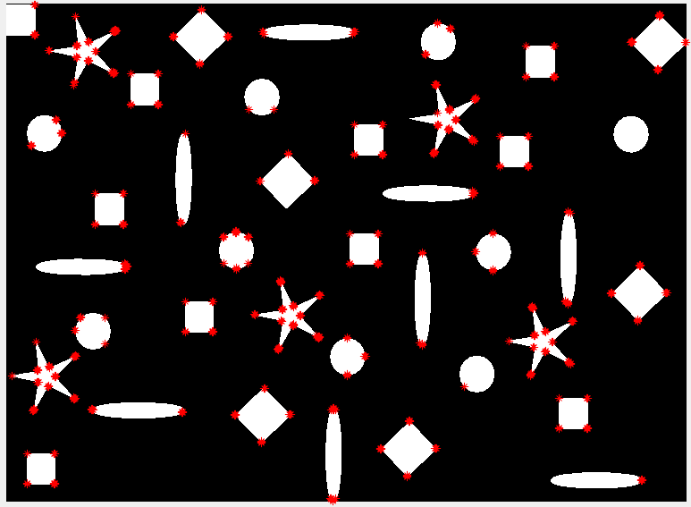
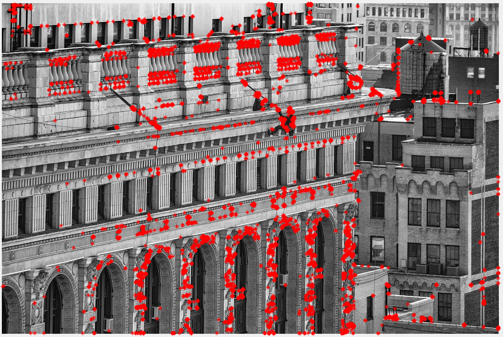
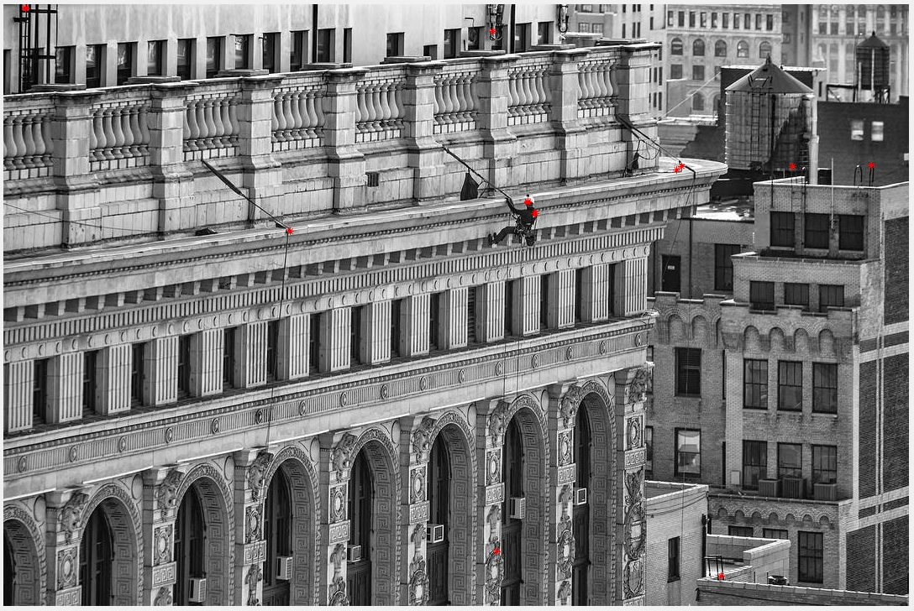

# Introducción

En este trabajo se va a implementar el detector de esquinas de
Moravec.

# Implementación del detector

Este detector se basa en el uso de cuatro diferencias de primer orden,
en las direcciones vertical, horizontal y las dos diagonales
principales. Para cada píxel, se calcula la suma de un vecindario de
tamaño $k$ de las diferencias anteriores. Tenemos entonces para cada
píxel el valor de las diferencias de primer orden de un vecindario en
las cuatro direcciones. Tomando el mínimo de dichos mapas de
características tenemos información de cómo cambia el entorno
alrededor de dicho punto. Si ese valor es suficientemente alto, estaremos
ante una potencial esquina.

El código en MATLAB que se ha desarrollado es el siguiente:

```{matlab, eval=FALSE}
% Detector de esquinas de Moravec
function [points_x, points_y] = moravec(input_image, sz, thr)
    % Calculamos las diferencias de primer orden para cada píxel,
    % las cuales se pueden calcular utilizando la operación de
    % convolución
    vert_img = abs(conv2(input_image, [-1 1],'same'));
    horz_img = abs(conv2(input_image, [-1; 1], 'same'));
    diag_1_img = abs(conv2(input_image,[-1 0; 0 1],'same'));
    diag_2_img = abs(conv2(input_image,[0 -1; 1 0],'same'));

    % Calculamos la suma del entorno de cada punto, lo cual se puede
    % realizar de nuevo convolucionando con una máscara llena de 1's
    f = ones(sz,sz);
    vert_conv = conv2(vert_img, f, 'same');
    horz_conv = conv2(horz_img, f, 'same');
    diag_1_conv = conv2(diag_1_img, f, 'same');
    diag_2_conv = conv2(diag_2_img, f, 'same');

    % Para buscar el mínimo, apilamos los cuatro mapas de características
    % en una nueva dimensión, y calculamos el mínimo en esa dimensión, lo
    % da como resultado una imagen del mismo tamaño que la anterior, en la
    % que cada píxel tiene como valor el mímino de los cuatro canales para
    % ese punto
    stack = cat(3, vert_conv, horz_conv, diag_1_conv, diag_2_conv);
    responses = min(stack, [], 3);

    % Cogemos los puntos que tengan los valores más altos, calculados como
    % un threshold entre 0 y 1 multiplicado por el máximo de los valores
    % encontrados
    [points_x, points_y] = find(responses > thr*max(responses(:)));
end
```

Una vez tenemos el código implementado, vamos a probarlo sobre
distintas imágenes. Comenzamos por la imagen de las formas que se nos
proporcionó para la práctica 3:

```{matlab, eval=FALSE}
[ptsx, ptsy] = moravec(formas, 3, 0.5);
imshow(formas); hold on; plot(ptsy, ptsx, 'r*')
```



Podemos observar que, con una imagen relativamente simple, los
resultados obtenidos son relativamente buenos. Para todas las
estrellas y cuadriláteros se detectan correctamente todas sus esquinas
(a excepción de la esquina inferior de uno de los rombos). El
resultado es ligeramente más problemático con las formas curvas, en
las que se detectan esquinas en algunos puntos del borde,
especialmente en los óvalos. Aun así, aparecen resultados coherentes.
Otro problema que tiene el algoritmo es la presencia de detecciones
múltiples para los puntos de esquina. Las respuestas no son únicas, si
no que se obtienen múltiples respuestas en los puntos esquina.

Veamos los resultados obtenidos sobre una imagen más compleja. Utilizamos
una fotografía real, en lugar de una imagen artificial:

```{matlab, eval=FALSE}
[ptsx, ptsy] = moravec(building, 3, 0.5);
imshow(building); hold on; plot(ptsy, ptsx, 'r*')
```



Aquí podemos observar que el algoritmo es capaz de identificar una
gran cantidad de esquinas presentes en la imagen. Podemos utilizar el
parámetro de sensibilidad para reducir el número de elementos que se
identifican:

```{matlab, eval=FALSE}
[ptsx, ptsy] = moravec(building, 3, 0.9);
imshow(building); hold on; plot(ptsy, ptsx, 'r*')
```


