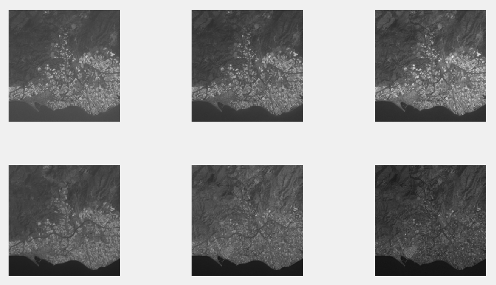
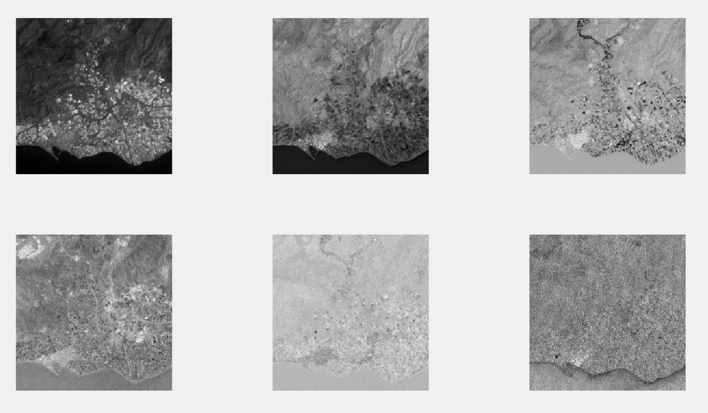

# Introducción

En esta práctica vamos a estudiar el uso de la transformada de
Hotelling para el tratamiento de imágenes. Esta transformada, conocida
también como transformada de Karhunen-Loéve o transformada por
componentes principales, convierte un conjunto de imágenes de una
misma escena en distintas condiciones de iluminación en otro conjunto
de imágenes del mismo tamaño, en el que las imágenes resultantes
maximizan la información almacenada, de forma que las primeras
imágenes del resultado contendrán la mayoría de información del
conjunto original, mientras que las últimas apenas contendrán
información.

Esta transformada tiene un trasfondo muy similar al análisis de
componentes principales, que es una técnica de reducción de
dimensionalidad utilizada clásicamente en conjuntos de datos con
múltiples características. La idea de este algoritmo consiste en
representar los ejemplos del conjunto de datos como vectores de un
espacio $N$ dimensional, y calcular cuáles son las direcciones
perpendiculares entre sí en las que la varianza del conjunto de datos
es máxima. De esta manera, seleccionando las $K < N$ direcciones de
máxima varianza y realizando un cambio de base entre el espacio
original y el espacio transformado, obtenemos un conjunto de tamaño
menor que el original (con $K$ características en lugar de $N$), en el
que se conserva la mayor variabilidad posible de los datos originales.

No entraremos en la fundamentación teórica del modelo, ya que se
escapa de los objetivos de la práctica, pero describiremos paso a paso
el algoritmo en la sección siguiente.

# Algoritmo de la Transformada de Hotelling

El algoritmo a implementar consiste en los siguientes pasos:

Dado un conjunto de $N$ imágenes de la misma escena, en distintas
condiciones de luminosidad, con $p$ filas y $q$ columnas, se construye
una matriz de tamaño $p \times q$ filas y $N$ columnas, de forma que
en cada fila se sitúan los $N$ valores distintos disponibles para cada
píxel de la imagen original.

Una vez construida dicha matriz, se calculan el vector medio (de
tamaño $N$), correspondiente a la media por columnas de la matriz
anterior, y se calcula la matriz de covarianzas de la misma, la cual es
una matriz de tamaño $N \times N$.

Una vez se tiene la matriz de covarianzas calculada, se diagonaliza
dicha matriz (esta matriz es siempre diagonalizable, porque es una
matriz simétrica y semidefinida positiva). Tras la diagonalización de
dicha matriz, tenemos los valores y vectores propios de la misma. Sea
$A$ la matriz formada por los vectores propios obtenidos al
diagonalizar la matriz de covarianzas puestos por filas y ordenados en
orden decreciente de valor propio asociado, y $m$ el vector medio
calculado anteriormente. Para cada vector $x$ formado por los $N$
valores distintos para cada píxel de la imagen puestos en columnas,
tenemos que aplicar la transformación:

\[ x' = A(x - m) \]

Y una vez tenemos esta transformación aplicada, reordenamos los
valores obtenidos en $N$ imágenes distintas. Las imágenes obtenidas
estarán ordenadas en orden decreciente de varianza explicada de la
información original. De esta manera, las dos o tres primeras imágenes
almacenarán la mayoría de la información, y las siguientes irán
almacenando cada vez menos información.

En el siguiente apartado, veremos la implementación de este algoritmo
en MATLAB, y su aplicación sobre un conjunto de imágenes aéreas de
Adra.

# Implementación de la Transformada de Hotelling en MATLAB

En este apartado vamos a ver cómo podemos implementar el algoritmo
descrito anteriormente en MATLAB. Implementaremos una función que
recibe una matriz de tres dimensiones, de forma que las distintas
imágenes están encadenadas en la tercera dimensión de la matriz, y
devuelve una estructura del mismo tipo con las imágenes transformadas.
El código de la función es el que sigue:

```{matlab, eval=FALSE}
function [output_channels] = hotelling_transform(list_images)
    % Se reordena la lista de imágenes en una matriz de tantas filas
    % como píxeles y tantas columnas como imágenes de partida
    vectors = reshape(...
        list_images, size(list_images, 1)*size(list_images, 2),...
        size(list_images, 3));

    % Se calcula el vector medio y la matriz de covarianzas
    mean_vec = mean(vectors, 1);
    cov_mat = cov(vectors);

    % Se diagonaliza la matriz para obtener los valores y vectores propios
    [eigenvecs, eigenvals] = eig(cov_mat);

    % Se reordena la matriz de vectores propios en orden descendente de
    % valores propios
    [~, ordering] = sort(diag(eigenvals), 'descend');
    eigenvecs = eigenvecs(:,ordering);

    % Aprovechando las operaciones matriciales de MATLAB podemos calcular
    % la transformación sobre todos los vectores simultáneamente. La
    % función eig devuelve los vectores propios por columnas, pero los
    % necesitamos por filas, por lo que tenemos que trasponer las matrices
    % y luego deshacer el cambio
    vectors = (eigenvecs'*(vectors - mean_vec)')';

    % Revertimos los cambios para tener las imágenes con las dimensiones
    % originales
    output_channels = reshape(vectors, size(list_images, 1),...
        size(list_images, 2), size(list_images, 3));
end
```

# Ejecución paso a paso con nuestro conjunto de imágenes

Aunque se ha implementado la función anterior para automatizar el
proceso de cálculo de la transformada de Hotelling sobre un conjunto
arbitrario de imágenes, a modo de demostración mostraremos los
resultados intermedios de los pasos que se dan sobre nuestro conjunto.

Trabajaremos con un conjunto de 6 imágenes de la población de Adra
vista desde arriba, con distintas condiciones de luminosidad. Las 6
imágenes de partida son las siguientes:

{width=100%}

Las imágenes tienen un tamaño de 256x256. Las agrupamos en una matriz
tridimensional de tamaño 256x256x6 y las convertimos en imágenes en
coma flotante, que será la estructura de datos que recibirá la función
que hemos definido anteriormente. La conversión a datos en coma
flotante es necesaria para evitar que se produzcan errores en el
cálculo de las covarianzas.

Una vez tenemos las imágenes cargadas y transformadas a una matriz de
dos dimensiones (de tamaño 65536x6), calculamos el vector medio y la
matriz de covarianzas, donde obtenemos el siguiente resultado:

\[ m = \left[90.9291, 80.9143, 90.6774, 76.8757, 78.6039, 58.4145
\right] \]

\[
C = 10^3 \begin{pmatrix}
0.6130 & 0.6476 & 0.7778 & 0.5118 & 0.3895 & 0.3128 \\
0.6476 & 0.7028 & 0.8611 & 0.5921 & 0.4827 & 0.3817 \\
0.7778 & 0.8611 & 1.0789 & 0.7576 & 0.6601 & 0.5209 \\
0.5118 & 0.5921 & 0.7576 & 0.6164 & 0.5381 & 0.3984 \\
0.3895 & 0.4827 & 0.6601 & 0.5381 & 0.5914 & 0.4499 \\
0.3128 & 0.3817 & 0.5209 & 0.3984 & 0.4499 & 0.3576 \\
\end{pmatrix}
\]

Diagonalizamos la matriz $C$ y obtenemos la matriz A con los
autovectores por columnas, así como los autovalores:

\[
A = \begin{pmatrix}
 0.3860 & -0.4868 & 0.1481 & -0.5705 & -0.2707 & 0.4397 \\
 0.4330 & -0.3228 & 0.0611 & -0.0695 & 0.0193 & -0.8363 \\
 0.5472 & -0.1677 & 0.1689 & 0.6047 & 0.4194 & 0.3199 \\
 0.3985 & 0.1718 & -0.8481 & 0.0871 & -0.2841 & 0.0642 \\
 0.3575 & 0.6323 & 0.0887 & -0.4965 & 0.4669 & -0.0004 \\
 0.2784 & 0.4487 & 0.4676 & 0.2234 & -0.6721 & -0.0290 \\
\end{pmatrix}
\]

\[
D = 10^3\begin{pmatrix}
 3.5570 & 0 & 0 & 0 & 0 & 0 \\
 0 & 0.3355 & 0 & 0 & 0 & 0 \\
 0 & 0 & 0.0575 & 0 & 0 & 0 \\
 0 & 0 & 0 & 0.0058 & 0 & 0 \\
 0 & 0 & 0 & 0 & 0.0035 & 0 \\
 0 & 0 & 0 & 0 & 0 & 0.0009 \\
\end{pmatrix}
\]

Como podemos observar, ya tenemos los autovalores ordenados, y este
mismo orden se mantiene con los autovectores. Aplicamos la
transformación anterior, y las imágenes resultantes son las que se
muestran a continuación:

{width=100%}

Como podemos observar en las imágenes resultantes, en las dos primeras
está almacenada casi toda la información sobre las imágenes de
partida. En las dos siguientes quedan algunos detalles mínimos,
y las dos últimas imágenes son básicamente ruido.

Finalmente, vamos a realizar un estudio del error cometido al
reconstruir las imágenes originales utilizando las imágenes que
hemos obtenido al transformar.

# Reconstrucción de las imágenes originales y error cometido

Finalmente, vamos a ver cómo podemos reconstruir las imágenes
originales a partir de las imágenes transformadas, y el error que se
comete al realizar la reconstrucción utilizando sólo un subconjunto de
las mismas. Se puede demostrar analíticamente que una cota del error
cuadrático medio entre la imagen original y la reconstrucción viene
dada por la suma de los autovalores correspondientes a los
autovectores descartados. De esta manera, el error cuadrático medio
que cometemos al utilizar las $K$ primeras imágenes transformadas para
hacer la reconstrucción es el siguiente:

```{r, echo = F}
library(knitr)
reconstruction.errors <- t(c(403.1721, 67.6581, 10.1731, 4.3831, 0.9081, 0))
rownames(reconstruction.errors) <- "Error cometido"
colnames(reconstruction.errors) <- 1:6
kable(reconstruction.errors, caption="Error cometido en función del número de vectores utilizados")
plot(t(reconstruction.errors), type="o", col = "blue",
     xlab="Número de elementos utilizados",
     ylab="Error cometido")
```

Como podemos observar, el error decrece drásticamente cuando
comenzamos a añadir vectores. Si utilizamos sólamente el primero de
ellos, se comete un error de más de 400 unidades. Introduciendo 2, el
error ya es inferior a 60, y con 3, ligeramente mayor que 10. Lógicamente, si
utilizamos las 6 imágenes, el error cometido al reconstruir es nulo.
